# 星闪无线通信系统 架构

版本：V2.0.0

2025-03-26 发布

2025-03-26 实施

## 目次

[TOC]

## 前言

《星闪无线通信系统》当前分别为如下部分：

- 星闪无线通信系统 架构；

- 星闪无线通信系统 媒体接入层标识分配机制；

- 无线短距通信 车载空口技术要求和测试方法；

- 星闪无线通信系统 接入层 同步低时延宽带空口 SLB 技术要求和测试方法；

- 星闪无线通信系统 测试 星闪基础接入技术（SLB）设备要求和测试方法；

- 星闪无线通信系统 接入层 同步低功耗空口 SLE 技术要求和测试方法；

- 星闪无线通信系统 测试 同步低功耗空口 SLE 设备空口要求和测试规范；

- 星闪无线通信系统 接入层 数据连接接口技术要求和测试方法；

- 星闪无线通信系统 网络安全 通用要求；

- 星闪无线通信系统 测试 星闪基础接入技术（SLB）设备安全要求和测试方法；

- 星闪无线通信系统 基础服务层 传输报文格式和传输协议；

- 星闪无线通信系统 基础服务层 网络报文格式和多跳组网协议；

- 星闪无线通信系统 基础服务层 服务质量管理；

- 星闪无线通信系统 基础服务层 多域协调与管理；

- 星闪无线通信系统 基础服务层 5G 蜂窝网络融合；

- 星闪无线通信系统 基础服务层 传输与控制规范；

- 星闪无线通信系统 基础服务层 设备发现与服务管；

- 星闪无线通信系统 测试 基础服务层设备要求和测试方法；

- 星闪无线通信系统 基础应用层 电量信息管理服务；

- 星闪无线通信系统 测试 基础应用层 电量信息管理服务；

- 星闪无线通信系统 基础应用层 设备信息管理服务；

- 星闪无线通信系统 测试 基础应用层 设备信息管理服务；

- 星闪无线通信系统 基础应用层 IP 承载管理；

- 星闪无线通信系统 基础应用层 基于OBEX协议的数据传输管理服务；

- 星闪无线通信系统 基础应用层 音频流配置与传输管理；

- 星闪无线通信系统 基础应用层 媒体控制；

- 星闪无线通信系统 基础应用层 合作设备集合管理；

- 星闪无线通信 基础应用层 低延迟低复杂度高清音频编解码技术规范；

- 星闪无线通信系统 基础应用层 视频配置与传输管理；

- 星闪无线通信系统 基础应用层 全景环视应用配置和管理；

- 星闪无线通信系统 基础应用层 流媒体后视镜应用配置和管理；

- 星闪无线通信系统 基础应用层 客车透视系统应用配置和管理；

- 星闪无线通信系统 基础应用层 用于 USB HID 的人机交互应用的数据交互；

- 星闪无线通信系统 测试 基础应用层 用于 USB HID 应用的数据交互管理服务；

- 星闪无线通信系统 基础应用层 USB HID 应用配置和管理；

- 星闪无线通信系统 测试 基础应用层 USB HID 应用配置和管理；

- 星闪无线通信系统 基础应用层 智能锁止设备管理服务；

- 星闪无线通信系统 测试 基础应用层 智能锁止设备管理服务；

- 星闪无线通信系统 基础应用层 视频门锁应用配置和管理；

- 星闪无线通信系统 测试 基础应用层 视频门锁应用配置和管理；

- 星闪无线通信系统 基础应用层 用于数字车钥匙应用的数据交互管理；

- 星闪无线通信系统 测试 基础应用层 用于数字车钥匙应用的数据交互管理；

- 星闪无线通信系统 基础应用层 数字车钥匙应用配置和管理；

- 星闪无线通信系统 测试 基础应用层 数字车钥匙应用配置和管理；

- 星闪无线通信系统 基础应用层 位置信息管理；

- 星闪无线通信系统 测试 基础应用层 位置信息管理；

其中，《无线短距通信车载空口技术要求和测试方法》（YD/T4007-2022）由中国通信标准化协会制定。

本文件按照GB/T1.1—2020《标准化工作导则第1部分：标准化文件的结构和起草规则》的规定起草。

请注意本文件的某些内容可能涉及专利。本文件的发布机构不承担识别专利的责任。

本文件由国际星闪无线短距通信联盟提出并归口。

本文件起草单位：华为技术有限公司、中国信息通信研究院、中国电子技术标准化研究院、中兴通讯股份有限公司、TCL科技集团股份有限公司、大唐高鸿数据网络技术股份有限公司、中国移动通信有限公司、上海数字电视国家工程研究中心有限公司、翱捷科技股份有限公司、鼎桥通信技术有限公司、深圳市闪联信息技术有限公司、北京中科晶上科技股份有限公司、联想（北京）有限公司、上海交通大学、广州汽车集团股份有限公司、紫光展锐（上海）科技有限公司、维沃移动通信有限公司、深圳市极致汇仪科技有限公司、歌尔股份有限公司、湖南国科微电子股份有限公司、上海移远通信技术股份有限公司、北京邮电大学、北京星河亮点技术股份有限公司、大唐联仪科技有限公司、珠海格力电器股份有限公司、OPPO广东移动通信有限公司、交通运输部公路科学研究院、中国科学院上海微系统与信息技术研究所、恒玄科技有限公司、奉加微电子（上海）有限公司。

本文件主要起草人：李明超、刘航、王键、全超、高磊、吴馨、杨修竹、李德建、王勇、唐维平、刘国权、宋思达、王智玮、葛雨明、杨宏、王婷、孙波、杜伟强、王丽萍、金星、李晨鑫、房家奕、罗达、张春天、李峰、苏畅、赵航斌、殷惠清、王婷婷、李维成、马骁菲、陈迎、丁路宁、万建超、汪剑锋、徐胤、杨波、朱勇旭、周晓萌、张元、陈海军、赵培杰、蔡智勇、应义星、许方敏、杨雅琼、纪建南、封岩、张博源、孙志勇、刘璐、董轩、耿心、刘洪、刘子琦、吴天煦、杨中奇。

## 星闪无线通信系统 架构

### 1 范围

本文件定义了星闪无线通信系统的总体要求，包括系统架构、主要功能以及各协议层的关键技术要求。

本文件适用于星闪无线通信终端设备。

### 2 规范性引用文件

下列文件中的内容通过文中的规范性引用而构成本文件必不可少的条款。其中，注日期的引用文件，仅该日期对应的版本适用于本文件；不注日期的引用文件，其最新版本（包括所有的修改单）适用于本文件。

T/XS 10001-2025 星闪无线通信系统 接入层 同步低时延宽带空口SLB技术要求和测试方法

T/XS 10002-2025 星闪无线通信系统 接入层 同步低功耗空口SLE技术要求和测试方法

T/XS 20001-2025 星闪无线通信系统 基础服务层 设备发现与服务管理

T/XS 20002-2025 星闪无线通信系统 基础服务层 传输与控制

T/XS 20003-2023 星闪无线通信系统 基础服务层 服务质量管理

T/XS 20004-2022 星闪无线通信系统 基础服务层 多域协调与管理

T/XS 20005-2022 星闪无线通信系统 基础服务层 5G蜂窝网络融合

T/XS 30001-2023 星闪无线通信系统 基础应用层 IP承载管理

T/XS 30002-2023 星闪无线通信系统 基础应用层 视频配置与传输管理

T/XS 30003-2023 星闪无线通信系统 基础应用层 音频流配置与传输管理

T/XS 30004-2025 星闪无线通信系统 基础应用层 用于USB HID人机交互应用的数据交互管理

T/XS 30005-2023 星闪无线通信系统 基础应用层 合作设备集合管理

T/XS 30006- 2023 星闪无线通信 基础应用层 低延迟低复杂度高清音频编解码技术规范

T/XS 30007-2025 星闪无线通信系统 基础应用层 位置信息管理

T/XS 30008-2024 星闪无线通信系统 基础应用层 用于数字车钥匙应用的数据交互管理

T/XS 30009-2025 星闪无线通信系统 基础应用层 数字车钥匙应用配置和管理

T/XS 30010-2024 星闪无线通信系统 基础应用层 媒体控制

T/XS 30011-2025 星闪无线通信系统 基础应用层 电量信息管理

T/XS 30012-2025 星闪无线通信系统 基础应用层 设备信息管理

T/XS 30013-2025 星闪无线通信系统 基础应用层 USB HID人机交互应用配置和管理

T/XS 40001-2022 星闪无线通信系统网络安全通用要求

### 3 术语和定义

下列术语和定义适用于本文件。

#### 3.1 星闪接入层

##### 3.1.1 管理节点 Grant Node

星闪无线通信系统接入层发送数据调度信息的节点。

##### 3.1.2 终端节点 Terminal Node

星闪无线通信系统接入层接收数据调度信息，根据数据调度信息发送数据的节点。

##### 3.1.3 默认承载 Default Bearer

星闪接入层建立的初始逻辑信道，具备默认的 QoS 参数配置，用于承载基础服务层的各功能单元的控制信令类数据。

##### 3.1.4 信道占用时间 Channel Occupancy Time

星闪SLB在非连续传输模式下，通信域、直通链路以竞争抢占的方式时分使用基础载波。从竞争信道成功后的第一个无线帧开始，到所有基础载波都释放信道之前的最后一个无线帧（含）为止，整数个无线帧组成的一个信道占用时间。

##### 3.1.5 传输时间间隔 Transmission Time Interval

星闪SLB传输块集合到达的间隔时间。

##### 3.1.6 基础信道 Basic Channel

星闪SLB工作频段划分最小频域资源单元。

##### 3.1.7 信道 Channel

星闪SLB工作所占用频率资源，由一个或多个连续的基础信道组成。

##### 3.1.8 子载波 Subcarrier

星闪SLB物理层最小频域资源单元。

##### 3.1.9 基础载波 Basic Carrier

星闪SLB物理层由多个连续的子载波组成的频域资源。基础载波与基础信道一一对应。

##### 3.1.10 有效子载波 Valid Subcarrier

星闪SLB物理层可用于映射数据或信号的子载波。

##### 3.1.11 中心子载波 Center Subcarrier

星闪SLB物理层处于基础载波中心的子载波。

##### 3.1.12 分隔子载波 Isolation Subcarrier

星闪SLB物理层频域相邻的两个基础信道对应的两个基础载波的邻近边缘之间所存在的子载波。

##### 3.1.13 载波 Carrier

星闪SLB物理层用于承载信息，并由多个基础载波组成的频域资源，基础载波之间由多个分隔子载波间隔。载波与信道一一对应。

#### 3.2 基础服务层

##### 3.2.1 功能单元 Functional Unit

星闪无线通信系统基础服务层定义的负责特定功能或操作的逻辑功能实体。

##### 3.2.2 传输通道 Transport Channel

星闪无线通信系统的基础服务层提供基于传输信道的数据传输服务，传输通道可以用来承载不同星闪设备之间基础应用层或者基础服务层功能单元的数据交互。

#### 3.3 基础应用层

#### 3.3.1 原子能力标准 Atomic Capability Standard

也简称为原子能力，是针对应用标准需要所抽象出来的基础与通用性的功能，同时定义了完成这个功能涉及到的控制信令与交互流程。根据原子能力类型的不同，也可称为对应类型的原子能力，如

音频原子能力、视频原子能力等。

### 4 缩略语

下列缩略语适用于本文件。

<table><tr><td>5GITC</td><td>5G Interworking Transport Channel</td><td>5G融合传输通道</td></tr><tr><td>AMF</td><td>Access and Mobility Management Function</td><td>接入和移动管理功能</td></tr><tr><td>CCBTC</td><td>Common Control Broadcast Transport Channel</td><td>通用控制广播传输通道</td></tr><tr><td>CLTP</td><td>Connectionless Transport Protocol</td><td>无连接传输协议</td></tr><tr><td>CMTC</td><td>Common Management Transport Channel</td><td>通用管理传输通道</td></tr><tr><td>CP-SAP</td><td>Control Plane - Service Access Point</td><td>控制面服务接入节点</td></tr><tr><td>CTS</td><td>Channel Training Sequence</td><td>信道训练序列</td></tr><tr><td>DLI</td><td>Data Link Interface</td><td>数据连接接口</td></tr><tr><td>DUDTC</td><td>Default Unicast Data Transport Channel</td><td>默认单播数据传输通道</td></tr><tr><td>EAP</td><td>Extensible Authentication Protocol</td><td>可扩展认证协议</td></tr><tr><td>FLAG</td><td>Fast Localization with Assistant Grouping</td><td>快速辅助成组定位</td></tr><tr><td>LWCTP</td><td>Lightweight Connected Transport Protocol</td><td>轻量面向连接的传输协议</td></tr><tr><td>MDCMTC</td><td>Multi-Domain Coordination and Management Transport Channel</td><td>多域协调与管理传输通道</td></tr><tr><td>NSA</td><td>Non-Standalone</td><td>非独立工作模式</td></tr><tr><td>PSK</td><td>Pre-shared Key</td><td>预共享密钥</td></tr><tr><td>QoS</td><td>Quality of Service</td><td>服务质量</td></tr><tr><td>RSMTC</td><td>Relay Service Management Transport Channel</td><td>中继服务管理传输通道</td></tr><tr><td>SLAI</td><td>SparkLink Air Interface</td><td>星闪空中接口</td></tr><tr><td>SLB</td><td>Synchronous Low latency Broadband</td><td>星闪同步低时延宽带模式</td></tr><tr><td>SLE</td><td>Synchronous Low Energy</td><td>星闪同步低功耗模式</td></tr><tr><td>SLP</td><td>Synchronous Link Positioning</td><td>星闪同步高精定位模式</td></tr><tr><td>SLQI</td><td>SparkLink QoS Index</td><td>星闪服务质量标识</td></tr><tr><td>SMF</td><td>Session Management Function</td><td>会话管理功能</td></tr><tr><td>SMTC</td><td>Service Management Transport Channel</td><td>服务管理传输通道</td></tr><tr><td>TCID</td><td>Transport Channel IDentifier</td><td>传输通道标识</td></tr><tr><td>TNGF</td><td>Trusted Non-3GPP Gateway Function</td><td>可信非3GPP网关功能</td></tr><tr><td>UPF</td><td>User Plane Function</td><td>用户面功能</td></tr><tr><td>UP-SAP</td><td>User Plane-Service Access Point</td><td>用户面服务接入节点</td></tr></table>

### 5 星闪无线通信系统概述

星闪无线通信技术是一种无线短距通信技术，用于承载智能汽车、智能家居、智能终端以及智能制造等领域应用场景的数据交互。星闪无线通信系统由星闪接入层、基础服务层以及基础应用层三部分构成。其中，星闪接入层也可被称为星闪底层，基础服务层和基础应用层构成了星闪上层。

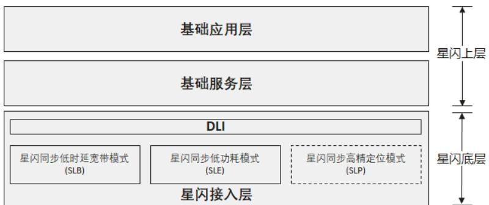

图1 星闪无线通信系统

星闪接入层根据实现功能的不同分为管理节点（G节点）和终端节点（T节点），其中G节点为其覆盖下的T节点提供连接管理、资源分配、信息安全等接入层服务。星闪接入层实现了G节点和T节点的上层业务数据在空口的传输交互。星闪标准化了底层与上层的接口即数据连接接口(DLI)，支持SLB和SLE。其中，SLB采用超短帧、多域同步、双向认证、快速干扰协调、双向认证加密、跨层调度优化等多项技术，用于支持具有低时延、高可靠、精同步、高并发和高安全等传输需求的业务场景。SLE采用Polar信道编码提升传输可靠性，减少重传节省功耗，同时支持最大4MHz传输带宽、最大8PSK调制，支持1对多可靠组播，支持4KHz短时延交互等特性，在尽可能保证传输效率的同时，充分考虑了节能因素，用于承载具有低功耗诉求的业务场景。SLP采用全新帧格式、更高脉冲功率、超宽带随机启动、CTS安全加密等多项技术，提供测距、测角等定位功能和存在感知、目标跟踪、行为感知等感知功能，并具有宽窄带融合、窄带提供同步与数传的能力，具有能耗更低的优势。除了通信，SLB、SLE也增加了测距、定位和感知的功能，与SLP一起，面向不同的业务诉求，提供不同精度的测距、定位和感知能力。

SLP是一种NSA模式，需结合SLE或SLB进行工作，SLP所需的空口交互信令由SLB或SLE数据链路层发送，SLP通过SLE或SLB的数据连接接口与基础服务层交互。图2给出了星闪设备可能的实现形式，星闪设备可以根据实际业务需求，选择任意六种模式之一。

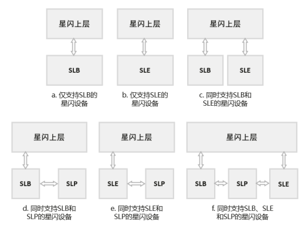

图2 星闪设备实现形式示例

星闪无线通信系统针对不同的星闪底层接入技术采用了统一的星闪上层架构。星闪上层由基础服务层和基础应用层构成。其中，基础服务层针对上层业务数据，提供了设备发现、服务管理、连接建立/维护与释放、QoS管理、测量管理、信息安全、多跳组网、面向连接或无连接传输等功能，用于支撑上层具体业务的从业务触发到业务结束的整个业务周期的连接交互需求。同时，基础服务层也可以与底层进行跨层交互并且根据业务需求以及传输情况提供底层传输路径的选择及切换。基础应用层实现各类应用功能，针对共性的业务诉求，定义原子能力标准，如音频原子能力、视频原子能力，供具体应用进行调用，实现模块化设计。基础应用层也面向具体应用定义应用配置标准，用于实现业务的端到端交互并且保证不同厂商的互联互通。

星闪无线通信系统除了提供纯无线短距离通信外，也可支持与5G网络进行融合，支持5G核心网对于星闪无线通信节点的注册感知、QoS策略管理以及通信状态监控，实现5G核心网对其覆盖下的星闪无线通信网络的统一管理和维护。

### 6 架构与功能划分

#### 6.1 通信场景

星闪无线通信系统可支持的短距离通信场景见图3。根据通信双方的星闪底层节点类型不同，可以分为：

a）支持G节点和T节点之间的通信；

b) 支持不同G节点之间的通信；

c) 支持同一通信域内不同T节点之间通过G节点进行中继通信；

d) 支持同一通信域内不同T节点之间直接进行通信；

e) 支持任意两个节点之间进行直通通信；

f）支持任意多个节点之间进行基于多跳网络拓扑的通信。

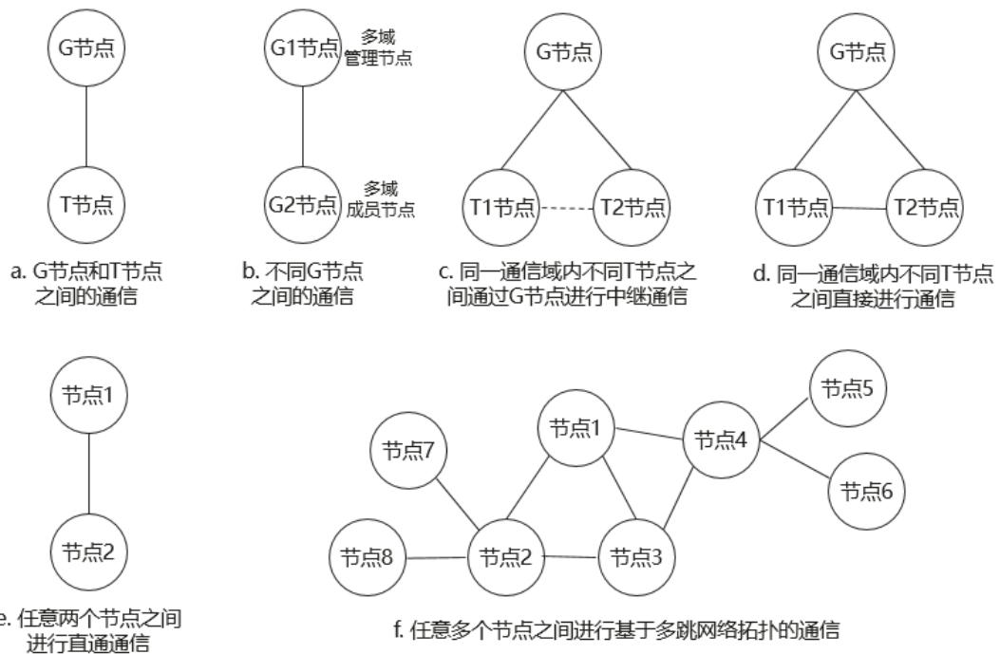

图3星闪无线通信系统支持的短距离通信场景

注1：对于G节点之间进行多域协调与管理的通信场景，在连接建立过程中，需要其中一个G节点退回到T节点的身份模式并发起向另一个G节点的连接；

#### 6.2 定位场景

G节点可以为位置锚点、位置标签或者位置解算节点。T节点可以为位置锚点、位置标签或者位置解算节点。G节点配置各个位置锚点、位置标签和位置信息解算节点的定位参数。

星闪无线通信系统可支持的定位场景，可以分为：

a）支持一个位置锚点与一个位置标签之间测量距离、到达角或离开角；

b) 支持至少一个位置锚点与多个位置标签之间并发测量距离、到达角或离开角，其中至少一个位置锚点与多个位置标签构成一个测量组；

c）支持至少一个位置标签与多个位置锚点之间并发测量距离、到达角或离开角，其中至少一个位置标签与多个位置锚点构成一个测量组。

#### 6.3 感知场景

星闪无线通信系统可支持的感知场景，可以分为：

a）单站感知：支持节点自发自收进行感知测量；

b）双站感知：支持两个节点之间进行感知测量；

c）多站感知：支持多个节点之间进行感知测量；

d) 协作感知：支持G节点作为感知管理节点，配置多个节点进行感知测量并上报感知测量信息，完成多节点协作感知；

e) 代理感知: 支持T节点作为感知请求节点, 向G节点发送感知流程请求, 并实现代理感知。

f）公共资源感知：同步信号可用作信道状态信息估计，并进一步用作感知。

#### 6.4 系统架构

星闪无线通信系统的整体系统架构见图4，具体的，

- 星闪接入层由星闪同步低时延宽带模式SLB、星闪同步低功耗模式SLE和星闪同步高精定位模式组成。根据图5所示，SLB、SLE由物理层和数据链路层构成，SLP仅含有物理层。SLB、SLE和SLP的功能介绍见6.5.1节。

- 基础服务层由一系列基础功能单元构成，各功能单元的具体功能介绍参见6.5.2节，其中：

a) 设备发现功能单元、通用管理功能单元(包括连接管理、测量管理、QoS管理)、服务管理功能单元、安全管理功能单元构成了星闪无线通信系统的无线短距通用控制面；

b) 多域协调与管理功能单元和 5G 融合功能单元为可选功能单元, 属于星闪无线通信系统扩展控制面;

c) 数据传输与适配功能单元负责了数据封装等用户面功能，支持承载包括控制类数据、广播类数据、实时数据、可靠数据和透传数据在内的业务数据传输；

d) 网络功能：包括拓扑配置协议、无线邻居协议、多跳组网安全、无线网络协议、路由协议、网络服务发现与访问、网络错误与诊断、网络节能等内容，提供多跳组网能力；

e）传输功能：支持点对点和多跳网络，提供面向连接或无连接的传输机制。

- 基础应用层由原子能力标准以及应用标准构成，具体介绍参见6.5.3节。

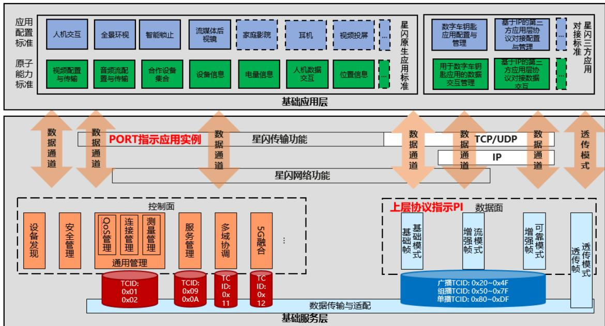

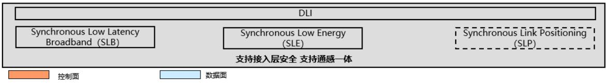

图4星闪无线通信系统架构

注1：基于该架构下的各标准独立定义。

图5星闪接入层协议栈架构

星闪终端通信协议栈见图6。

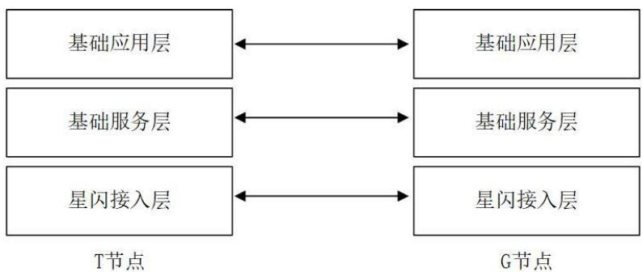

图6 星闪终端通信协议栈

#### 6.5 功能划分

##### 6.5.1 星闪接入层

###### 6.5.1.1 星闪同步低时延宽带模式

SLB的物理层支持以下功能：

- 传输信息的正确性校验并指示给数据链路层；

- 传输信息的前向纠错（FEC）编码/解码；

- 混合自动重传请求（HARQ）软合并；

- 传输信息到对应的物理资源的速率匹配；

- 编码后的传输信息到对应的物理资源的映射；

- 物理层控制信息和物理层数据信息的调制和解调；

- 频率和时间的同步；

- 无线特性测量并指示给数据链路层；

- 多输入多输出天线处理；

- 波束赋形；

- 射频处理；

SLB数据链路层又可分为媒体接入层和链路控制层。其中，SLB的媒体接入层支持以下功能：

- 对不同逻辑信道的数据进行复用，生成传输块，并递交到物理层；

- 对链路控制层 PDU 数据进行级联；

- 物理层传递的传输块进行解复用，并递交到不同的逻辑信道；

随机接入过程；

资源请求过程；

- HARQ;

- 逻辑信道优先级机制；

链路控制层数据量报告；

非连续接收；

数据透传。

SLB的链路控制层支持以下功能：

- 传输上层 PDU;

- 对传输模式 1 类型的数据，进行 ARQ 状态报告；

- 对链路控制层 SDU 进行切分和重组（如果配置）；

- 对链路控制层 SDU 进行重分段（如果配置）；

- 上层 PDU 重复检测；

- 上层 PDU 重排序；

链路管理功能；

- 加解密；

完整性保护；

数据透传。

SLB还支持G节点和T节点之间的以下控制管理功能：

通信域系统消息广播；

- 连接建立、重配置、拒绝、释放；

认证与安全机制更新；

资源配置；

- 状态管理；

测量与上报；

T节点能力上报；

辅助信息上报。

###### 6.5.1.2 星闪同步低功耗模式

SLE的物理层支持以下功能：

- 非链接态同步广播数据传输(比如视频流、音频流等)；

- 非链接态异步广播数据传输(比如节点业务信息、温度信息、湿度信息、传感器信息等);

- 非链接态的广播发现过程，通过广播流程获取节点信息(比如节点业务信息等)；

- 链接态同步广播数据传输(比如视频流、音频流等)；

- 支持 GFSK 波形的无线帧类型 1;

- 使用在低时延传输、高频率交互场景中的无线帧类型 2；

- 使用在常规覆盖场景下的无线帧类型 3;

- 使用在扩展覆盖场景下的无线帧类型 4;

- 支持单播，支持基于N/A反馈的可靠组播；

- 传输信息的前向纠错（FEC）编码/解码；

支持重传合并；

- 用于灵活配置物理层资源的系统管理帧；

- 不同测量模式或阶段使用的四种测量帧类型。

SLE数据链路层数据面支持以下功能：

非周期同步广播数据传输；

- 周期同步广播数据传输；

数据包的分段和重组；

数据面信息与控制面信息的复用；

- 加解密；

完整性保护。

SLE数据链路层控制面支持以下功能：

数据链路物理层参数交互和更新；

节点特性交互；

- 节点版本交互；

信道质量上报；

- 功率控制；

休眠与唤醒；

测量与上报。

###### 6.5.1.3 星闪同步高精定位模式

SLP的物理层支持以下功能：

基于超宽带脉冲波形的位置测量；

- 基于超宽带脉冲波形的感知测量。

###### 6.5.1.4 数据连接接口

星闪数据连接接口定义了基础服务层与接入层之间，数据和信息交互的格式，以及相应物理接口使用方式。DLI支持以下功能：

- 基础服务层对接入层的指令下发；

- 接入层对基础服务层的事件上报；

- 异步单播数据封装和传输；

同步单播数据封装和传输；

- 异步组播数据的封装和传输；

指令的流控；

数据面的流控；

- UART、USB等物理接口传输。

##### 6.5.2 基础服务层

基础服务层由若干功能单元构成，星闪无线通信系统通过调用不同功能单元实现对于上层应用功能以及系统管理维护的支持。各功能单元具体负责的功能见6.5.2.1节至6.5.2.7节描述。

###### 6.5.2.1 设备发现功能单元

设备发现功能单元用于公开自身存在或发现周边设备。设备发现功能单元支持以下功能：

被发现方公开信息配置；

发现方过滤条件的配置；

发现方扫描结果的过滤和上报。

###### 6.5.2.2 通用管理功能单元

通用管理功能单元为基础服务层提供了包括连接管理、测量监控、QoS保证在内的基本管理服务。通用管理功能单元可以进一步拆分为连接管理功能单元、测量管理功能及QoS管理单元，其中：

连接管理功能单元支持以下功能：

- 传输通道的建立、更新和删除；

业务端口与传输通道TCID的映射关系维护；

- 传输通道与星闪接入层逻辑信道的映射关系维护；

- 触发星闪接入层建立、更新或删除逻辑信道；

- 向 QoS 管理功能单元反馈当前传输通道的建立状态；

- 星闪接入层传输路径的选择；

与星闪接入层接口信息交互的维护。

测量管理功能单元支持以下功能：

- 触发星闪接入层测量物理层信号质量；

- 管理面向已有传输通道的测量；

- 为星闪设备内部的其他功能单元（如 QoS 管理功能单元、5G 融合功能单元等）或授权应用提供统一的测量服务接口。允许相应功能单元向测量管理功能单元提供期望测量的配置信息并对测量结果进行查询。

QoS管理功能单元可根据业务传输需求以及网络状况等因素确定星闪无线通信系统需要提供的服务质量，确保星闪无线通信系统的传输能力与业务需求相匹配。QoS管理功能单元支持以下功能：

- 星闪传输通道的 QoS 参数配置；

- 管理并维护业务流与传输通道的 QoS 映射规则；

- 指示连接管理功能单元建立新的传输通道或更改传输通道映射关系；

基于QoS流的流量监控。

###### 6.5.2.3 服务管理功能单元

服务管理功能单元用于设备内部的服务管理及维护，以及设备之间的服务发现。具体支持以下功能：

设备内部的服务注册、更新与删除；

设备内部的服务信息管理与维护；

设备间的服务发现；

设备间的属性读取；

设备间的属性写入；

设备间的交互信息错误处理；

- 服务端的通知与指示；

方法交互操作；

事件上报操作。

###### 6.5.2.4 安全管理功能单元

安全管理功能单元用于为上层应用提供安全连接和5G融合安全等服务，具体支持以下功能：

安全连接管理；

安全状态管理；

授权管理；

5G融合安全管理。

###### 6.5.2.5 多域协调与管理功能单元

多域协调与管理功能单元用于相邻G节点之间的协调交互，具体支持以下功能：

相邻G节点的扫描；

- 触发多域服务发现及相邻G节点之间的连接建立；

- 相邻G节点之间的资源协调与管理；

- 相邻G节点之间的测距信息交互。

###### 6.5.2.6 5G融合功能单元

G节点或者T节点可以通过5G融合功能单元与5G核心网进行交互，5G融合功能单元具体支持以下功能：

可信G节点的选择；

- T节点或者G节点的注册；

- QoS 策略的下发；

- 星闪无线通信系统远程状态查询；

###### 6.5.2.7 数据传输与适配功能单元

数据传输与适配功能单元负责执行基础服务层的用户面操作，具体支持以下功能：

支持对发送端基础服务层SDU进行分包处理；

- 支持发送端基础服务层 SDU 进行向下透传处理；

- 支持发送端基础服务层多个SDU进行聚合处理；

- 支持数据重传；

支持ACK;

支持优先级处理；

- 接收端基础服务层PDU合片处理；

- 支持接收端基础服务层PDU进行向上透传处理；

- 支持接收端基础服务层SDU的数据分拆处理；

- 支持包括冗余传输、分流传输、星闪接入层从SLB切换到SLE、星闪接入层从SLE切换到SLB四类使用方式在内的融合传输；

- 支持中继传输；

- 支持面向传输通道的测量帧发送和接收。

###### 6.5.2.8 网络功能单元

网络功能单元负责执行多个星闪节点间的多跳组网，具体支持以下功能：

通过拓扑配置协议，支持多跳网络动态构建；

通过无线邻居协议，支持网络邻居建立和维护；

通过无线网络协议，定义网络报文格式、网络地址分配方法、网络转发机制；

通过无线网络组播、广播协议，支持多跳组播、广播能力；

- 支持星闪多跳路由功能，支持多种路由协议，适应不同场景使用；

支持网络服务发现与访问；

支持多跳组网安全；

- 支持网络错误与诊断；

支持网络节能，报文缓存特性。

###### 6.5.2.9 传输功能单元

传输功能单元负责执行星闪用户面的数据封装和传输，具体支持以下功能：

- 支持无连接的用户面数据传输；

- 支持有连接的用户面数据可靠传输；

- 支持基础服务层数据传输与适配功能单元承载的点到点传输；

- 支持基础服务层网络功能单元承载的多跳传输；

- 支持校验和；

- 支持通告接收窗口；

- 支持传输生命周期的状态管理；

- 支持控制消息携带用户数据；

- 支持延迟确认与合并确认；

- 支持流量控制；

- 支持过载控制。

##### 6.5.3 基础应用层

基础应用层标准包括原子能力标准和应用标准。

###### 6.5.3.1 应用标准

应用标准面向特定场景定义了两个或多个设备的角色、每个角色的功能及设备之间的交互行为，也定义了每个角色完成业务所需的应用标准之下各层的能力和具体参数配置，通过这些应用标准，星闪设备完成业务的开展。

###### 6.5.3.2 原子能力标准

原子能力标准定义应用标准所使用的基础与通用性的功能，以及完成这个功能涉及到的控制信令与交互流程。原子能力标准具有通用性、独立性。一个原子能力标准可服务多个应用标准，一个应用标准也可调用多个原子能力标准。

#### 6.6 接口

星闪无线通信系统涉及的主要接口定义如下：

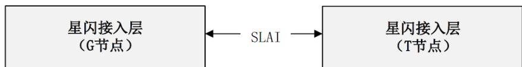

图7 SLAI接口示意

SLAI：星闪接入层关于G节点和T节点之间的接口称为SLAI接口，见图7。

### 7 数据传输架构

#### 7.1 概述

星闪无线通信系统支持星闪设备之间在基础应用层、基础服务层以及星闪接入层层面进行对等协议处理实体间的控制面业务数据或者用户面数据的交互。为此，基础应用层、基础服务层和星闪接入层分别定义了业务流、传输通道以及逻辑信道用于数据传输。通过配置并或更新三者的传输控制参数、业务流与传输通道的映射关系以及传输通道与逻辑信道的映射关系，确保星闪无线通信系统建立的端到端传输管道能够满足数据传输所需要的QoS需求。

在星闪无线通信系统中，使能星闪设备对等协议实体之间进行数据传输的端到端传输管道称为星闪通道。根据通信实体所属的协议层不同，星闪通道的构成会存在差别。以图8为例，基础应用层的星闪通道由业务流、传输通道以及逻辑信道三部分构成，而基础服务层特定功能单元交互所需的星闪通道由传输通道和逻辑信道两部分构成。

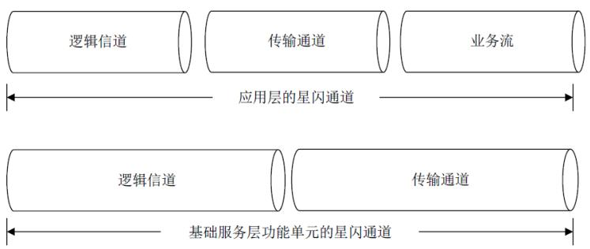

图8 星闪通道示例

#### 7.2 逻辑信道

逻辑信道是星闪接入层传输承载的最小单位，以LCID进行标识。为了实现星闪上层协议栈的控制面交互，星闪无线通信系统定义了一条具备默认QoS参数的逻辑信道（称为默认承载）用于承载相关信令数据，具体参数配置见附录C。在SLE接入层中，“逻辑链路”即为逻辑信道，可包含单播、组播和数据广播等逻辑链路。

#### 7.3 传输通道

##### 7.3.1 基本概念

传输通道由基础服务层的数据传输与适配功能单元定义并维护，用于承载不同星闪设备之间基础应用层或者基础服务层功能单元的数据交互。

传输通道通过传输通道标识（TCID）进行识别，星闪设备基础服务层的连接管理功能单元会为与它连接的同一星闪设备的每一条传输通道在本侧建立并维护唯一的TCID。如图9所示，星闪设备1同时与星闪设备2和星闪设备3进行通信，其中星闪设备1与星闪设备2存在两条传输通道，星闪设备1与星闪设备3存在一条传输通道。

每一对星闪设备间维护独立的 TCID 空间。不同星闪设备针对同一条传输通道的 TCID 可以独立维护，因此星闪无线通信系统允许同一条传输通道在不同星闪设备侧分配不同的 TCID。如图 9，针对同一条传输通道，星闪设备 1 和星闪设备 2 分别为其分配了 TCID15 和 TCID20。

不同星闪设备之间在各自一侧允许复用相同的 TCID。如图 9，星闪设备 2 和星闪设备 3 均使用了 TCID20 标识各自本侧的传输通道。

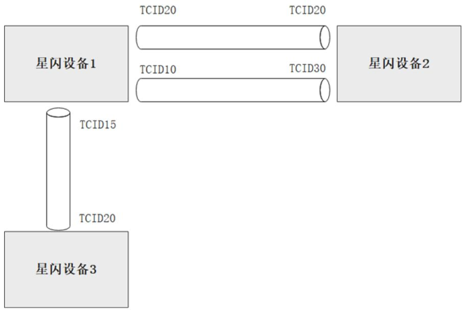

图9传输通道标识TCID示意

传输通道根据维护方式的不同分为和非缺省方式方式两种，具体的：

a) 缺省方式：传输通道使用预先定义好的固定TCID，具备默认的配置参数。数据传输与适配功能单元可以在星闪接入层逻辑链路建立完成后可以自动建立并使用该类传输通道，也可以在星闪接入层逻辑链路释放后自动释放该类传输通道，不要求星闪设备之间必须进行配置信令协商。

注：缺省传输通道的建立和释放流程见 T/XS 20002-2022 的 7.4 节。

b) 非缺省方式：传输通道使用的TCID、传输通道的配置参数以及传输通道的建立与释放等操作，都需要基于连接管理功能单元之间的配置信令协商结果。

传输通道也可根据传输的业务类型进行分类，具体分类方式见表1。

表 1 基于业务类型的传输通道分类

<table><tr><td>传输通道类型</td><td>缩写</td><td>固定TCID</td><td>功能描述</td></tr><tr><td>SLB通用管理传输通道</td><td>SLB-CMTC</td><td>0x01</td><td>适用于星闪设备使用SLB的情形，用于承载星闪设备间连接管理、测量管理、QoS管理等功能单元之间的信令交互。</td></tr><tr><td>SLE通用管理传输通道</td><td>SLE-CMTC</td><td>0x02</td><td>适用于星闪设备使用SLE的情形，用于承载星闪设备间连接管理、测量管理、QoS管理等功能单元之间的信令交互。</td></tr><tr><td>SLB服务管理传输通道</td><td>SLB-SMTC</td><td>0x09</td><td>适用于星闪设备使用SLB的情形，用于承载星闪设备间服务管理功能单元之间的数据交互。</td></tr><tr><td>SLE服务管理传输通道</td><td>SLE-SMTC</td><td>0x0A</td><td>适用于星闪设备使用SLE的情形，用于承载星闪设备间服务管理功能单元之间的数据交互。</td></tr><tr><td>SLB中继服务管理传输通道</td><td>SLB-RSMTC</td><td>0x10</td><td>适用于星闪设备使用SLB的情形,用于不同T节点通过G节点进行服务发现。</td></tr><tr><td>多域协调与管理传输通道</td><td>MDCTC</td><td>0x11</td><td>用于承载星闪设备间多域协调与管理功能单元之间的数据交互。</td></tr><tr><td>5G融合传输通道</td><td>5GITC</td><td>0x12</td><td>用于承载5G融合相关的信令数据交互。</td></tr><tr><td>SLB默认单播数据传输通道</td><td>SLB-DUDTC</td><td>0x1E</td><td>适用于星闪设备使用SLB的情形,用于承载对QoS没有特定要求的用户面数据。传输模式为基础模式。</td></tr><tr><td>SLE默认单播数据传输通道</td><td>SLE-DUDTC</td><td>0x1F</td><td>适用于星闪设备使用SLE的情形,用于承载对QoS没有特定要求的用户面数据。传输模式为基础模式。</td></tr><tr><td>通用控制广播传输通道</td><td>CCBTC</td><td>-</td><td>用于承载星闪设备基础应用层或基础服务层控制类的广播数据。</td></tr><tr><td>专用业务传输通道</td><td>DTTC</td><td>-</td><td>用于承载星闪设备之间的用户面数据,可以是广播、组播或单播业务。</td></tr></table>

注：在本版本文件中，通用控制广播传输通道执行透传即可，无需对数据进行封装并添加携带 TCID 的包头。故无需为通用控制广播传输通道分配固定 TCID。

##### 7.3.2 功能

为了适配不同业务的传输需求，星闪无线通信系统为传输通道定义了四种传输模式：基础模式、透传模式、流模式和可靠模式，每种传输模式的主要特性见表2。从控制面角度，连接管理功能单元负责根据业务的QoS需求为业务数据配置具有匹配传输模式的传输通道；从数据传输角度，数据传输与适配功能单元负责基于被配置的传输模式及相关参数对传输通道内的业务数据执行具体的用户面操作。

表 2 传输通道的传输模式

<table><tr><td>传输模式</td><td>主要特性</td><td>典型应用</td></tr><tr><td>基础模式</td><td>默认的传输模式。发送端不对数据进行重传，数据包的发送无超时丢弃。接收端不对接收数据进行反馈确认。</td><td>用于基础服务层的控制面信令传输</td></tr><tr><td>透传模式</td><td>适用于时延敏感业务，在传输过程中发送端的数据传输与适配功能单元不对数据进行任何缓存、封包、流控等处理，直接将数据传入星闪底层。</td><td>主动降噪业务</td></tr><tr><td>流模式</td><td>适用于具有实时性需求的流业务，采用单向传输。发送端的数据传输与适配功能单元对数据进行超时丢弃操作。接收端不对接收数据进行反馈确认。</td><td>音频流</td></tr><tr><td>可靠模式</td><td>适用于具有高可靠性需求的业务。发送端支持数据重传，接收端支持数据接收后的反馈确认。</td><td>FTP业务</td></tr></table>

为了承载业务数据在不同星闪设备之间进行交互，基础服务层定义了不同的帧格式。具体的，帧格式可以分为基础帧、透传帧、增强帧、测量帧四大类。其中基础帧、透传帧和增强帧主要用于承载星闪设备间基础应用层或基础服务层功能单元的控制面或用户面数据，而测量帧主要用于测量特定传输通道端到端时延以及抖动等性能。增强帧可以进一步细分为单向聚合帧、单向分片帧、双向聚合帧、双向分片帧以及应答帧。测量帧可以进一步分为测量请求帧和测量应答帧。

每种帧格式都有其适用的传输模式，具体对应关系表3。

表 3 传输通道支持的帧格式与传输模式的对应关系

<table><tr><td>传输模式</td><td>可以支持的帧格式</td></tr><tr><td>基础模式</td><td>数据传输: 基础帧;</td></tr><tr><td>透传模式</td><td>数据传输: 透传帧;</td></tr><tr><td>流模式</td><td>数据传输: 单向分片帧、单向聚合帧;传输通道测量: 测量请求帧。</td></tr><tr><td>可靠模式</td><td>数据传输: 单向分片帧、单向聚合帧、双向分片帧、双向聚合帧及应答帧;传输通道测量: 测量请求帧单独使用, 或测量请求帧与测量应答帧联合使用。</td></tr></table>

#### 7.4 业务流

业务流由基础应用层定义并维护，是用于承载业务数据传输的最小单位。业务流通过端口（Port）进行识别，一条业务流在本端和对端使用的端口可以独立维护。一条业务流中的数据通过用户面服务接入节点D-SAP递交给基础服务层。

#### 7.5 映射关系

星闪物理层信息、逻辑信道与基础服务层传输通道的映射关系见图10和图11。

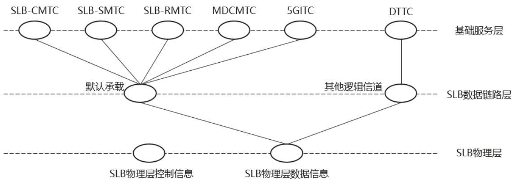

图10传输通道与SLB逻辑信道、物理层信息的映射关系

注：SLB接入层可以建立多条逻辑信道，其中用于承载星闪上层控制信令的逻辑信道为默认承载，其他逻辑信道可以用于承载星闪上层的业务数据。

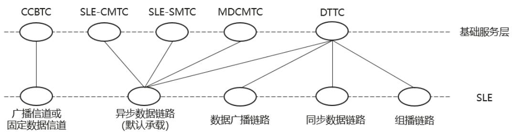

图11 传输通道与SLE逻辑信道的映射关系

基础服务层传输通道与服务接入节点与的映射关系见图12。

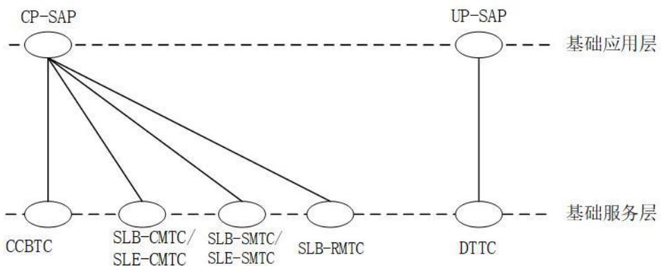

图12服务接入节点与传输通道的映射关系

星闪无线通信系统的端到端映射及各协议层用户面主要操作示例见图13。

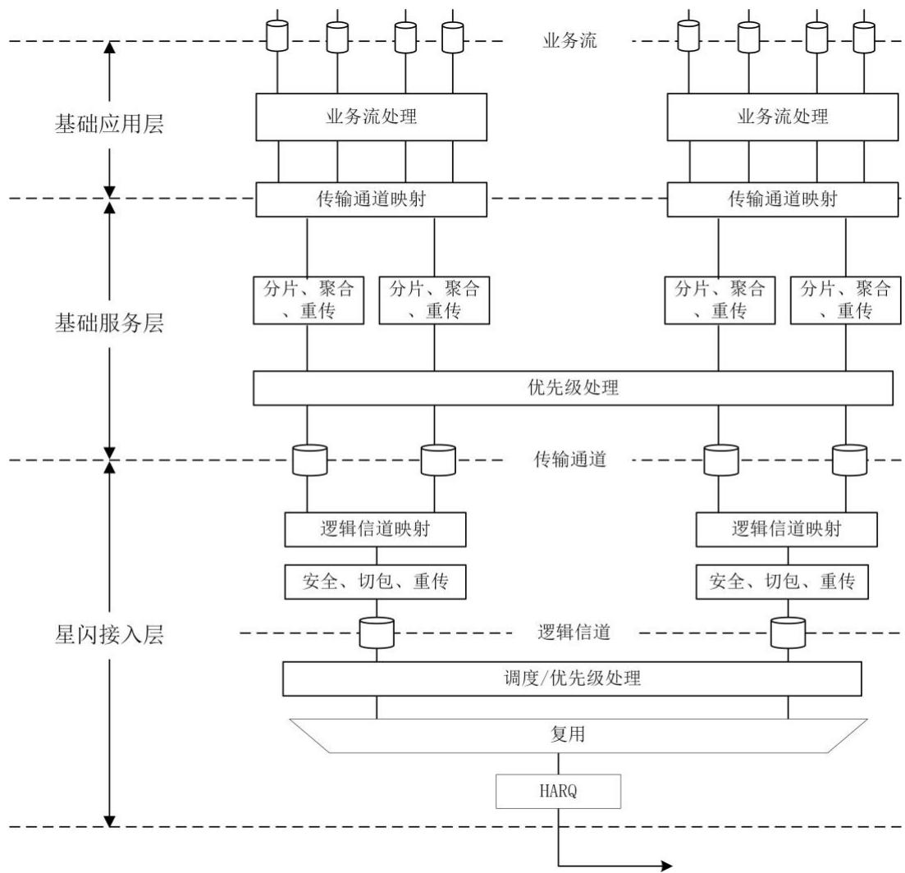

图13 星闪无线系统用户面端到端映射示意

### 8 星闪接入层概述

#### 8.1 星闪同步低时延宽带模式

##### 8.1.1 波形和符号

系统采用CP-OFDM波形传输，物理层时间度量为基本时间单位Ts的倍数，Ts定义为Ts=1/fs，fs=30.72MHz，子载波间隔  $\Delta f = 120\mathrm{kHz}$ 。

CP-OFDM符号在时域上包含循环前缀部分和有效数据部分，有效数据部分长度为256Ts。为了满足不同信道环境、设备类型和应用需求，标准定义了5种符号类型，分别对应5种循环前缀部分的长度。循环前缀部分的长度，以及对应的CP-OFDM符号的长度如下表所示：

表 4 CP-OFDM符号长度

<table><tr><td>符号类型</td><td>一般循环前缀长度</td><td>一般CP-OFDM符号长度切换间隔GAP1</td><td>边界循环前缀长度</td><td>边界CP-OFDM符号长度切换间隔GAP2</td></tr><tr><td>类型一A</td><td>18Ts</td><td>274Ts</td><td>20Ts</td><td>276Ts</td></tr><tr><td>类型一B</td><td>18Ts</td><td>274Ts</td><td>22Ts</td><td>278Ts</td></tr><tr><td>类型二</td><td>39Ts</td><td>295Ts</td><td>44Ts</td><td>300Ts</td></tr><tr><td>类型三</td><td>64Ts</td><td>320Ts</td><td>——</td><td>——</td></tr><tr><td>类型四</td><td>128Ts</td><td>384Ts</td><td>——</td><td>——</td></tr></table>

系统支持派生帧结构和物理资源，即基于派生系数  $\alpha$  ，生成派生的基准频率  $f_{s\_d} = f_s / \alpha = (30.72 / \alpha)MHz$  和派生的基本时间单位  $T_{s\_d} = T_s \times \alpha = (1 / f_s \times \alpha)$ ，其中派生系数  $\alpha$  为有理数。派生帧结构和物理资源与未派生的帧结构和物理资源相比，所有类型的时域资源对应的时间长度为未派生的  $\alpha$  倍，所有类型的频域资源对应的频率带宽为未派生的  $1 / \alpha$ 。

##### 8.1.2 信道和载波

系统支持的工作频段为2.4GHz，5GHz，6GHz，8GHz和Sub1GHz。频段使用应符合所在国家和地区的要求。系统支持在以子载波间隔为120kHz，带宽为20MHz的基础信道为频域资源单元的连续N个基础信道组成的一个信道上工作，其中N为正整数。同时，系统也支持在多个信道上工作，各信道分别由一个或连续多个基础信道组成。基础信道对应的基础载波由连续161个子载波组成，按照对应频率从低到高的顺序依次编号为#0,#1,...,#160，其中#80子载波为中心子载波，不映射任何数据或信号，其余子载波为有效子载波。如下图所示，两个相邻的基础信道（基础信道1和基础信道2）组成一个信道，其中，基础信道1对应的基础载波1和基础信道2对应的基础载波2邻近边缘之间由多个分隔子载波间隔。信道左右边缘各预留部分资源不放置有效子载波。

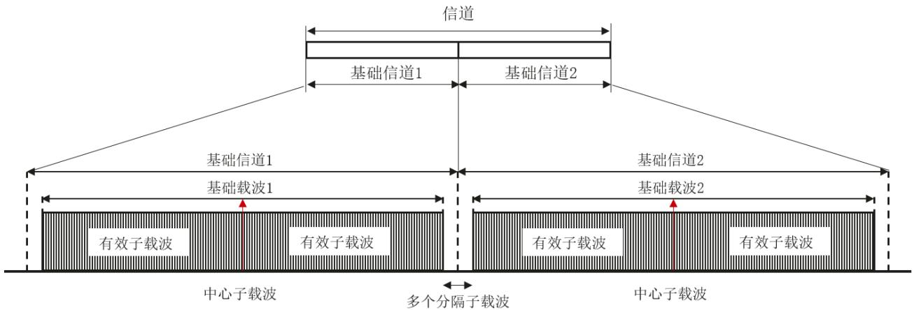

图14 星闪系统信道和载波示意图

##### 8.1.3 超帧和无线帧

一个超帧的时间长度为  $\mathrm{Tf} = 30720 \times \mathrm{Ts}$  。一个超帧中包含8个长度相同的无线帧，按照时间从前到后的顺序依次编号为  $\#0, \#1, \ldots, \#7$  。

不同类型的链路使用无线帧中不同的符号。

SLB接入层采用TDD的方式。通信域中，G链路使用的符号称为G符号，T链路使的符号称为T符号，附链路使用的符号称为A符号。通信域的一个无线帧中的符号可以灵活配置为G符号、T符号、A符号和切换间隔。

直通链路使用的符号称为P符号。直通链路的一个无线帧中的符号可以灵活配置为P符号和切换间隔。

不同符号类型对应的无线帧中符号的个数如下表所示：

表 5 120KHz 子载波无线帧设计

<table><tr><td>符号类型</td><td>无线帧中包含符号的个数，</td></tr><tr><td>类型一A</td><td>14</td></tr><tr><td>类型一B</td><td>14</td></tr><tr><td>类型二</td><td>13</td></tr><tr><td>类型三</td><td>12</td></tr><tr><td>类型四</td><td>10</td></tr></table>

每一个无线帧包含的符号配置如下表所示。

表 6 无线帧符号配置

<table><tr><td>符号类型</td><td>无线帧内符号编号和个数</td><td>一般CP-OFDM符号位置</td><td>边界CP-OFDM符号位置</td></tr><tr><td>类型一A</td><td>#0,#1,#2,…, #13,共14个符号</td><td>#1,#2,…, #6,#8,#9,…, #13</td><td>#0,#7</td></tr><tr><td>类型一B</td><td>#0,#1,#2,…, #13,共14个符号</td><td>#1,#2,…, #13</td><td>#0</td></tr><tr><td>类型二</td><td>#0,#1,#2,…, #12共13个符号</td><td>#1,#2,…, #12</td><td>#0</td></tr><tr><td>类型三</td><td>#0,#1,#2,…, #11共12个符号</td><td>#0,#1,#2,…, #11</td><td>——</td></tr><tr><td>类型四</td><td>#0,#1,#2,…, #9共10个符号</td><td>#0,#1,#2,…, #9</td><td>——</td></tr></table>

##### 8.1.4 空口接入层广播

在连续传输模式下，SLB接入层G节点从#0超帧开始，以8毫秒为周期发送广播信息。

在非连续传输模式下，SLB接入层在每一个COT中，从COT的第一个无线帧开始，以8毫秒为周期发送广播信息，一直到该COT结束。

SLB接入层广播信息的内容包括：传输模式、无线帧号、TTI长度、GCI资源、系统消息资源等。

SLB接入层通过周期的系统消息发送空口的配置信息，包括系统的域名，系统开销的具体资源配置等。系统消息的发送周期和起始时刻可灵活配置。

##### 8.1.5 第一类数据信息传输

第一类数据信息传输为预配置调度传输（包含预配置调度半静态周期传输），调度信息通过高层信令发送，可配置为每个TTI中发送一个或时分的发送多个数据包，每个TTI中的资源配置相同，每个数据包的调制编码方式相同。第一类数据信息使用极化码信道编码，调制方式支持（QPSK、16QAM、64QAM、256QAM、1024QAM、4096QAM）。

##### 8.1.6 第二类数据信息传输

第二类数据信息传输支持预配置调度传输（包含预配置调度半静态周期传输）和动态调度传输。

当第二类数据信息传输采用预配置调度传输时，调度信息通过高层信令发送。此时，第二类数据信息能够以一个或多个TTI为周期传输。其中每个周期在一个TTI中传输一个数据包，每个周期传输的数据包采用TTI中相同的资源配置和相同的调制编码方式。

当第二类数据信息传输采用动态调度传输时，调度信息通过物理层控制信令发送。此时，使用1个调度信息调度一个第二类数据信息的数据包在一个TTI中传输；或者使用两个调度信息分别在不同频率资源上调度两个第二类数据信息的数据包在一个TTI中传输。

第二类数据传输使用极化码作为信道编码，支持基于TB的单比特ACK反馈、基于CB的多比特ACK反馈和基于CB的2级多比特ACK反馈，支持CC重传和IR重传。

##### 8.1.7 共存和多域同步

系统支持通过网络部署保证系统间、多通信域间共存的连续传输模式，也支持通过竞争占用信道实现系统间、多通信域间共存的非连续传输模式。在非连续传输模式下，G节点在时域以1个无线帧为粒度、频域以基础信道为粒度竞争信道。竞争信道成功后，占用竞争到的每个基础信道通信，占用结束后G节点释放信道。不同次占用信道，G节点和T节点之间始终保持定时和频率的同步，无需每次占用信道G节点和T节点重新建立同步关系。

多域同步指的是多个具有相同符号类型的通信域之间保持时间和频率同步，以避免邻频共存时通信域/直通链路间的邻频干扰。G节点通过同步源选择/更新、本域同步调整、域间同步跟踪等操作，可实现多域同步。

##### 8.1.8 灵活带宽

同步低时延宽带通信系统支持灵活带宽，可以基于  $120\mathrm{kHz}$  基础子载波间隔及  $20\mathrm{MHz}$  基础信道带宽按比例派生出更窄或更宽的子载波间隔的系统。另外，对于可用频谱资源比信道带宽更窄的场景，设计了可选的窄带宽模式。

##### 8.1.9 数据链路层

数据链路层支持透传模式，此时基础服务层的数据包不添加数据链路层包头，直接交付给物理层。

数据链路层支持确认模式，此时发送端可以请求对端发送数据包的接收状态信息，发送端根据对端的接收状态对数据包进行重传。

数据链路层支持非确认模式，此时发送端不对数据进行数据链路层重传，接收端按照配置的时间窗口进行数据接收并将接收到的数据链路层SDU向上递交给基础服务层。

##### 8.1.10 定位

SLB支持的定位测量模式包括：

1) RTT测量模式: 基于飞行时间的测量模式, 可在一个无线帧内快速完成双向两信号或双向三信号的测量信号交互。

2）基于双向复合信道的测量模式：根据锚点和标签测量的多频带/多信道的信道状态信息，利用复合信道状态信息解算位置锚点和位置标签的距离。

1) 快速辅助成组定位 (FLAG): 由G节点为多个锚点与多个标签建立测量组, 配置测量组的测量参数, 测量信号以及测量时间差报告, 按照组播地址发送, 实现一对多或多对多高效测量。

支持的测量信号包括：

1) 专用位置测量信号

2）安全位置测量信号

支持的测量类型包括：

1) G节点与T节点的测量；

2) T节点与T节点的测量。

##### 8.1.11 感知

SLB感知测量信号包括感知参考信号和安全感知测量信号。

SLB感知测量支持单站感知、双站感知、多站感知、多种协作感知、代理感知、公共资源感知等测量模式。

SLB感知测量量包括：出发角(AoA)信息，到达角(AoD)信息，基于频率域I路和Q路信息的信道状态信息，基于时间域信道冲击响应的信道状态信息，距离多普勒信息，感知目标信息等。

#### 8.2 星闪同步低功耗模式

##### 8.2.1 传输波形

使用低成本低功耗的GFSK波形。同时，为了满足较高速率传输支持高阶业务，也支持QPSK调制波形和8PSK调制波形。

##### 8.2.2 信道和跳频设计

系统工作频段为  $2400\mathrm{MHz} - 2483.5\mathrm{MHz}$ ， $5150\mathrm{MHz} - 5350\mathrm{MHz}$ ， $5725\mathrm{MHz} - 5850\mathrm{MHz}$ 。系统采用单载波跳频的方法进行数据传输，信道带宽支持  $1\mathrm{MHz}$ ， $2\mathrm{MHz}$  和  $4\mathrm{MHz}$ 。

##### 8.2.3 无线帧结构

支持4种无线帧结构，无线帧结构1采用GFSK波形不进行信道编码。无线帧结构2、无线帧结构3和无线帧结构4采用PSK调制并使用极化码信道编码。无线帧结构2中，控制信息进行码长64的信道编码，使用QPSK进行调制。无线帧结构3中，控制信息进行码长256的信道编码，使用QPSK进行调制。无线帧结构4中，控制信息进行码长256的信道编码，使用BPSK进行调制。

无线帧结构2适用于鼠标类应用，无线帧结构3适用于个域网、智能汽车等常规覆盖的场景，无线帧结构4适用于智能家居、智能制造等对覆盖有要求的扩展覆盖场景。

##### 8.2.4 空口接入层广播

支持基础广播、扩展广播，以及通过扩展广播配置的同步数据广播或者异步数据广播。基础广播、扩展广播，以及配置的同步数据广播和异步数据广播都是无连接广播。

##### 8.2.5 异步数据链路

异步数据链路传输支持数据单播传输、数据组播传输、反馈组播传输、双向组播传输。

异步数据链路用于系统G节点与T节点以及两个T节点间进行可靠传输。在异步数据传输过程中，对于发送端发送的数据包，如果接收端接收错误，发送端需要重传该数据包，直到接收端指示接收正确为止。

##### 8.2.6 同步数据链路

同步数据链路支持数据单播传输、数据组播传输、反馈组播传输、双向组播传输、异步广播传输、同步广播传输。

对于同步数据链路，发送节点的每一个数据包只有有限次发送机会，发送节点只能在有限的时间内重传发送该数据包。数据包重传到一定时间后，发送节点不再重传该数据包。对于单播传输、数据组播传输、反馈组播传输、双向组播传输，接收节点支持给发送节点发送数据包确认信息。

单播传输、数据组播传输、反馈组播传输、双向组播传输通过异步数据链路建立，每一条同步数据链路绑定一条异步数据链路，同步数据链路的参数变更消息由异步数据链路传输。异步数据链路断开时，与之绑定的同步数据链路也相应断开。

异步广播传输、同步广播传输通过扩展广播配置和变更。

##### 8.2.7 半静态资源配置和动态资源调整

异步数据链路和同步数据链路的资源，可以通过高层信令进行半静态配置。同时，在高层信令基础上，还可以通过系统管理帧进行动态的时间资源调整。

##### 8.2.8 数据链路层

数据链路层支持控制面数据和数据面数据的复用传输。

##### 8.2.9 定位

SLE支持的定位测量模式包括：

1）多频点相位测量模式：多频点上双向测量相位，并基于双向测量得到的信道状态信息获取复合信道，计算得到距离或角度。

1) 基于飞行时间（Time of Flight）的测量模式

支持的测量信号包括：

1）测量信号1的调制方式为无相位旋转BPSK，且可以配置为安全类型的测量信号。

2）多音信号（音的个数为  $N = 1$  ，2，4，8）。当  $N = 1$  时，为单音信号。

支持的测量类型包括：

1）G节点与T节点的测量；

1) T节点与T节点的测量。

##### 8.2.10 感知

SLE支持的感知测量模式包括多频点相位测量模式。

SLE感知测量量包括：出发角(AoD)信息，到达角(AoA)信息，基于频率域I路和Q路信息的信道状态信息，基于时间域信道冲击响应的信道状态信息，距离多普勒信息，感知目标信息等。

SLE感知测量支持单站感知、双站感知、多站感知、多种协作感知、代理感知、公共资源感知、非链接感知等测量模式。

#### 8.3 星闪同步高精定位模式

##### 8.3.1 超宽带脉冲波形和调制

超宽带脉冲信号的参考脉冲波形为凯撒Kaiser波形，其表达方式为：

$$
r(t)=\begin{cases}
\dfrac{1}{L}\dfrac{I_{0}\bigl(\beta\sqrt{1-\bigl(\dfrac{2t}{L}\bigr)^2}\bigr)}{I_{0}(\beta)}, & |t|\leq \dfrac{L}{2} \\
0, & |t|>\dfrac{L}{2}
\end{cases}
$$

其中， $I_0$  为第一类零阶修正贝塞尔函数， $\beta = 10$  为决定波形形状的参数。定义  $T_p$  为波形的带宽参数，对于凯撒脉冲波形， $L$  为脉冲持续时间，该值为  $3 \cdot T_p$ 。

针对不同带宽的信号，带宽参数  $T_{p}$  如下表 7 所示

表 7 信号带宽参数  ${T}_{p}$  的值

<table><tr><td>信号带宽</td><td>Tp, 单位 ns</td></tr><tr><td>-10dB 带宽大于等于 500MHz</td><td>2</td></tr><tr><td>-10dB 带宽大于 1300MHz</td><td>0.75</td></tr></table>

超宽带脉冲的时域波形模板如下图 15所示：

时域模板

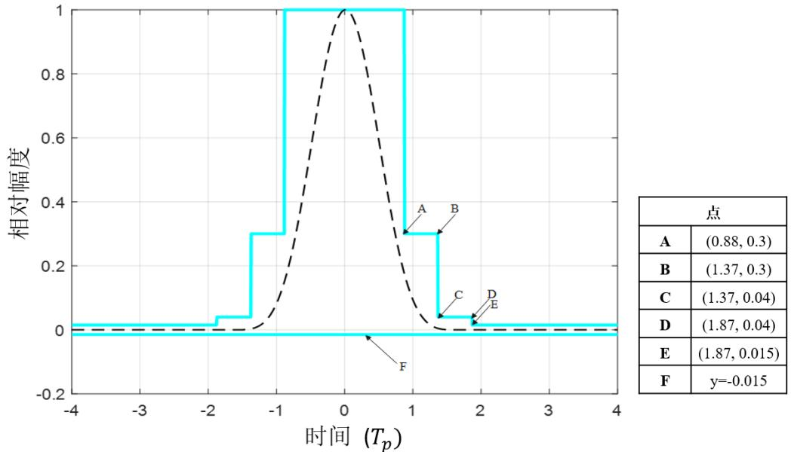

图15 超宽带脉冲时域波形模板

##### 8.3.2 超宽带脉冲测量信号

超宽带脉冲符号支持长度为31、63、91、127和133的码字序列。

##### 8.3.3 超宽带脉冲测量帧

超宽带脉冲测量帧包括同步字段和测量字段。超宽带脉冲测量帧同步字段的格式如下图 16所示：

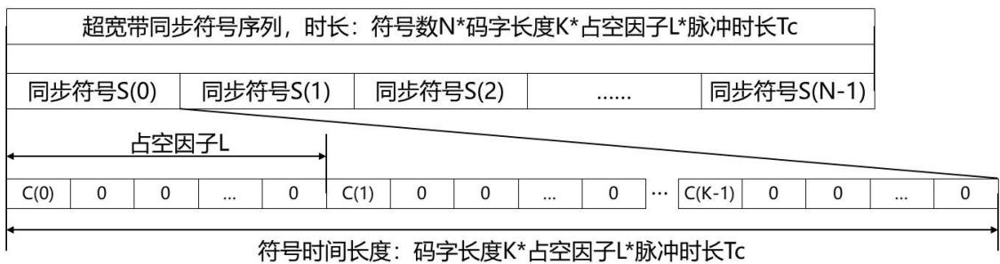

图16 超宽带脉冲测量帧同步字段格式

其中， $S(i)$  为同步字段符号序列，每个符号是一个长度为  $K$  的码字序列，码字序列经过占空比为  $L$  的插零时域扩展后形成同步信号。同步字段重复发送  $N_{sync}$  个相同的符号，个数0代表不发送同步字段。

同步符号的参数  $K$  和  $L$ , 同步符号索引, 以及同步序列的长度  $N_{sync}$  由高层信令配置。

超宽带脉冲测量帧的测量字段由多个测量子片段间隔一定的时间间隔构成，表示如下图 17所示：

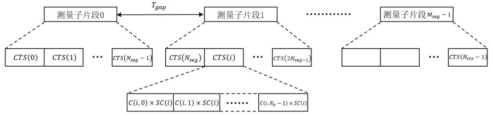

图17 测量字段格式

测量字段包含  $M_{seg}$  个测量子片段，每个测量子片段由  $N_{seg}$  个测量符号CTS组成， $M_{seg}$  和  $N_{seg}$  由高层信令配置。测量字段的测量符号CTS总个数为  $N_{cts} = N_{seg} \times M_{seg}$ ，0代表不发送测距字段。相邻的两个测量子片段之间的时间为  $T_{gap}$ 。超宽带脉冲测量支持普通测量模式和安全测量模式。

##### 8.3.4 定位

SLP支持的定位测量模式包括：

1）双边两消息测量：两个节点中一个节点先发送第一超宽带脉冲测量帧，另外一个节点后发送第二超宽带脉冲测量帧，此时两个节点分别根据对方节点发送的超宽带脉冲测量帧进行测量；

2）双边三消息测量：两个节点中第一个节点先发送第一超宽带脉冲测量帧，然后第二个节点后发送第二超宽带脉冲测量帧，最后第一个节点发送第三超宽带脉冲测量帧，此时两个节点分别根据对方节点发送的超宽带脉冲测量帧进行测量。

超宽带脉冲定位测量量包括：出发角信息AoD，到达角信息AoA，双边两消息的时间测量信息，双边三消息的时间测量信息，基于频率域I路和Q路信息的信道状态信息，基于时间域信道冲击响应的信道状态信息，距离多普勒信息等。

##### 8.3.5 感知

超宽带脉冲感知测量支持单站感知、双站感知、多站感知、多种协作感知、代理感知、非链接感知等测量模式。

超宽带脉冲感知测量量包括：出发角(AoD)信息，到达角(AoA)信息，基于频率域I路和Q路信息的信道状态信息，基于时间域信道冲击响应的信道状态信息，距离多普勒信息，感知目标信息等。

#### 8.4 数据连接接口

##### 8.4.1 数据连接接口传输层

星闪数据连接接口定义了在 UART 接口和 USB 接口上传输 DLI 指令、事件、用户数据的方法。标准不限制其他传输方式，但应确保传输的 DLI 指令、事件、用户数据与标准定义的格式和语义一致。

##### 8.4.2 数据连接接口封装与交互

星闪数据连接接口定义了基础服务层到接入层的指令封装格式、接入层到基础服务层的事件封装格式、异步单播数据封装格式、同步单播数据封装格式、异步组播数据封装格式。

指令包含同步完成指令和异步完成指令两种类型。同步完成指令要求接入层在收到指令的指定时间内，回复指令执行完成事件，并在事件中携带指令执行后的返回参数；异步完成指令要求接入层在收到指令的指定时间内，回复指令执行状态事件，并在指令最终执行完成后，上报特定事件，指示指令异步完成。

事件包含独立上报事件和特定指令的完成事件两种类型。独立上报事件由接入层根据运行状态独立决定是否上报；特定指令的完成事件一般由指令触发，并在指令结束后上报，也可不依赖特定指令的执行而独立上报。

用户数据接口包括异步单播、同步单播、异步组播等封装格式，使用链路标识作为数据的通道标识，支持分段和优先级指示等功能。异步单播数据还支持基础服务层和接入层之间的流量控制。

##### 8.4.3 指令

星闪数据连接接口为SLE和SLB定义了一套统一的指令，指令的分组如下表所示：

表 8 数据连接接口指令分组

<table><tr><td>指令组</td><td>指令组编号</td><td>指令标识</td></tr><tr><td>基本指令</td><td>1</td><td>0x0401~0x07ff</td></tr><tr><td>广播配置指令</td><td>3</td><td>0x0c01~0x0fff</td></tr><tr><td>查询配置指令</td><td>4</td><td>0x1001~0x13ff</td></tr><tr><td>连接指令</td><td>5</td><td>0x1401~0x17ff</td></tr><tr><td>链路控制指令</td><td>6</td><td>0x1801~0x0bfff</td></tr><tr><td>安全指令</td><td>7</td><td>0x1c01~0x1fff</td></tr><tr><td>测量指令</td><td>8</td><td>0x2001~0x23ff</td></tr><tr><td>SLB逻辑信道指令</td><td>9</td><td>0x2401~0x27ff</td></tr><tr><td>测试指令</td><td>62</td><td>0xf801~0xbfff</td></tr><tr><td>厂商自定义指令</td><td>63</td><td>0xfc01~0xffff</td></tr><tr><td>其它</td><td>预留</td><td>预留</td></tr></table>

##### 8.4.4 事件

星闪数据连接接口为SLE和SLB定义了一套统一的事件，事件的分组如下表所示：

表 9 数据连接接口事件分组

<table><tr><td>事件分组</td><td>事件标识</td></tr><tr><td>联盟定义事件</td><td>0x0001~0xbff</td></tr><tr><td>厂商自定义事件</td><td>0xfc01~0xffff</td></tr><tr><td>其它</td><td>预留</td></tr></table>

### 9 星闪基础服务层基本操作

#### 9.1 设备发现

星闪无线通信系统的基础服务层定义了设备发现协议（DDP，Device Discovery Protocol），不同星闪设备通过运行设备发现功能单元的DDP协议可以实现彼此设备信息的发布及扫描感知。星闪设备根据在执行设备发现过程中的角色不同，分为被发现方和发现方两类。具体角色由星闪设备的设备发现主体决定并指示给基础服务层的设备发现功能单元，设备发现功能单元负责该角色对应操作的执行。设备发现的主体包括具备设备发现需求的基础应用层或者基础服务层功能单元。

当星闪设备被设置为被发现方角色时，需要根据基础应用层的要求通过设备发现功能单元公开自身的设备信息，以被其他设备发现。根据信息公开程度的差异，被发现方可能被配置为不可见发现、一般可发现、优先可发现、仅允许被曾配对过的设备发现以及仅允许被指定设备发现这五种可发现等级中的一种。对于被发现方，其公开的自身设备信息可包括可发现等级、设备名称、厂商信息、媒体接入标识、服务信息等等。这些设备信息中的部分信息可以通过星闪接入层的消息承载，其他信息也可通过基础服务层设备发现功能单元发送的消息承载。具体信息的发送方式需要根据设备能力、使用的星闪接入层类型及实现方案确定。

当星闪设备被设置为发现方角色时，需要根据设备发现主体的要求通过设备发现功能单元扫描发现其他设备。具体的，发现方的设备发现主体应向其设备发现功能单元提供过滤条件，以使设备发现功能单元过滤出设备发现需求主体感兴趣的被发现方。设备发现功能单元接收到过滤条件后，可以独立执行过滤，也可以配置星闪接入层进行过滤（如果星闪接入层支持），或者两者结合。

当星闪接入层同时支持多种接入技术（即SLB和SLE）时，设备发现主体应该向设备发现功能单元指示用于设备发现操作的具体星闪接入技术。

#### 9.2 服务管理

##### 9.2.1 概述

服务管理是基础服务层的核心功能单元之一，其可以为基础应用层以及基础服务层提供包括服务注册、维护、删除等在内的设备内部服务管理功能。同时，不同星闪设备通过运行星闪服务交互协议（SSAP，Sparklink Service Access Protocol）还可实现彼此之间的服务发现及交互。

服务管理定义了两种角色，即服务端和客户端。服务端是服务的承载方，接收和响应客户端的请求；客户端是服务的使用方，向服务端提交访问请求，获取并接收服务端返回的响应。

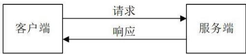

图18 服务管理角色

##### 9.2.2 服务的定义及表达

服务是指服务端公开的一组能力信息或功能集合。一个特定应用、应用原子能力或者基础服务层功能单元所能提供的完整功能可以由一个或多个服务组成。例如一个家庭室内监测应用可以由湿度检测服务和温度检测服务构成。

星闪无线通信系统定义了统一的表达格式来描述各类服务，这种表达格式称为服务结构。服务结构由服务声明、服务引用、属性、方法、事件等结构成员构成，各结构成员的定义见表10。基于服务结

构的表达形式，服务定义的示例见图19。需要注意的是，一个服务的定义表达中必须具备服务声明。

表 10 服务结构中的结构成员定义

<table><tr><td>结构成员</td><td>定义描述</td></tr><tr><td>服务声明</td><td>用于指示服务的最基本信息，包括服务类型、服务标识等。</td></tr><tr><td>服务引用</td><td>用于支持当前服务所引用的一个或几个其他的服务以及服务的类型和句柄范围。当前服务可以继承被引用服务所提供功能。</td></tr><tr><td>属性</td><td>用于描述服务具体功能、状态以及相关的配置信息。客户端通过对属性的访问来实现与服务端的服务交互。</td></tr><tr><td>方法</td><td>用于服务端向客户端提供的访问接口，客户端通过请求服务端的方法完成对应功能的操作。每种方法定义了其所需的输入参数、返回结果的含义和格式。方法一般用来简化多步骤属性访问流程。</td></tr><tr><td>事件</td><td>用于服务端特定情况下触发并由相关服务主动向客户端发送指示信息。事件包含事件类型及关联数据。事件类型包括：设备异常、故障和告警等。</td></tr></table>

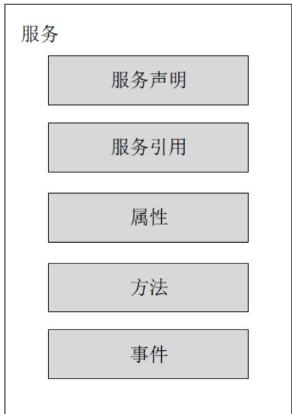

图19 服务通过服务结构定义

每个结构成员的具体信息表达采用统一的数据结构，称为条目。每个条目由句柄、类别，标识，数据、权限和附加信息等元素构成，条目结构的示意图见图20，各元素的定义见表11。其中一条条目中的句柄、类别、标识和数据信息可以被服务端用来与客户端进行交互。权限和附加信息仅由服务端维护，不参与同客户端的交互过程。

<table><tr><td>句柄
(2字节)</td><td>类别
(1字节)</td><td>标识
(2字节或16字节)</td><td>数据
(变长)</td><td>权限
(实现定义)</td><td>附件信息
(实现定义)</td></tr></table>

图20条目定义的数据结构示意

表 11 条目中的元素定义

<table><tr><td>元素</td><td>定义描述</td></tr><tr><td>句柄</td><td>服务端生成的条目的索引号。在一个服务端上的每个条目都具备唯一句柄索引，句柄值不允许重复使用。</td></tr><tr><td>类别</td><td>表示该条目承载数据的类型信息，长度为1字节。示例性的，可以指示条目数据所属的服务结构成员类型、首要服务、次要服务等等。</td></tr><tr><td>标识</td><td>表示该条目描述的具体内容，由通用唯一标识 UUID指示。标准服务或标准服务成员使用16比特通用唯一标识；自定义服务或自定义服务成员使用128比特的通用唯一标识。例如，标识可以指示该条目记录信息的具体内容为湿度、温度等等。</td></tr><tr><td>数据</td><td>指示了与该条目的标识相关联的数据信息。数据字段中又分为操作指示，数据值和描述符。</td></tr><tr><td>权限</td><td>权限是客户端对服务端上的服务结构成员进行访问时，服务端提出的安全层面的要求。只有满足安全要求的客户端才能对服务结构成员进行访问，由服务端进行设置，对客户端不可见。</td></tr><tr><td>附加信息</td><td>作为可选项，用于服务端对相应的条目进行注释，注释内容由实现决定，对客户端不可见。</td></tr></table>

服务按照类型分为首要服务和次要服务，首要服务是可以被服务端直接对外公开的服务。次要服务不能独立对外公开，需要被首要服务引用才可使用。此外，根据标准化的程度，服务还可以被分为星闪标准服务和自定义服务。星闪标准服务是由星闪联盟定义的服务，自定义服务则是由厂商根据实际需求按照服务管理规范自行定制的服务。

服务结构缓存是服务端的服务结构信息保存到客户端本地形成的服务端的服务结构副本。服务结构缓存是一种可选的优化方案，用于避免客户端对同一服务固化的服务端在多次连接时每次都进行服务发现；也可以用于避免客户端连接多个承载相同服务的不同服务端时，对每个服务端都进行服务发现。服务结构缓存对应的是一种服务结构，而不是绑定于一个服务端。多个服务端拥有同样的服务结构时，服务结构缓存对这些服务端均有效。当服务端上的服务结构发生变更时，该服务结构缓存不能适用于变化后的服务端。客户端在使用服务结构缓存时，需保证使用的服务结构缓存对服务端是有效的。服务结构缓存的有效性可以通过比对服务结构散列值和接收服务结构变更事件来验证。

##### 9.2.3 星闪服务交互协议

星闪服务交互协议 SSAP 提供了服务端与客户端之间交互特定服务及其属性信息的信令并定义了交互操作。

SSAP的信令均采用SSAPPDU的格式，SSAPPDU由消息码、消息控制码和属性载荷三部分组成，见表12。根据交互功能的不同，可以将SSAPPDU消息分为七个类别：错误处理、信息交互、服务发现、读取操作、写入操作、通知或指示和方法调用。

表 12 SSAP PDU数据格式

<table><tr><td>SSAP PDU 组成</td><td>大小/字节</td><td>描述</td></tr><tr><td>消息码</td><td>1</td><td>SSAP 消息类别，可以用来表示命令、请求、响应、通知、指示和确认等六种信令类型。</td></tr><tr><td>消息控制码</td><td>1</td><td>SSAP 消息的 Control Flag 指示字节</td></tr><tr><td>属性载荷</td><td>多字节</td><td>消息负载内容</td></tr></table>

在服务端和客户端之间默认通过服务管理传输通道SMTC（见表1）交互SSAPPDU。SMTC作为缺省传输通道，其可以在星闪接入层的默认承载建立后自动激活并进行使用。根据星闪接入层的类型不同，服务管理传输通道可以细分为SLB服务管理传输通道和SLE服务管理传输通道。

#### 9.3 QoS 协商

在星闪无线通信系统中，为了满足业务数据传输的QoS需求，基础服务层需要基于业务传输需求确定传输通道的QoS要求，并基于该要求建立相应的传输通道。QoS功能单元负责QoS要求的确定。具体的，当发送端的基础应用层或基础服务层功能单元有业务数据需要传输时，应将业务类型、端口号、业务关联的QoS参数等信息递交给QoS管理功能单元，发送端QoS管理功能单元基于接收到的参数与对端QoS管理功能单元进行传输所需的QoS参数协商。经过协商，每个对应的业务流（以端口号标识）都会被分配

到一个QoS流，并且获得传输所需的QoS参数。QoS管理功能单元将协商后的QoS参数递交给连接管理功能单元，连接管理功能单元将基于该些参数启动传输通道的建立或更新。

QoS流是QoS管理功能单元对业务数据进行管理的最小单位，以QFI进行标识。QoS管理功能单元可以将多个业务流配置到一个QoS流进行管理。其中，归属于同一个QoS流的业务流数据在传输层面会具备相同的QoS要求。QoS流的划分属于逻辑概念，仅用于QoS管理单元的控制面管理使用，无需在数据传输时增加包头或者类型标识进行用户面的显示标识。从控制面管理的角度，QoS流可以用来做QoS映射关系管理、QoS流监控等工作。

对于星闪5G融合系统来说，QoS管理功能单元可以接收5G融合功能单元从5G网络获取的QoS策略，并使用该策略确定业务传输所需要的QoS要求。此外，当QoS流无法满足传输需求时，QoS管理功能单元还可向5G融合功能单元进行指示，以便5G融合功能单元将该信息传递给5G核心网或本地的网络管理设备。

#### 9.4 连接管理

星闪无线通信系统使用星闪通道来承载不同星闪设备间的数据传输，根据图8所示，星闪通道拆分在基础服务层的承载为传输通道。为了满足基础应用层或基础服务层数据的传输需求，传输通道的建立/维护/重配/释放、传输通道与上下层承载的映射关系等需要进行统一的管理。这些连接管理功能由基础服务层的连接管理功能单元负责，此外连接管理功能单元还负责对端星闪设备的能力查询等功能。

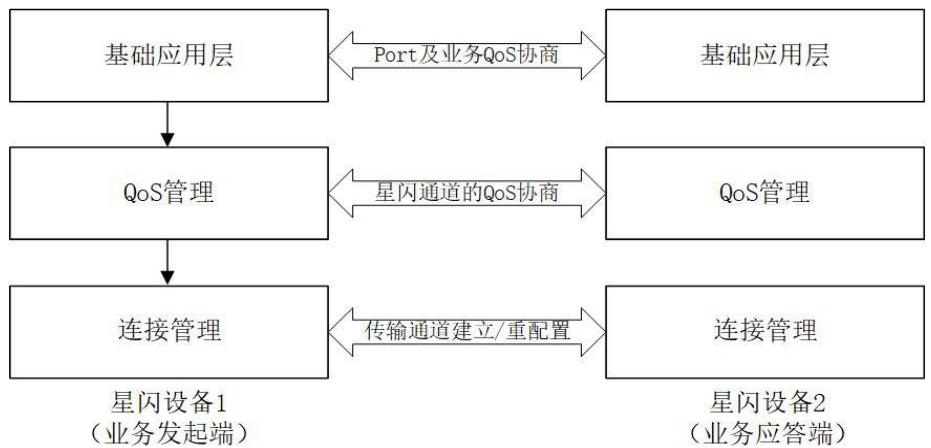

图21 传输通道建立/重配的典型流程示意

注：图21仅适用于非缺省方式的传输通道。

对于用于承载基础应用层数据的传输通道的建立或重配，图21给出了典型流程的示意。在该流程中，通信双方的基础应用层首先针对具体业务流协商通信端口（port）以及业务层面的QoS需求，随后将协商好的信息递交基础服务层的QoS管理功能单元。QoS管理功能单元基于接收到的业务信息协商用于承载该业务流的传输通道QoS需求，随后向连接管理功能单元递交协商结果并指示建立传输通道或更新传输通道与业务流的映射关系。连接管理功能单元基于该信息启动传输通道的建立或重配操作流程。

一般情况下，不同星闪设备之间通过传递传输控制信令或中继控制信令（针对传输通道中继场景）来协商特定传输通道的配置信息。这类信令均通过通用管理传输通道来承载。星闪无线通信系统针对SLB和SLE两种接入层技术，分别定义了SLB通用管理传输通道（SLB-CMTC）和SLE通用管理传输通道（SLE-CMTC），连接管理功能单元需要基于当前使用的星闪接入层技术以及基础应用层指示信息选择合适的通用管理传输通道进行信令交互。在这种通过信令协商确定传输通道配置信息的情况中，星闪设备的连接管理功能单元必须在完成与对端星闪设备的信令交互后才可以对指定的传输通道进行操作。

为了减少信令交互并提升通信效率，除了通过信令协商的方式来管理传输通道外，星闪无线通信系统还支持使用缺省方式来建立或释放传输通道。缺省方式的传输通道具有如下特点：采用固定传输通道

标识并具备默认的配置参数，可以在星闪接入层默认承载建立完成后直接激活并使用，并可在星闪接入层链路释放后自动释放，不要求星闪设备间进行传输控制信令的交互。使用缺省方式建立或释放的传输通道一般用于承载基础服务层各类功能单元的控制信令数据。典型的，SLB-CMTC和SLE-CMTC均可使用缺省方式建立或释放。

在本版本文件中，基础服务层可以提供针对单播类业务和广播类业务的连接管理服务。

针对同时支持SLB和SLE的星闪设备，基础服务层可为特定业务流提供基于SLB和SLE的融合传输服务。融合传输具体包括的操作：同时使用SLB逻辑信道和SLE逻辑信道为同一条传输通道中的数据进行冗余传输或分流传输、将一条传输通道对应星闪接入层技术从SLB切换到SLE或从SLE切换到SLB。针对融合传输，如果一个传输通道被映射到多个逻辑通道，每个逻辑信道都应归属于不同的星闪接入层实体。星闪设备内的一个业务传输通道不应与该星闪设备同一个接入层实体（例如SLB实体或SLE实体）的不同逻辑信道同时建立映射关系。

基础服务层还支持不同的T节点之间通过G节点进行传输通道中继通信。具体的，G节点的基础服务层可以为两个星闪接入层均为T节点身份的星闪设备提供数据转发服务，从而实现两个T节点的上层业务交互。具体介绍见第12章。

#### 9.5 测量管理

在星闪无线通信系统中，测量管理功能单元统一负责了基础服务层以及星闪接入层相关性能参数的测量以及状态监控。针对星闪接入层，测量功能单元通过跨层原语调用可以支持采集包括RSRP、RSSI、RSRQ、SINR、误码率、收发速率、AoA、AoD、ToF等在内的物理层参数信息。针对基础服务层流模式或可靠模式下的传输通道，测量功能单元支持测量端到端时延、抖动等性能指标测量。

为了使能星闪无线通信系统能够基于当前性能状态进行业务或传输策略调整，测量功能单元为其他功能单元（如QoS管理功能单元、5G融合功能单元等）或授权应用提供了统一的测量服务接口。允许相应功能单元或授权应用向测量管理功能单元提供期望测量的配置信息并对测量结果进行查询。

针对星闪接入层的物理层参数，测量功能单元可通过跨层原语交互的方式触发并获取。本版标准支持的跨层原语包括物理层参数查询请求、物理层参数上报、物理层参数查询取消以及物理层参数查询取消确认等。

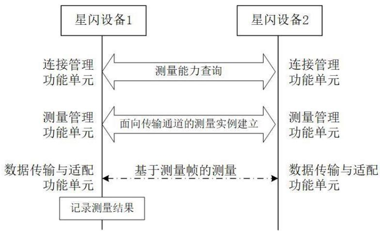

图22 端到端传输通道性能测量各功能单元交互示意图

针对基础服务层传输通道的性能测量流程概述见图22。本文件支持基于测量帧的传输通道测量，该测量能力属于可选能力。本端星闪设备与对端星闪设备需先通过连接管理功能单元提供的连接管理能力查询请求信令和连接管理能力查询回复信令确认测量能力。

当确定对端星闪设备具备测量能力，本端星闪设备的测量管理功能单元通过在通用管理传输通道上与对端交互测量管理信令确定测量实例的配置并建立相关测量实例。每一个测量实例对应于一组面

向特定传输通道的测量项。通过测量管理信令确定的配置信息包括目标传输通道标识、测量模式（单向测量或双向测量）、同步时钟源类型等。

在成功完成测量实例的建立后，本端或对端测量管理功能单元将触发同端传输与适配单元发送测量请求帧，开始进行端到端传输通道性能测量。测量管理功能单元记录测量结果，并可以被其他功能单元或者授权应用进行调用。

### 10 多域协调与管理

多域协调与管理是星闪无线通信系统基础服务层为G节点提供的一项服务功能，用于相邻G节点针对通信域的资源使用进行协调或管理交互，实现资源管理、干扰协调等目的。同时，也可以用于多个通信域的协同工作，例如进行联合测距等。

多个支持多域协调与管理功能的G节点可以组成多域组。多域协调与管理按照工作模式的不同，分为管理模式和非管理模式。具体的：

a) 管理模式：管理模式适用于同一个多域组内的多个G节点之间。多域组内的G节点间存在从属关系，分为多域管理节点和多域成员节点。多域管理节点具备对多域成员节点的控制管理功能，多域成员节点严格服从多域管理节点的管理。多域成员节点如果无法执行多域管理节点的信令，应及时向多域管理节点进行反馈。

b) 非管理模式：G节点之间不存在严格的从属关系，通过协商或者建议的方式进行多域信息的协调。不要求其中一方严格服从另一方的控制管理。

对于支持多域协调与管理功能的 G 节点来说，必须支持非管理模式，可选支持管理模式。

为了实现多域协调与管理，G节点需要执行多域设备发现，多域设备连接、多域服务发现、多域信令交互等主要步骤。

多域设备发现主要用于广播自身设备信息或者扫描发现周围的邻居G节点。当G节点开启多域协调与管理功能，并且星闪接入层以G节点身份广播设备信息时（此时，对应的设备发现角色为被发现方），宜尽量携带可以显式指示其具备多域协调与管理功能的设备信息。例如，当G节点使用SLB时，可以通过domainName（域名）的适当取名来指示；当G节点使用SLE时，可以通过多域协调与管理的服务标识（UUID）来指示。当G节点决定扫描周围G节点的设备信息时（此时，对应的设备发现角色为发现方），星闪接入层应使用T节点身份。标准定义了扫描冲突解决模式来避免因相邻G节点同时在星闪接入层使用T节点身份扫描而引发多域设备发现失败。

多域设备连接遵循星闪无线通信系统通用的连接管理操作。设备之间的连接建立应由发起方的多域协调与管理功能单元触发，并由连接管理功能单元执行。

多域服务发现被相邻G节点用来确认对端是否支持多域协调与管理服务、交互多域能力以及确定多域协调与管理模式。根据多域服务发现的角色不同，G节点可以分为客户端G节点和服务端G节点。对于支多域协调与管理的G节点，当作为服务端G节点时应按照多域协调与管理服务结构定义服务。多域协调与管理服务属于星闪标准服务。多域服务发现分为非管理模式下的多域服务发现和管理模式下的多域服务发现。对于非管理模式下的多域服务发现，G节点之间可以执行多域能力交互确认彼此的设备能力、多域服务能力以及设备信息等。对于管理模式下的多域服务发现，除了上述信息的交互，G节点之间还需要通过协商确认出由哪方担任多域管理节点。

经过多域服务发现并确认出多域协调与管理模式和角色后，G节点之间可以通过交互多域协调与管理信令的方式来执行多个通信域的具体协商和管理操作。对于非管理模式下的本端G节点，可以将自身使用的星闪接入层技术类型、以及对应的载波信道和半静态资源信息告知给对端G节点，用于干扰协调等目的。此外，本端G节点还可以向对端G节点发送邻区扫描指示信息，用于辅助对端G节点的多域设备发现。由于处于非管理模式，对端G节点是否按照本端G节点的指示进行后续操作将留给

实现决定。对于管理模式，多域管理节点可以为多域成员节点配置可用载波信道以及不同载波信道上的半静态资源，最终实现资源管理和干扰协调的目的。多域成员节点应严格按照多域管理节点的配置信息进行资源配置。为了让多域管理节点更好的获知多域成员节点对应通信域的资源使用情况，多域成员节点可以向多域管理节点发送通信域资源报告消息，上报当前使用的载波信道、半静态资源以及业务等信息。多域管理节点和多域成员节点之间也可以执行邻区扫描信息的交互，辅助对端进行多域设备发现或指示对端将扫描结果反馈给本端。此外，管理模式下的多域管理节点和多域成员节点之间还支持联合测距功能。

### 11 5G融合

#### 11.1 概述

星闪无线通信系统和5G蜂窝网构成的整体网络系统简称为星闪5G融合系统。星闪5G融合系统即可以保证短距通信的微秒级时延、高可靠、精同步、多并发、抗干扰等特性，同时借助5G核心网可以实现对其覆盖下的星闪无线通信网络进行统一的网络管理和状态监控，对于包括工业现场网在内的众多应用场景的无线化及灵活部署具有突出的产业意义。

根据星闪无线通信系统和5G蜂窝网之间交互所涉及的网元类型及功能不同，整体系统可分为类型一、类型二和类型三。三种类型的典型特征如下：

a) 类型一：5G核心网支持对星闪无线通信系统覆盖下G节点和T节点进行设备感知和交互。其中，T节点的5G融合功能单元具备NAS功能，G节点为可信管理节点且具备5G融合功能单元。

b) 类型二：5G核心网仅支持对星闪无线通信系统覆盖下G节点进行设备感知和交互。其中，G节点为可信管理节点且具备5G融合功能单元。

c) 类型三：5G核心网支持对星闪无线通信系统覆盖下G节点和T节点进行设备感知和交互。其中，T节点的5G融合功能单元不具备NAS功能，G节点为可信管理节点且具备5G融合功能单元，T节点通过可信星闪接入网关接入5G网络。

本版本文件重点对类型一和类型二的星闪5G融合系统进行了规范。

从控制面角度，5G核心网根据能力不同，可以仅管理其覆盖下的T节点和G节点之间的短距通信；也可以管理其覆盖下的T节点或G节点与5G核心网之间的远端通信。对于5G核心网仅管理短距通信的场景，5G核心网根据星闪5G融合系统类型，可支持对T节点和/或G节点进行身份鉴权、注册、QoS策略管理和状态监控等操作。对于5G核心网还可以管理T节点或G节点与5G核心网之间远端通信的场景，5G核心网还可以支持会话管理功能。

#### 11.2 星闪5G融合系统类型一

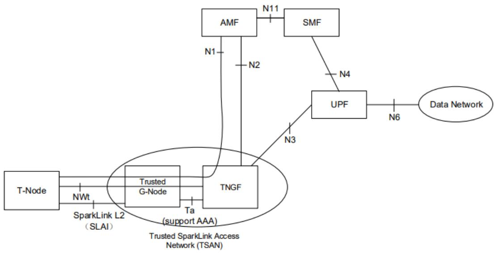

图23 星闪5G融合类型一的网络架构示意

星闪5G融合系统类型一架构见图23，其涉及的主要网元及功能如下：

- T节点：星闪无线通信系统中的终端节点，其基础服务层具备5G融合功能单元且5G融合功能单元支持NAS功能。

- G节点：类型一下的G节点为可信管理节点，其基础服务层具备5G融合功能单元。

- TNGF: 类型一下的可信非 3GPP 网关节点, 主要负责星闪短距与 5G 核心网之间的信息转发。

星闪5G融合系统类型一的主要网络接口定义如下：

- SLAI: T节点与可信G节点之间的接口，承载星闪无线通信系统空口的控制面和用户面数据。

- NWt: T节点与TNGF之间的接口，T节点与TNGF之间的控制面和用户面数据交互均承载在NWt接口上。

- Ta：可信G节点与TNGF之间的接口，支持AAA协议，承载EAP-5G业务。

#### 11.3 星闪5G融合系统类型二

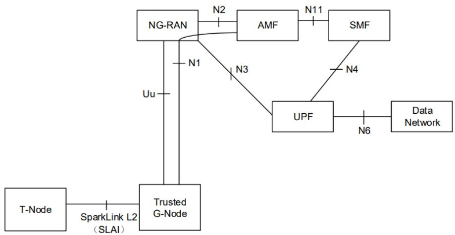

图24 星闪5G融合类型二的网络架构示意图

星闪5G融合系统类型二架构见图24，其涉及的主要网元及功能如下：

- T节点：星闪无线通信系统中的终端节点，其基础服务层不支持NAS功能。

- G节点：类型二下的G节点为可信管理节点，其基础服务层具备5G融合功能单元，通过蜂窝空口（Uu）接入5G蜂窝网络。

星闪5G融合系统类型二的主要网络接口定义如下：

- SLAI: T节点与可信G节点之间的接口，承载星闪无线通信系统空口的控制面和用户面数据。

#### 11.4 5G融合功能单元

针对星闪5G融合系统类型一和类型二，5G核心网可为其覆盖下的一个或多个星闪无线通信网络提供统一的网络管理服务，其中每个星闪无线通信网络包含至少一个可信G节点和若干T节点。为了使能5G核心网为星闪无线通信网络下的T节点或可信G节点提供注册、身份认证、QoS策略管理和传输状态管理等网络管理服务，星闪5G融合系统在星闪通信设备的基础服务层定义了5G融合功能单元用于执行相关控制面操作。

从功能角度，5G融合功能单元一方面负责所属星闪通信设备与星闪5G融合系统中的其他网元的控制面交互，另一方面也负责与所属星闪通信设备内的其他功能单元进行5G融合相关的操作交互（例如，将5G核心网配置的QoS策略推送给QoS管理功能单元，或触发测量功能单元执行5G融合所需的测量）。

#### 11.5 5G融合功能操作

在星闪5G融合系统中，T节点为了获取5G融合服务，首先要选择支持5G融合服务的可信G节点进行接入。T节点通过对周围G节点进行服务发现来实现该目的。对于一个支持5G融合服务的G节点，T节点通过服务发现操作可以获得该G节点支持的PLMN、移动运营商核心网连接类型、回传类型等信息。T节点将扫描到的携带有感兴趣的PLMN以及移动运营商核心网连接类型信息的G节点作为候选可信G节点。T节点将所有候选可信G节点排序后从中选择出优先级最高的G节点作为可信G节点。

当T节点接入到可信G节点后，根据星闪5G融合系统类型的不同，T节点可以进行注册/去注册（仅适用于类型一）、会话建立/修改/释放、QoS策略管理、状态管理等操作。

### 12 传输通道中继

传输通道中继功能支持T节点与T节点之间通过G节点的数据转发形式实现通信。数据转发由G节点基础服务层的数据与传输适配功能单元完成，见图25。

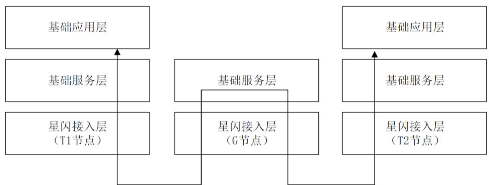

图25 传输通道中继的数据转发示意图

中继能力属于星闪设备的可选能力。当T1节点希望通过G节点与T2节点进行传输通道中继通信时，T1节点应先通过连接管理能力查询相关信令确认G节点支持中继能力。

当T1节点确认G节点支持中继能力后，需通过G节点与T2节点进行中继服务发现相关交互。中

继服务发现涉及的信令数据需要基于SLB中继服务管理传输通道以及中继服务管理帧进行传输。经过中继服务发现，T1节点和T2节点的基础应用层可以获得彼此通信所需的端口、业务、QoS需求相关信息。进一步的，基于这些参数信息，T1节点、G节和T2节点基础服务层的连接管理功能单元通过中继控制信令的交互可以建立T1节点与T2节点之间用于中继业务数据传输的中继业务传输通道。

每条中继业务传输通道由两条子中继业务传输通道构成，分别用于承载T1节点和G节点、G节点和T2节点之间的中继业务数据，见图26。为了实现中继业务数据的转发，G节的连接管理功能单元在通过中继控制信令建立T1和T2之间的中继业务传输通道后，应生成并维护传输通道映射关系表，映射关系表中到的每一项记录包括T1节点的媒体接入层标识、T2节点的媒体接入层标识、TCIDx、TCIDy、TCIDI、TCIDj。

图26中继业务传输通道示意图

在中继业务数据传输过程中，G节点接收到T1节点通过子中继业务传输通道1发送的PDU1后（对应数据帧包头封装TCIDy），G节点根据传输通道映射关系表将TCIDy替换成TCIDj生成PDU2（必要时还需重新计算CRC）并将其转发给T2节点。

### 13 QoS

星闪无线通信系统定义了星闪 QoS 参数，以 SLQI 为标识。SLQI 可以具体索引到一套包括资源类型、默认优先级、时延、丢包率、突发数据量大小、平均窗口等项目在内 QoS 配置参数。以 SLQI 可以表达的 QoS 参数成为基本 QoS 参数。为了适配更多业务特征，星闪无线通信系统还定义了扩展 QoS 参数，扩展 QoS 参数可以包括发送周期、数据大小等参数。

星闪无线通信系统的端到端QoS模型见图27。

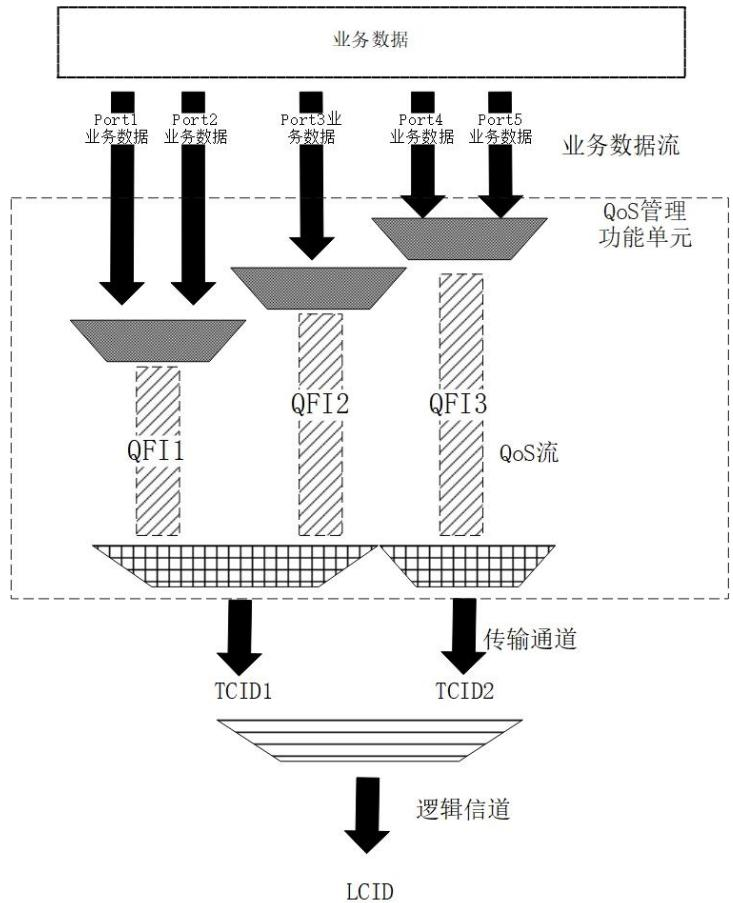

图27QoS模型示意

从控制面的角度，星闪无线通信系统需要维护的承载映射关系包括：

业务流与QoS流的映射关系；

- QoS流与传输通道的映射关系；

- 传输通道与逻辑信道的映射关系。

其中，业务与 QoS 流之间的映射关系以及 QoS 流与传输通道的映射关系均由 QoS 管理功能单元进行维护，且 QoS 流仅为用于 QoS 管理的逻辑概念，不参与实际用户面传输的具体流程。因此，从用户面的角度星闪无线通信系统需要维护的承载映射关系包括：

业务流与传输通道的映射关系；

- 传输通道与逻辑信道的映射关系。

### 14 安全

星闪接入层为星闪上层提供的SLB和SLE两种通信接口为上层提供了相应的接入层安全机制。SLB信息安全定义了星闪设备间SLB安全通信所需的信息安全特征，如认证凭证配置、双向认证、安全上下文协商和更新、传输数据信息安全保护、隐私保护等，提供了强认证鉴权和高信息安全的传输安全保护。同时，SLB信息安全还定义了企业场景的安全认证流程，包括EAP认证、证书认证和自定义认证的方式。SLE信息安全定义了星闪设备间SLE安全通信所需的信息安全特征，如配对和鉴权、加密管理、隐私管理、加解密等，提供了数字比较、免输入、通行码输入、口令验证、带外方式和预配置密钥PSK等6种配对和鉴权方式。SLB和SLE支持定位和感知能力。SLB和SLE的定位技术支持物理层安全机制，基于随机参数产生测量波形，防止测量信号被伪造和非法用户接受测量信号。SLB和

SLE感知技术可以在多天线场景下对感知信号进行加扰，防止非法用户窃听。星闪接入层还定义了超宽带脉冲测量的安全机制，包括超宽带脉冲测量的密钥派生、测量子片段间隔随机生成、加扰序列生成等。

星闪基础服务层的安全管理功能提供基础服务层的信息安全服务功能，包括安全连接管理、安全状态管理、授权管理、5G融合安全管理等服务功能。安全连接管理为应用层提供建立安全连接、取消安全连接、安全连接状态查询和安全连接状态通知等服务。安全状态管理为应用层提供安全状态查询和安全状态通知等服务。授权管理提供基础服务层授权管理和基础应用层授权管理等服务。5G融合安全管理为星闪和5G蜂窝网融合场景提供安全服务，为支持5G融合业务的T节点和G节点定义了三类PSK：非可信5G-PSK；可信5G-PSK；普通PSK，同时也明确了该三类PSK的使用原则。G节点和T节点进行业务时需根据PSK类型确定该连接的业务范围。

为保证应用层端到端的传输安全，星闪安全为应用层传输安全机制提供了参考和建议，以保障端到端的应用层传输安全。针对基于IP的传输，星闪设备宜支持TLS/TLCP协议；针对基于Non-IP的传输，星闪设备使用的应用层传输安全机制由具体应用实现。

为提高星闪无线通信系统抵抗攻击的能力，星闪设备应满足设备安全要求。设备安全要求包括硬件安全、软件安全、通信安全、数据安全和安全管理等方面。

### 15 网络功能

星闪网络功能位于星闪基础服务层，定义了包括拓扑配置协议、无线邻居协议、多跳组网安全、无线网络协议、路由协议、网络服务发现与访问、网络错误与诊断、网络节能等内容。

星闪网络功能技术栈架构如下图所示。在具体的实施中，涉及的协议或功能可以选择性的部署或实现。

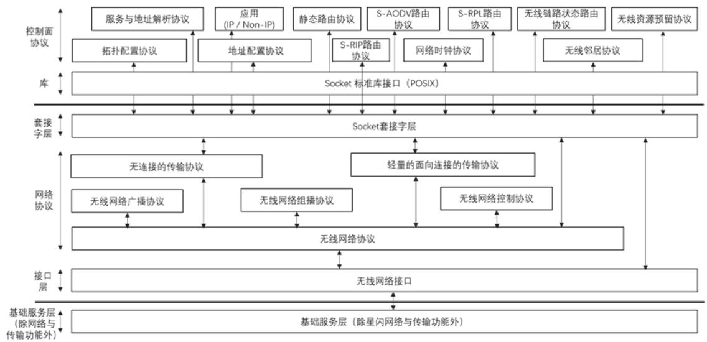

图28 星闪网络功能技术栈架构

星闪网络功能技术栈架构概述如下：

- 无线网络接口：星闪接入层实体（如SLB/SLE等）在网络功能的IO操作对象，通过该接口进行报文收发，以及对接入层实体状态、属性、统计值（如收发报文量等）进行读写。

- 无线网络协议：定义了星闪网络报文格式、网络地址分配、多跳转发机制、网络安全功能（认证&加密）等。

- 无线网络广播协议：定义了星闪网络广播机制，支持可靠性广播协议和非可靠性广播协议。

- 无线网络组播协议：定义了星闪网络组播机制，支持可靠性组播协议和非可靠性组播协议。

- 无线网络控制协议：用于在星闪网络节点间传递控制消息，测量/诊断网络可达性、丢包、时延等，以及实现部分网络控制功能，如路由控制。

- 拓扑配置协议：定义了星闪网络拓扑动态构建的流程。用于待入网节点发现网络、接入网络。

- 无线邻居协议：定义了星闪网络设备间的邻居动态发现，以及维护设备邻居关系。无线邻居协议用于发现和管理邻居节点。

- Address Configuration Protocol/地址配置协议：定义星闪网络地址动态分配协议。

- 多种路由协议，包括静态路由协议，星闪无线自组网按需距离矢量路由协议（S-AODV Routing Protocol），星闪低功耗及有损网络路由协议（S-RPL Routing Protocol），星闪链路状态路由协议

- 无线资源预留协议：按需为业务计算满足其QoS要求的端到端转发路径，比如保证带宽路径、低时延路径等。需要基于链路状态协议工作。

- 服务与地址解析协议：管理服务名/服务UUID与星闪网络地址映射关系，提供查询服务的网络地址信息能力。

对于一个网络节点，执行以下的步骤来完成多跳组网，实现数据传输：

（1）发现网络；

(2) 加入网络，建立网络邻居，获取网络秘钥；

（3）获取网络地址；

（4）生成路由表；

（5）完成服务发现和服务访问；

（6）传输业务流量。

### 16 传输功能

星闪传输功能接收星闪应用层向下递交的应用的数据，封装传输功能报文头，并向下递交给传输承载通道。星闪传输功能支持无连接的非可靠传输模式（CLTP）和面向连接的可靠传输模式（LWCTP）。传输承载的通道支持由星闪网络功能生成的多跳路径，也可以支持基础服务层传输与适配功能生成的传输通道。

星闪传输功能通过端口号区分不同应用，源端口号指示本设备的源应用，目的端口号指示对端设备的目的应用。其中，LWCTP还通过发送序列号与确认序列号，支持源应用和目的应用间的可靠传输。

LWCTP支持完整的连接状态切换和生命周期控制，数据传输的一个完整生命周期，分为传输开始、传输数据、传输结束三个阶段，如下图所示。

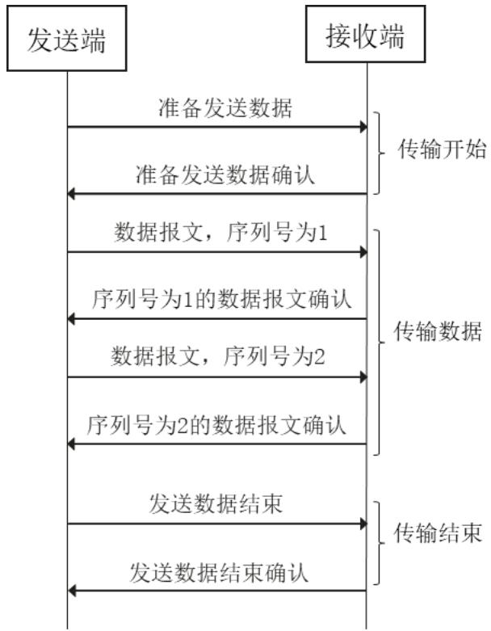

图29面向连接的传输流程的生命周期

LWCTP对传输的两个方向解耦，每一个方向都可按需启动和结束数据传输，以实现单工或全双工通信。

LWCTP支持延迟确认与合并确认，批量传输数据时，接收端可分配缓存区资源，对接收的报文进行顺序缓存。接收端可以在延时一定时间，对接收的报文进行确认，确认序列号填写已接收的连续报文的序列号的最大值。

LWCTP 支持流量控制和过载控制，接收端将接收窗口通告发送端使发送端调整发送速率或暂停传输。

### 17 基础应用层

基础应用层可分为音(音频)、视(视频)、控(控制)、数(数传)、定(定位)5类。

#### 17.1 音频标准

##### 音频应用标准

音频流配置与传输管理

### 17 基础应用层

#### 17.1 音频标准

##### 音频应用标准

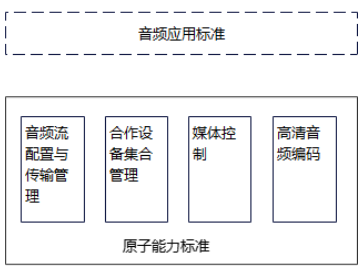

图30音频标准架构

音频标准架构如上图所示，其中已标准化的音频相关原子能力标准及其内容如下：

音频流配置与传输管理，定义单播、组播、广播等音频传输方式；码流格式；多音频通道音频流的分发和混音。

合作设备集合管理，提供将多个功能与状态相同的设备视为一个合作设备集合进行管理的能力。定义了合作设备集合的组建、发现、连接、移除的功能。合作设备集合在其他类型应用也有使用。

媒体控制，定义了媒体播放、媒体浏览、音量调整等控制面功能。

高清音频编码，定义了L2HC高清音频编码。

#### 17.2 视频标准

##### 视频应用标准

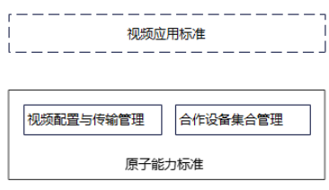

图31 视频标准架构

视频标准架构如上图所示，其中已标准化的视频相关原子能力标准以及内容如下：

视频流配置与传输管理：定义单播、组播的视频传输方式，视频编码以及封装格式。

合作设备集合管理：提供将多个功能与状态相同的设备视为一个合作设备集合进行管理的能力。定义了合作设备集合的组建、发现、连接、移除的功能。

#### 17.3 控制类标准

在本节中，以人机交互标准为例进行介绍。

##### USB HID应用配置和管理

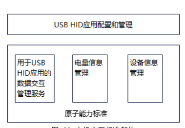

图32 人机交互标准架构

人机交互标准的架构如上图所示，其中已标准化的人机交互标准以及内容如下：

USB HID 应用配置和管理，是人机交互的应用标准，定义了对原子能力标准相关服务的配置和数据传输的要求。

用于USB HID应用的数据交互管理服务，定义星闪以无线方式模拟USB HID设备和主机，通过服务管理呈现功能及使用SSAP传输USB HID数据。

电量信息管理服务，定义电量信息。

设备信息管理服务，定义设备信息，包括设备的厂商、型号、版本、外观等信息。

#### 17.4 数传类标准

##### 数传类应用标准

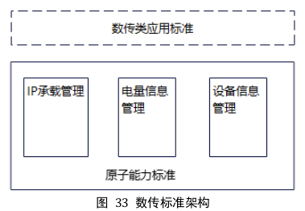

图33 数传标准架构

数传标准的架构如上图所示，其中已标准化的数传相关原子能力标准以及内容如下：

IP承载管理，定义IP报文在星闪IP网关和节点的转发流程和数据传输要求。

电量信息管理服务，定义电量信息。

设备信息管理服务，定义设备信息，包括设备的厂商、型号、版本、外观等信息。

#### 17.5 定位类标准

在本节中，以数字车钥匙标准为例进行介绍。

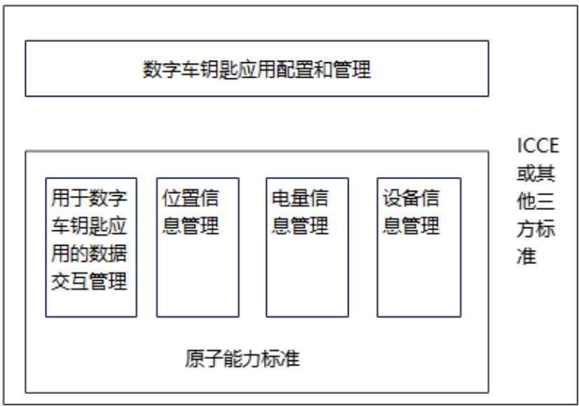

图34数字车钥匙标准架构

数字车钥匙标准的架构如上图所示，星闪数字车钥匙标准需要与ICCE或其他三方标准配合工作。其中，星闪已标准化的数字车钥匙相关标准以及内容如下：

数字车钥匙应用配置和管理为应用标准，定义了对数字车钥匙场景下各角色与行为，原子能力标准相关服务的配置和数据传输的要求。

用于数字车钥匙应用的数据交互管理，定义了对接 ICCE 标准体系的数据传输接口

位置信息管理，定义了参与位置测量和解算的各角色、行为及一般交互流程。

电量信息管理服务，定义电量信息。

设备信息管理服务，定义设备信息，包括设备的厂商、型号、版本、外观等信息。

#### 附录A

#### （规范性）

#### AID分配列表

表A.1 AID分配

<table><tr><td>AID(12比特)</td><td>内容类型</td></tr><tr><td>0</td><td>主动降噪</td></tr><tr><td>1</td><td>车内通话</td></tr><tr><td>2</td><td>车载音频播放</td></tr><tr><td>3</td><td>车载免提</td></tr><tr><td>4</td><td>流媒体后视镜</td></tr><tr><td>5</td><td>360环视</td></tr><tr><td>6</td><td>终端车机交互式投屏</td></tr><tr><td>7</td><td>智能钥匙</td></tr><tr><td>8</td><td>胎压监测</td></tr><tr><td>9</td><td>配置信息刷新</td></tr><tr><td>10</td><td>移动终端数据传输</td></tr><tr><td>11-2047</td><td>基础应用层预留值</td></tr><tr><td>2048</td><td>基础服务层通用管理</td></tr><tr><td>2049</td><td>基础服务层服务管理</td></tr><tr><td>2050</td><td>基础服务层中继服务管理</td></tr><tr><td>2051</td><td>基础服务层多域协调与管理</td></tr><tr><td>2052</td><td>基础服务层5G融合</td></tr><tr><td>2053-2300</td><td>基础服务层预留值</td></tr><tr><td>2301</td><td>Internet Protocol version 4 (IPv4)</td></tr><tr><td>2302</td><td>Internet Protocol version 6 (IPv6)</td></tr><tr><td>2303-3998</td><td>保留</td></tr><tr><td>3999</td><td>无效值</td></tr><tr><td>4000-4095</td><td>实验</td></tr></table>

#### 附录B

#### （规范性）

#### TCID标识符分配列表

表B.1 TCID标识符分配列表

<table><tr><td>标识类别</td><td>标识</td><td>用途</td></tr><tr><td rowspan="8">固定传输通道标识</td><td>0x0001</td><td>SLB通用管理传输通道</td></tr><tr><td>0x0002</td><td>SLE通用管理传输通道</td></tr><tr><td>0x0009</td><td>SLB服务管理传输通道</td></tr><tr><td>0x000A</td><td>SLE服务管理传输通道</td></tr><tr><td>0x0010</td><td>SLB中继服务管理传输通道</td></tr><tr><td>0x0011</td><td>多域协调与管理传输通道</td></tr><tr><td>0x0012</td><td>5G融合传输通道</td></tr><tr><td>其它</td><td>RFU</td></tr><tr><td rowspan="4">动态传输通道标识</td><td>0x0100~0x01FF</td><td>广播动态分配</td></tr><tr><td>0x0200~0x02FF</td><td>组播动态分配</td></tr><tr><td>0x0300~0x0FFF</td><td>单播动态分配</td></tr><tr><td>其它</td><td>RFU</td></tr></table>

#### 附录C

#### （规范性）

#### 星闪接入层默认承载配置

对于SLB，星闪设备在星闪接入层的默认承载的配置应符合表C.1。

表C.1 SLB默认承载参数配置

<table><tr><td>变量</td><td>取值</td><td>描述</td></tr><tr><td>lc mode</td><td>m11</td><td></td></tr><tr><td>priority</td><td>2</td><td>次高优先级</td></tr><tr><td>prioritisedBitSize</td><td>invalid</td><td>无限制</td></tr><tr><td>maxRetxThreshold</td><td>4</td><td>单位:次</td></tr><tr><td>Timer_connection</td><td>1024</td><td>单位:毫秒</td></tr><tr><td>t-PollRetransmit</td><td>45</td><td>单位:毫秒</td></tr><tr><td>t-PollPeriod</td><td>60</td><td>单位:毫秒</td></tr><tr><td>mcsforAccess</td><td>QPSK</td><td></td></tr><tr><td>t-RR</td><td>135</td><td>单位:毫秒</td></tr><tr><td>periodic-LCSR-Timer</td><td>10</td><td>单位:毫秒</td></tr></table>

对于SLE，星闪设备在星闪接入层的默认承载应采用异步数据链路。
