# 星闪无线通信系统 - 基础服务层 - 设备发现与服务管理

# SparkLink Wireless Communication System - Basic Service Layer - Device Discovery and Service Management

2025-11-17 发布

2025-11-17 实施

## 目次

[TOC]

## 1 范围

本文件规范了星闪无线通信终端设备间的设备发现和服务交互的机制和流程，主要内容包括定义设备发现过程中的设备角色、设备公开信息、设备发现过程、广播数据格式，以及服务管理中服务及其元素、服务结构、服务交互信令等内容。

本标准适用于星闪无线通信终端设备，星闪接入层技术可以是星闪基础接入技术和/或星闪低功耗接入技术。

## 2 规范性引用文件

下列文件的内容通过文中的规范性引用而构成本文件必不可少的条款。其中，注日期的引用文件，仅该日期对应的版本适用于本文件；不注日期的引用文件，其最新版本（包括所有的修改单）适用于本文件。

YD/T 4007-2022 无线短距通信 车载空口技术要求和测试方法

T/XS 00001-2025 星闪无线通信系统 架构

T/XS 10001-2025 星闪无线通信系统接入层同步低时延宽带空口SLB技术要求和测试方法

T/XS 10002-2025 星闪无线通信系统 接入层 同步低功耗空口SLE技术要求和测试方法

T/XS 20002-2025 星闪无线通信系统 基础服务层 传输与控制

T/XS 20003-2023 星闪无线通信系统 基础服务层 服务质量管理

T/XS 20004-2022 星闪无线通信系统 基础服务层 多域协调与管理

T/XS 20005-2022 星闪无线通信系统 基础服务层 5G蜂窝网络融合

T/XS 40001-2022 星闪无线通信系统网络安全通用要求

## 3 术语和定义

### 3.1 概述

下列术语和定义适用于本文件。

### 3.2 星闪接入层

3.2.1

管理节点 Grant Node

管理节点又称G节点，星闪无线通信系统接入层发送数据调度信息的节点。

3.2.2

终端节点 Terminal Node

终端节点又称T节点，星闪无线通信系统接入层接收数据调度信息，根据数据调度信息发送数据的节点。

### 3.3 基础服务层

#### 3.3.1

被发现方 Discovered Party

设备发现过程中，公开发现等级和设备信息的一方。

#### 3.3.2

发现方 Discovery Party

设备发现过程中，搜索其它设备及其公开信息的一方。

#### 3.3.3

发现等级 Discovery Level

被发现方公开的信息之一，表示为被发现方可发现性指示，也可理解为被发现方对发现方的要求，要求发现方在接收到该信息后要如何处理。

#### 3.3.4

过滤条件 Filter Condition

针对设备公开信息提供的可过滤选项，可按照逻辑“与”“或”“非”进行组合。

#### 3.3.5

服务 Service

服务是指服务端公开的一组能力信息或功能集合。

#### 3.3.6

首要服务 Primary Service

首要服务是服务端对外公开的能提供一组应用完整功能的服务集合。

#### 3.3.7

次要服务 Secondary Service

次要服务是不独立对外公开，为其它服务提供支撑性功能的服务。

#### 3.3.8

服务结构 Service Structure

服务管理定义的用于描述各类服务的统一的表达格式和框架。

#### 3.3.9

服务结构缓存 Service Structure Cache

服务结构缓存是服务端的服务结构信息保存到客户端本地形成的服务端的服务结构副本。

## 4 缩略语

下列缩略语适用于本文件。

<table><tr><td>MsgCode</td><td>Message Code</td><td>消息码</td></tr><tr><td>MsgControl</td><td>Message Control</td><td>消息控制码</td></tr><tr><td>MTU</td><td>Maximum Transmission Unit</td><td>最大传输单元</td></tr></table>

<table><tr><td>PDU</td><td>Packet Data Unit</td><td>数据包单元</td></tr><tr><td>RFU</td><td>Reserved for Future Use</td><td>保留给未来使用</td></tr><tr><td>RSSI</td><td>Received Signal Strength Indication</td><td>接收信号强度指示</td></tr><tr><td>SLB</td><td>Synchronous Low latency Broadband</td><td>星闪同步低时延宽带模式</td></tr><tr><td>SLE</td><td>Synchronous Low Energy</td><td>星闪同步低功耗模式</td></tr><tr><td>SSAP</td><td>SparkLink Service Access Protocol</td><td>星闪服务交互协议</td></tr><tr><td>TCID</td><td>Transport Channel IDentifier</td><td>传输通道标识</td></tr><tr><td>TLV</td><td>Type-Length-Value</td><td>类别-长度-取值</td></tr><tr><td>UUID</td><td>Universally Unique IDentifier</td><td>通用唯一标识</td></tr></table>

## 5 概述

### 5.1 架构概述

星闪无线通信系统分为基础应用层、基础服务层和星闪接入层，见图1，架构详细描述可参见T/XS00001-2025。其中，基础服务层提供设备发现、服务管理、连接管理、数据传输与适配、QoS管理、测量管理、信息安全、网络和传输等服务，支撑从业务触发到业务结束整个业务周期内的设备发现、连接、传输、交互需求。

本协议主要描述基础服务层中设备发现和服务管理的功能，这两个功能分别由设备发现功能单元和服务管理功能单元负责承载。

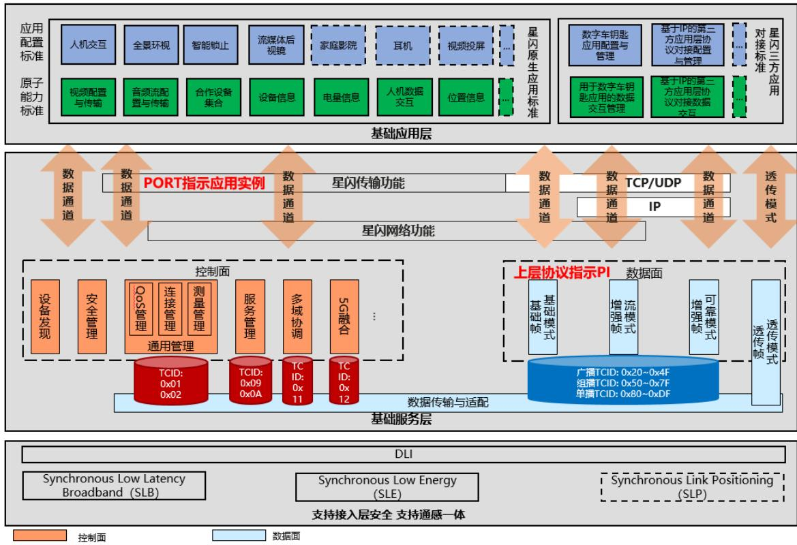

图1 星闪无线通信系统整体架构

设备发现功能单元和服务管理功能单元与基础应用层、星闪接入层以及基础服务层的其它功能单元的关系见图2，设备发现功能单元承接基础应用层或基础服务层特定功能单元（如多域协调与管理功能单元）的需求，直接调用星闪接入层能力完成设备发现功能，相关配置流程和层间交互见6.6节。

服务管理功能单元在数据传输与适配功能单元建立的服务管理传输通道上进行交互，完成应用的服务访问与响应需求，相关层间交互见7.3节。

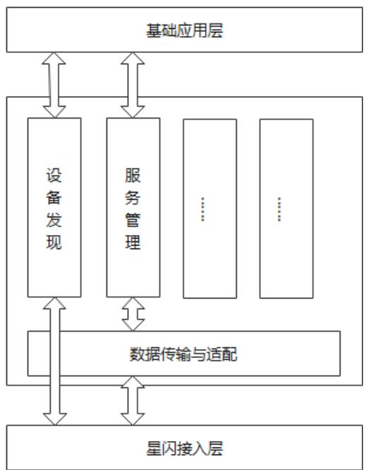

图2 设备发现功能单元和服务管理功能单元与其他协议层及功能单元的逻辑关系示意

### 5.2 功能概述

#### 5.2.1 设备发现概述

设备发现功能单元定义了设备发现流程。不同星闪设备通过该流程可以实现彼此设备信息的公开及扫描感知。设备发现功能单元定义了设备公开信息的类型和格式，以及相关过滤条件，帮助星闪设备能够更好的披露信息及找到感兴趣的信息。星闪设备间的设备发现实现，应遵从设备发现功能单元中的定义与约束。

#### 5.2.2 服务管理概述

服务管理是基础服务层的核心功能单元之一，其可以为基础应用层以及基础服务层提供包括服务注册、维护、删除等设备内部的服务管理功能。同时，服务管理功能单元还定义了统一的服务结构和星闪服务交互协议。服务结构是一种表达格式，为服务定义提供了统一的基础模板。星闪服务交互协议则为星闪设备实现彼此之间的服务发现及交互提供标准信令。

## 6 设备发现

### 6.1 功能和需求描述

设备发现定义了不同星闪设备实现彼此设备自身需求的表达与信息的公开以及扫描感知的规范。

基础应用层或基础服务层的其它功能单元是使用设备发现需求主体，设备发现需求主体会决定设备在设备发现过程中的角色。设备发现需求主体也会传递自身需求和信息给设备发现单元，设置过滤策略并接收感兴趣的结果。

星闪设备根据自身星闪接入层能力通过广播消息或系统信息来公开自身信息，通过星闪接入层扫

描能力来感知周边存在的其它星闪设备，并可以指示星闪接入层按配置的过滤条件过滤扫描结果来获取感兴趣的目标星闪设备。设备公开信息通过在星闪接入层广播消息或系统信息中携带对应的数据来实现。感知其它星闪设备通过星闪接入层扫描和配置不同的扫描过滤条件进行。

一般来说，设备发现是业务进行的第一步，后续设备之间会进行更多的交互来展开业务。

### 6.2 角色定义

设备发现过程里存在两类角色：被发现方和发现方。

被发现方设备会发布自身的可发现性信息，要求只有符合需求的设备进行感知发现。被发现方也会发布设备信息，这个信息会包括星闪设备上承载的基础应用层和基础服务层功能单元的信息，也会有星闪设备自身固有的信息或星闪接入层能力信息。

发现方会根据基础应用层和基础服务层功能单元的设备发现需求，并结合被发现方发布的可发现性信息和设备信息，筛选出符合条件的设备并反馈。

被发现方角色和发现方角色是基础服务层定义的角色，星闪设备运行的角色由设备发现需求主体指定。一个星闪设备可以同时运行被发现方和发现方角色。

### 6.3 被发现方公开信息

#### 6.3.1 概述

被发现方需要公开自己的信息便于发现方发现和了解。设备公开信息按照作用可分为两类：发现等级和设备信息。发现等级是被发现方公开的可发现性信息，也是对发现方的要求，要求和期望发现方在接收到发现等级信息后应如何处理。设备信息是被发现方自身属性信息和设备运行的应用公开的信息等。

#### 6.3.2 发现等级

##### 6.3.2.1 概述

被发现方定义了如下发现等级：

- 不可见发现

一般可发现

优先可发现

- 被曾配对过的设备发现

被指定设备发现

##### 6.3.2.2 不可见发现

不可见发现是一种设备信息最小化披露，被发现设备不希望被呈现给用户，仅特定应用能感知被发现设备。

##### 6.3.2.3 一般可发现

一般可发现需求是指被发现方设备期望被发现，且无其它特别要求。

##### 6.3.2.4 优先可发现

优先可发现需求是指被发现方设备期望被优先发现，优先可发现在时间维度上表现为更快的被发现，在空间维度，与同类型设备相比，被发现的要求更强烈。

##### 6.3.2.5 被配对过的设备发现

被配对过的设备发现是指被发现方设备要求仅被曾经配对过的设备发现。

##### 6.3.2.6 被指定设备发现

被指定设备发现是指被发现方设备要求被指定媒体接入层标识的设备发现。

#### 6.3.3 设备信息

设备信息包括设备名称、设备支持的服务信息、通信域域名（引用T/XS10001-2025中7.5.3.10定义的“通信域域名信息”）等，详细定义见6.5节。

### 6.4 发现方过滤策略

#### 6.4.1 概述

过滤策略是设备发现功能单元为基础应用层和基础服务层功能单元提供的服务，用于筛选其感兴趣的设备。发现方也可不设置任何过滤规则。

#### 6.4.2 被发现方发现等级在发现方的处理

##### 6.4.2.1 不可见发现

当发现方应用或基础服务层功能单元收到携带不可见发现的设备信息时，不应直接将设备和其信息展示在用户 UI 界面上。

##### 6.4.2.2 一般可发现

发现方不做特殊处理。

##### 6.4.2.3 优先可发现

当发现方应用或基础服务层功能单元收到携带优先可发现的设备信息时，应该优先处理或展示该设备和信息。

##### 6.4.2.4 被配对过的设备发现

当发现方设备发现功能单元收到携带被配对过的设备发现的设备信息时，设备发现功能单元会检查发现方是否与被发现方配对过。若配对过，则发现该设备，并将设备信息上报。若未配对过，则丢弃该设备信息，不对该设备进行发现。

##### 6.4.2.5 被指定设备发现

接收到配置为被指定媒体接入层标识发现的被发现方设备信息时，星闪接入层会检查过滤被发现方配置的指定媒体接入层标识，若与本设备的媒体接入层标识匹配，则星闪接入层发现该设备并上报给设备发现功能单元。若不匹配，星闪接入层将丢弃该设备信息。

设备发现功能单元按基础应用层或基础服务层其它功能单元的需求处理该设备信息即可。

#### 6.4.3 过滤条件

可作为过滤条件的选项包括媒体接入层标识、设备名称、以及被发现方公开的其它设备信息。被发现方公开信息类型如表 1 所示，每一项可作为一个过滤条件。所有过滤条件可以按需求向星闪接入层配置，由星闪接入层完成设备发现结果过滤。或者由设备发现功能单元本身完成设备发现结果过滤。

#### 6.4.4 过滤规则

对于多项过滤条件，提供逻辑与、逻辑或、逻辑非的配置，逻辑与是指被发现设备必须同时符合各

项过滤条件才能被发现，逻辑或是指被发现设备只需符合一项过滤条件就能被发现。逻辑非是指被发现设备符合一项过滤条件就被丢弃。

当满足过滤条件后，还需满足被发现方的需求之后，才能将设备信息上报。

### 6.5 被发现方公开信息数据表示

#### 6.5.1 数据格式

被发现方公开数据结构见图3，该数据格式用于被发现方设备发现功能单元向星闪接入层配置广播携带的设备公开信息，发现方设备发现功能单元从星闪接入层接收扫描结果中解析被发现方公开信息。

在使用SLE时，设备公开信息数据整体填充在SLE接入层广播数据类型为255的数据内容中。在使用SLB时，设备公开信息数据整体填充在通信域系统消息中。

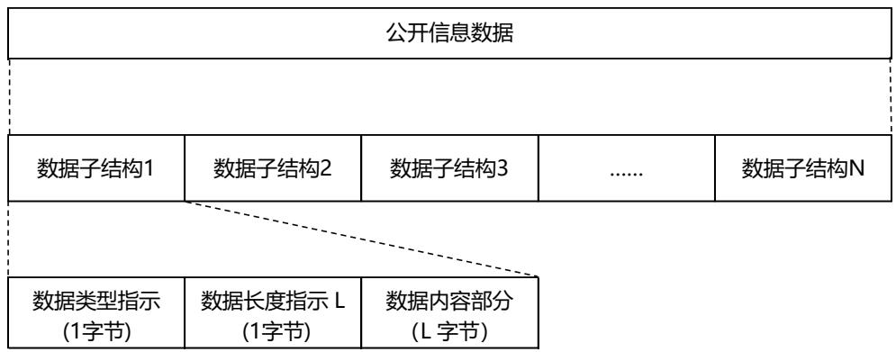

图3 设备公开信息数据结构

其中：

数据子结构：设备公开信息数据可以包含多个数据子结构，每个子结构承载一种类型的数据。

数据类型指示：长度1字节，表示该数据子结构中的数据类型。

数据长度指示：长度1字节，指示数据内容的长度，单位是字节。

数据内容部分：数据内容长度由数据长度指示域给出，表示该数据子结构中的数据内容。数据内容不应包含填充字节。

#### 6.5.2 数据类型

##### 6.5.2.1 数据类型定义

设备公开信息的数据类型由1字节的值表示，取值为0x00-0xFF。当前可携带信息类型定义见表1。

表 1 设备公开信息数据类型

<table><tr><td>数据类型值</td><td>数据类型名称</td><td>描述</td></tr><tr><td>0x01</td><td>发现等级</td><td>指示被发现方的发现等级</td></tr><tr><td>0x02</td><td>星闪接入层能力</td><td>指示设备支持的星闪接入层能力</td></tr><tr><td>0x03</td><td>标准服务数据信息</td><td>单一标准服务数据信息，16bit UUID和数据信息</td></tr><tr><td>0x04</td><td>自定义服务数据信息</td><td>单一自定义服务数据信息，128bit UUID和数据信息</td></tr><tr><td>0x05</td><td>完整标准服务标识列表</td><td>设备支持的所有标准服务 UUID（16bit）列表</td></tr><tr><td>0x06</td><td>完整自定义服务标识列表</td><td>设备支持的所有自定义服务 UUID（128bit）列表</td></tr><tr><td>0x07</td><td>部分标准服务标识列表</td><td>设备支持的部分标准服务 UUID(16bit)列表</td></tr><tr><td>0x08</td><td>部分自定义服务标识列表</td><td>设备支持的部分自定义服务 UUID(128bit)列表</td></tr><tr><td>0x09</td><td>服务结构散列值</td><td>服务结构的散列值</td></tr><tr><td>0xA</td><td>设备缩写本地名称</td><td>设备本地名称缩写</td></tr><tr><td>0xB</td><td>设备完整本地名称</td><td>完整的设备本地名称</td></tr><tr><td>0xC</td><td>广播发送功率</td><td>广播的发送功率</td></tr><tr><td>0xD</td><td>SLB通信域域名</td><td>SLB通信域域名</td></tr><tr><td>0xE</td><td>SLB媒体接入层标识</td><td>SLB媒体接入层标识</td></tr><tr><td>0xF</td><td>SLE媒体接入层标识</td><td>SLE媒体接入层标识</td></tr><tr><td>0x10</td><td>多跳组网信息</td><td>多跳组网信息</td></tr><tr><td>0x11~0xFD</td><td>保留位</td><td></td></tr><tr><td>0xFE</td><td>数据类型扩展</td><td>当数据类型超过255个时,可以使用该类型进行数据类型扩展</td></tr><tr><td>0xFF</td><td>厂商自定义信息</td><td>厂商自定义信息</td></tr></table>

各数据类型关联的多字节数据值应使用小端模式。

各数据类型对应的数据内容格式见6.5.2.2-6.5.2.12。

##### 6.5.2.2 发现等级

发现等级由1字节值表示，比特  $0\sim 2$  表示发现等级，比特  $3\sim 7$  预留，发现等级数据结构定义见图4，发现等级具体数值得定义见表2。

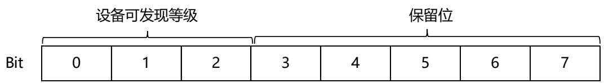

图4发现等级类型数据结构

表 2 发现等级格式

<table><tr><td>数据类型</td><td>发现等级取值</td><td>描述</td></tr><tr><td rowspan="5">发现等级</td><td>0</td><td>不可见发现</td></tr><tr><td>1</td><td>一般可发现</td></tr><tr><td>2</td><td>优先可发现</td></tr><tr><td>3</td><td>被配对过的设备发现</td></tr><tr><td>4</td><td>被指定设备发现</td></tr></table>

##### 6.5.2.3 星闪接入层能力

星闪接入层能力数据由1字节表示，比特0指示星闪接入层是否支持SLB接入技术，使用比特1指示星闪接入层是否支持SLE接入技术，比特2~7保留。星闪接入层能力数据值定义见表3。

表 3 星闪接入层能力数据格式

<table><tr><td>数据类型</td><td>比特位</td><td>描述</td></tr><tr><td rowspan="3">星闪接入层能力</td><td>0</td><td>取值0表示不支持SLB；取值1表示支持SLB；</td></tr><tr><td>1</td><td>取值0表示不支持SLE；取值1表示支持SLE；</td></tr><tr><td>2···7</td><td>保留</td></tr></table>

##### 6.5.2.4 服务数据信息

服务数据信息包含服务标识（使用UUID表示，见7.2.3.4节）及服务相关数据，服务数据信息格式定义见表4。

表 4 服务数据信息格式

<table><tr><td>数据类型</td><td>数据长度</td><td>描述</td></tr><tr><td>标准服务数据信息</td><td>变长，取值范围 2~255，单位字节</td><td>字节 0~1：标准服务的服务标识
字节 2~可变长：服务信息数据内容</td></tr><tr><td>自定义服务数据信息</td><td>变长，取值范围16~255，单位字节</td><td>字节 0~15：自定义服务的服务标识
字节 16~可变长：自定义服务的信息数据内容</td></tr></table>

##### 6.5.2.5 服务标识列表

服务标识列表用于表明设备支持的部分或所有服务，服务标识列表包含一系列的服务标识（使用UUID表示，见7.2.3.4节），服务标识列表数据格式定义见表5。

表 5 服务标识列表数据格式

<table><tr><td>数据类型</td><td>数据长度</td><td>描述</td></tr><tr><td>部分标准服务标识列表</td><td>变长，最小2字节</td><td>星闪设备支持的部分标准服务的服务标识列表，每个服务标识长度为2字节</td></tr><tr><td>部分自定义服务标识列表</td><td>变长，最小16字节</td><td>星闪设备支持的部分自定义服务的服务标识列表，每个服务标识长度为16字节</td></tr><tr><td>完整标准服务标识列表</td><td>变长，最小2字节</td><td>星闪设备支持的所有标准服务的服务标识列表，每个服务标识长度为2字节</td></tr><tr><td>完整自定义服务标识列表</td><td>变长，最小16字节</td><td>星闪设备支持的所有自定义服务的服务标识列表，每个服务标识长度为16字节</td></tr></table>

##### 6.5.2.6 服务结构散列值

服务结构散列值是服务端设备通过服务结构计算出来的散列值，服务结构散列值长度16字节，数据格式定义见表6。

表 6 服务结构散列值数据格式

<table><tr><td>数据类型</td><td>数据长度</td><td>描述</td></tr><tr><td>服务结构散列值</td><td>16字节</td><td>服务端中通过服务结构计算出来的散列值，散列值见7.2.6.2节定义。</td></tr></table>

##### 6.5.2.7 设备本地名称

设备本地名称为分配给设备的名称，按数据类型可以分为完整的设备名称和缩写的本地名称。缩写设备名称包含从完整设备名称起始点开始的一段连续字符，缩写设备名称长度短于完整设备名称。如果发现方设备获取的是缩写设备名称，则可以在建立连接之后继续读取完整的设备名称。设备本地名称为UTF-8字符串，最大长度为128字节，允许截断。设备本地名称数据格式定义见表7。

表 7 设备本地名称数据格式

<table><tr><td>数据类型</td><td>数据长度</td><td>描述</td></tr><tr><td>设备缩写本地名称</td><td>变长</td><td>从完整设备名称起始点开始的一段连续字符</td></tr><tr><td>设备完整本地名称</td><td>变长</td><td>完整设备本地名称</td></tr></table>

##### 6.5.2.8 广播发送功率

广播发送功率数据表示被发现方设备发送广播的实际功率，使用1字节值来表示，数据格式定义见表8。

表 8 广播发送功率数据格式

<table><tr><td>数据类型</td><td>数据长度</td><td>描述</td></tr><tr><td>广播发送功率</td><td>1字节</td><td>单位 dBm, 发送功率值范围-127dBm~127dBm</td></tr></table>

##### 6.5.2.9 SLB通信域域名

SLB通信域域名定义引用T/XS10001-2025中7.5.3.10定义的“通信域域名信息”，通信域域名为长度可变的十进制字符串。如果设备发现需求主体选择使用SLE接入层进行设备发现时，可以选择在设备公开信息中携带SLB通信域域名以辅助SLB进行设备发现。SLB通信域域名数据格式定义见表9。

表 9 SLB通信域域名数据格式

<table><tr><td>数据类型</td><td>数据长度</td><td>描述</td></tr><tr><td>SLB通信域域名</td><td>1~128字节</td><td>SLB通信域域名</td></tr></table>

##### 6.5.2.10 SLB媒体接入层标识

SLB 媒体接入层标识的长度 6 字节的二进制字符串。如果设备发现需求主体选择使用 SLE 接入层进行设备发现时，可以在设备公开信息中携带 SLB 媒体接入层标识，以辅助 SLE 进行设备发现。SLB 媒体接入层标识的数据格式定义见表 10。

表 10 SLB媒体接入层标识

<table><tr><td>数据类型</td><td>数据长度</td><td>描述</td></tr><tr><td>SLB 媒体接入层标识</td><td>6 字节</td><td>SLB 媒体接入层标识</td></tr></table>

##### 6.5.2.11 多跳组网信息

多跳组网基于接入层广播传输承载时，可以使用该类型标识多跳组网信息，数据长度不超过255字节。该数据封装和解析可参考《星闪无线通信系统 基础服务层 网络报文格式和多跳组网协议》10.8.4.3小节。

##### 6.5.2.12 扩展数据类型

扩展数据类型用于预留未来扩展数据类型使用，扩展数据类型的数据格式定义见表11。

表 11 数据类型扩展数据格式

<table><tr><td>数据类型</td><td>数据长度</td><td>描述</td></tr><tr><td>扩展数据类型</td><td>变长，最小2字节</td><td>字节0~1：表示扩展的数据类型字节2~255：扩展数据类型对应的数据</td></tr></table>

##### 6.5.2.13 厂商自定义数据

厂商自定义数据类型用于指示厂商自定义数据，厂商自定义数据格式定义见表12。

表 12 厂商自定义数据格式

<table><tr><td>数据类型</td><td>数据长度</td><td>描述</td></tr><tr><td>厂商自定义数据</td><td>变长，最小2字节</td><td>字节0~1：厂商标识（由UUID表示，见7.2.3.4节）
字节2~255：数据内容</td></tr></table>

### 6.6 配置管理

#### 6.6.1 概述

星闪设备可以支持仅SLB工作、仅SLE工作以及SLB和SLE同时工作等多种星闪接入层工作方式，在设备上电初始化后，星闪基础服务层可以向星闪接入层查询其支持的特性与能力，或者星闪接入层向星闪基础服务层上报其支持的特性与能力，具体由实现决定。

设备发现需求主体需要执行设备发现过程时，需确定自身角色并向设备发现功能单元下发相关请求，并指示星闪接入层类型、发现等级或者过滤策略等参数。设备发现功能单元按设备发现需求主体的要求，向星闪接入层提出发出广播消息/系统消息或扫描的请求，星闪接入层按照该请求执行相关通信过程并反馈结果。

#### 6.6.2 配置流程

##### 6.6.2.1 SLE承载上的端到端配置流程

SLE承载上的设备发现配置流程见图5，包括被发现方设备和发现方设备的配置流程。

被发现方设备配置流程对应如下：

1-1：设备发现需求主体向设备发现功能单元下发设备公开信息请求（见6.6.3.1.1），请求中可以包括星闪接入层类型指示、广播参数、发现等级、服务信息等。本流程中星闪接入层类型指示选择SLE接入层。

1-2：设备发现功能单元依据接收的设备公开信息请求，依据其中的星闪接入层类型指示向SLE接入层分别下发广播配置命令（见6.6.3.2.1），命令可以包括广播参数设置命令、广播数据设置命令和扫描响应数据设置命令。

1-3：设备发现功能单元完成设备公开信息请求配置后，向设备发现需求主体回复设备公开信息请求配置反馈（见6.6.3.1.2）。

1-4：设备发现需求主体向设备发现功能单元下发设备公开信息使能（见6.6.3.1.3）。

1-5: 设备发现功能单元接收到设备公开信息使能后, 向SLE接入层下发广播使能命令 (见6.6.3.2.2)。

1-6：设备发现功能单元返回设备公开信息使能反馈（见6.6.3.1.4）。

1-7：SLE接入层按设备发现功能单元的配置向外发送广播消息。广播消息包括发现等级、设备信息等数据。

发现方设备配置流程对应如下：

2-1：设备发现需求主体向设备发现功能单元下发设备发现请求（见6.6.3.1.5），请求中可以包括星闪接入层类型指示、扫描参数、过滤策略等信息。本流程中星闪接入层类型指示选择SLE接入层。

2-2：设备发现功能单元接收设备发现请求后，依据其中的星闪接入层类型指示向SLE接入层分别下发扫描配置命令（见6.6.3.2.3），命令可以包括扫描参数设置命令、过滤条件设置命令和过滤器使能

设置命令等。

2-3：设备发现功能单元向设备发现需求主体反馈设备发现请求配置反馈（见6.6.3.1.6）。

2-4：设备发现需求主体向设备发现功能单元下发设备发现使能（见6.6.3.1.7）。

2-5：设备发现功能单元接收到设备发现使能后，向SLE接入层下发扫描使能命令（见6.6.3.2.4）。SLE接入层依据使能命令开始扫描接收被发现方设备的广播消息或停止扫描接收被发现方设备的广播消息。

2-6：设备发现功能单元完成向SLE接入层配置扫描命令后，向设备发现需求主体回复设备发现状态反馈（见6.6.3.1.8）。

2-7：设备发现功能单元接收SLE接入层上报的扫描结果报告（见6.6.3.2.5），扫描结果报告包含设备信息列表，每个设备信息包括媒体接入层标识、发现等级、设备公开信息等内容。若步骤2-4中配置了过滤条件和过滤使能，则星闪接入层将对扫描结果进行过滤后再上报。

2-8：设备发现功能单元向设备发现需求主体上报设备发现结果报告（见6.6.3.1.9），设备发现结果报告包含设备信息列表，每个设备信息包括媒体接入层标识、发现等级、设备公开信息等内容。可选的，设备发现功能单元可以利用6.4.4节中描述的过滤规则对设备发现结果进行过滤，再将结果进行上报。

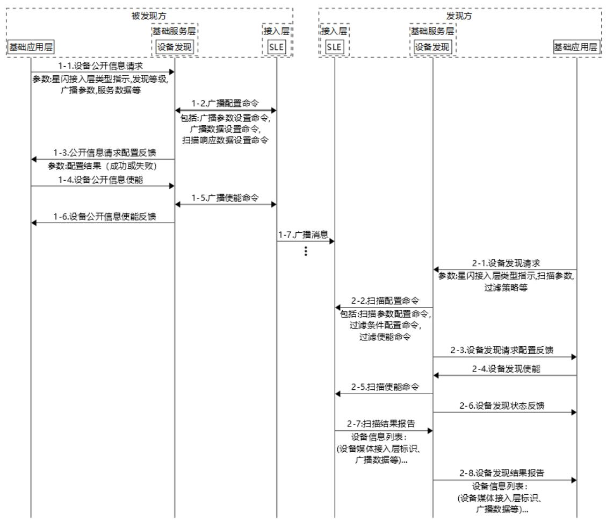

图5SLE承载的设备发现配置流程

##### 6.6.2.2 SLB承载上的端到端配置流程

SLB承载上的设备发现的配置流程见图6，包括被发现方设备和发现方设备的配置流程。

被发现方设备的具体配置流程如下：

1-1：设备发现需求主体向设备发现功能单元下发设备公开信息请求（见6.6.3.1.1），请求中可以包括星闪接入层类型指示、通信域域名等信息；本流程中星闪接入层类型指示选择SLB接入层。

1-2：可选的，若需要配置通信域域名，则设备发现功能单元需要向SLB接入层下发系统消息配置命令（同广播配置命令，见6.6.3.2.1)，命令包含通信域域名参数。如不需要配置通信域域名，设备发现功能单元可以不向SLB接入层下发系统消息配置命令。

1-3：设备发现功能单元向设备发现需求主体反馈设备公开信息请求配置反馈（见6.6.3.1.2）。

1-4：可选的，设备发现需求主体向设备发现功能单元下发设备公开信息使能（见6.6.3.1.3）。

1-5：若设备发现功能单元接收到设备公开信息使能后，返回设备公开信息使能反馈（见6.6.3.1.4），参数为成功。

1-6：SLB接入层对外发送系统消息。

发现方设备具体配置流程如下：

2-1：设备发现需求主体向设备发现功能单元下发设备发现请求（见6.6.3.1.5），请求中可以包含星闪接入层类型指示、扫描参数过滤策略等参数。本流程中星闪接入层类型指示选择SLB接入层。

2-2：设备发现功能单元接收设备发现请求后，依据其中的星闪接入层类型指示向SLB接入层下发扫描配置命令（见6.6.3.2.3），命令包括扫描参数设置命令、过滤条件设置命令、过滤器使能设置命令等。

2-3：设备发现功能单元完成向SLB接入层配置扫描命令后，向设备发现需求主体回复设备发现请求配置反馈（见6.6.3.1.6）。

2-4：设备发现需求主体向设备发现功能单元下发设备发现使能（见6.6.3.1.7）。

2-5：设备发现功能单元向SLB接入层下发扫描使能命令（见6.6.3.2.4）。

2-6：设备发现功能单元向设备发现需求主体返回设备发现状态反馈（见6.6.3.1.8）。参数为开始发现或停止发现。

2-7：设备发现功能单元接收SLB接入层上报的扫描结果报告（见6.6.3.2.5），扫描结果是设备信息列表，每个设备信息包括频点、通信域域名和媒体接入层标识等信息。

2-8：设备发现功能单元向设备发现需求主体上报设备发现结果报告（见6.6.3.1.9），设备发现结果报告可以是设备信息列表，每个设备信息包括频点、通信域域名和媒体接入层标识等信息。可选的，设备发现功能单元可以利用6.4.4节中描述的过滤规则对设备发现结果进行进一步过滤，再上报给设备发现需求主体。

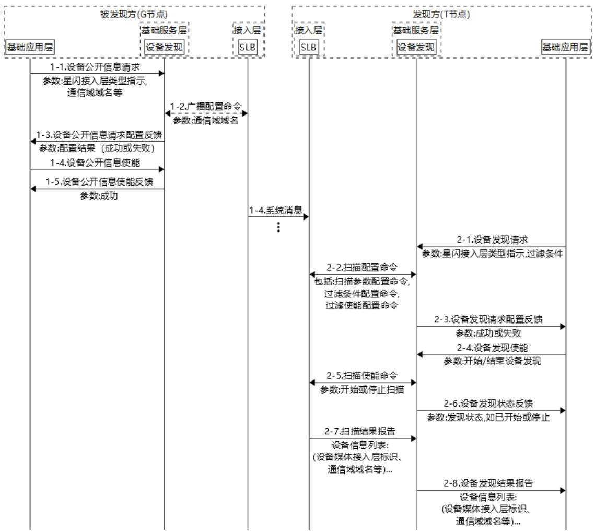

图6SLB承载的设备发现配置流程

#### 6.6.3 设备发现原语

##### 6.6.3.1 概述

本节定义了设备发现功能单元与需求主体、星闪接入层间的接口原语。该原语给出的是一般性的设计原则，具体实现可以参考，更多形式的原语可在本节基础上扩充或者重新定义。

##### 6.6.3.2 设备发现功能单元与需求主体间的原语

###### 设备公开信息请求

设备公开信息请求适用于被发现方设备，由设备发现需求主体发送给设备发现功能单元，用于指示设备发现功能单元配置星闪接入层发送广播的参数，向外公开设备信息。设备公开信息请求原语参数见表13。

表 13 设备公开信息请求原语参数

<table><tr><td>参数</td><td>说明</td></tr><tr><td>星闪接入层类型指示</td><td>用于指示设备发现功能单元选择对应的星闪接入层执行设备公开信息操作该指示可以有四种取值场景，具体如下：
缺省：即基础应用层不明确指示；此时，设备发现功能单元优选SLE接入层，若不支持SLE，则选择SLB。</td></tr><tr><td></td><td>SLE: 即明确指示选择 SLE 接入层;
SLB: 即明确指示选择 SLB 接入层;
Both: 即明确指示选择 SLE 和 SLB 接入层同时对外公开设备信息。</td></tr><tr><td>发现等级</td><td>该参数用于在广播中公开设备发现等级,见 6.3 节描述。</td></tr><tr><td>广播参数集</td><td>该参数集适用于指示 SLE 接入层发送广播的方式,具体参数如下:
广播间隔、广播时长、广播类型、广播信道列表、广播本端媒体接入层标识及其类型、广播对端媒体接入层标识类型等。</td></tr><tr><td>设备公开信息</td><td>该参数适用于控制 SLE 接入层在广播中承载设备公开信息,比如设备名称、设备支持的服务标识等。</td></tr><tr><td>通信域域名</td><td>该参数适用于控制 SLB 接入层在系统信息中承载该域名。</td></tr></table>

###### 设备公开信息请求配置反馈

设备公开信息请求适用于被发现方设备，由设备发现功能单元发送给设备发现需求主体，用于设备发现功能单元向设备发现需求主体反馈设备公开信息请求配置结果，设备公开信息请求配置反馈原语参数见表14。

表 14 广播配置反馈原语参数

<table><tr><td>参数</td><td>说明</td></tr><tr><td>配置结果</td><td>指示广播配置结果，如成功或失败。若配置失败，应携带失败原因，比如星闪接入层类型指示错误等。</td></tr></table>

###### 设备公开信息使能

设备公开信息使能适用于被发现设备，由设备发现需求主体发送给设备发现功能单元，用于指示设备发现功能单元向外公开或停止公开设备公开信息。设备公开信息使能原语参数见表15。

表 15 设备公开信息使能原语参数

<table><tr><td>参数</td><td>说明</td></tr><tr><td>使能</td><td>使能/关闭公开信息</td></tr></table>

###### 设备公开信息使能反馈

设备公开信息使能反馈适用于被发现方设备，由设备发现功能单元发送给设备发现需求主体，用于设备发现功能单元向设备发现需求主体反馈设备公开信息使能配置结果，设备公开信息使能反馈的原语参数见表16。

表 16 设备公开信息使能反馈原语参数

<table><tr><td>参数</td><td>说明</td></tr><tr><td>配置结果</td><td>指示使能/关闭公开信息的结果。如成功或失败。</td></tr></table>

###### 设备发现请求

设备发现请求原语适用于发现方设备，由设备发现功能需求主体发送给设备发现功能单元，用于指示设备发现功能单元配置星闪接入层执行扫描的参数。设备发现请求原语参数见表17。

表 17 扫描请求原语参数

<table><tr><td>参数</td><td>说明</td></tr><tr><td>星闪接入层类型指示</td><td>用于指示设备发现功能单元选择对应的接入层执行设备发现过程，该指示可以有四种取值场景，具体如下：
1. 缺省：即基础应用层不明确指示；此时，设备发现功能单元优选SLE接入层，若不支持SLE，则选择SLB。
2. SLE：即明确指示选择SLE接入层；
3. SLB：即明确指示选择SLB接入层；
4. Both：即明确指示选择SLE和SLB接入层同时执行设备发现过程。</td></tr><tr><td>扫描参数集</td><td>针对SLE接入层：扫描参数集包括扫描窗长、扫描间隔、扫描信道列表、扫描类型（主动扫描/被动扫描）。
针对SLB接入层：扫描参数集包括扫描窗长、扫描/上报周期（周期性扫描）或者扫描时长（非周期性扫描）、事件类型（指示接入层获得扫描结果后立即上报还是按照扫描周期上报）、扫描频点列表</td></tr><tr><td>过滤策略</td><td>该参数用于指示设备发现功能单元上报满足条件的设备发现结果，当缺省时，设备发现功能单元将上报所有设备发现结果。</td></tr></table>

###### 设备发现请求配置反馈

设备发现请求配置反馈原语适用于发现方设备，由设备发现功能单元发送给设备发现需求主体，用于设备发现功能单元向设备发现需求主体反馈设备发现请求配置结果，设备发现请求配置反馈原语参数见表18。

表 18 设备发现请求配置反馈原语参数

<table><tr><td>参数</td><td>说明</td></tr><tr><td>配置结果</td><td>指示设备发现请求配置结果，如成功或失败。若配置失败，应携带失败原因，比如星闪接入层类型指示错误等。</td></tr></table>

###### 设备发现使能

设备发现使能适用于发现方设备，由设备发现功能需求主体发送给设备发现功能单元，用于设备发现功能需求指示设备发现功能单元开始/结束设备发现过程。设备发现使能原语参数见表19。

表 19 设备发现使能原语参数

<table><tr><td>参数</td><td>说明</td></tr><tr><td>使能</td><td>开始/结束设备发现过程</td></tr></table>

###### 设备发现状态反馈

设备发现现状反馈原语适用于发现方设备，由设备发现功能单元发送给设备发现需求主体，用于设备发现功能单元当发现状态变化时向设备发现功能需求主体反馈新的状态。设备发现反馈原语参数见表20。

表 20 设备发现状态反馈原语参数

<table><tr><td>参数</td><td>说明</td></tr><tr><td>状态</td><td>指示当前发现状态，开始发现或停止发现。</td></tr></table>

###### 设备发现结果报告

设备发现结果报告适用于发现方设备，由设备发现功能单元发送给设备发现需求主体，用于设备发现功能单元向设备发现需求主体上报设备发现结果，设备发现结果报告原语参数见表21。

表 21 设备发现结果上报原语参数

<table><tr><td>参数</td><td>说明</td></tr><tr><td>设备信息列表</td><td>设备发现功能单元上报的设备发现结果，可以存在多个设备及关联信息。</td></tr></table>

##### 6.6.3.3 设备发现与接入层层间原语

###### 广播配置命令

广播配置命令适用于被发现方设备，由设备发现功能单元发送给星闪接入层，指示星闪接入层按后续发送广播消息或系统消息的配置要求。

设备发现功能单元发送给SLE接入层的广播配置命令和参数见表22。

表 22 SLE广播配置命令和参数

<table><tr><td>设备角色</td><td>配置命令</td><td>参数</td><td>说明</td></tr><tr><td rowspan="9">被发现方</td><td>广播数据设置</td><td>设备公开信息</td><td>内容如6.3节所述,类型和格式如6.5节所述。</td></tr><tr><td rowspan="7">广播参数配置</td><td>广播间隔</td><td>广播发送频率</td></tr><tr><td>广播时长</td><td>发送广播的时间</td></tr><tr><td>广播类型</td><td>广播类型</td></tr><tr><td>广播信道列表</td><td>广播信道选择列表</td></tr><tr><td>本端媒体接入层标识类型</td><td>本端媒体接入层标识是随机媒体接入层标识还是公共媒体接入层标识</td></tr><tr><td>对端媒体接入层标识类型</td><td>对端设备媒体接入层标识是随机媒体接入层标识还是公共媒体接入层标识</td></tr><tr><td>对端媒体接入层标识</td><td>对端设备媒体接入层标识</td></tr><tr><td>设置扫描响应数据配置</td><td>扫描响应数据</td><td>设备公开信息参数的类型和格式如6.5节所述。</td></tr></table>

设备发现功能单元发送给SLB接入层的广播配置命令和参数见表23。

表 23 SLB广播配置命令和参数

<table><tr><td>设备角色</td><td>配置命令</td><td>参数</td><td>说明</td></tr><tr><td></td><td>域名配置命令</td><td>通信域域名</td><td>配置SLB接入层通信域域名</td></tr></table>

设备发现功能单元向星闪接入层配置的命令均有对应响应，响应包含命令配置成功/失败，如果失败，应携带失败原因，比如接入层配置失败、参数错误等。

###### 广播使能命令

广播使能命令适用于被发现方设备，由设备发现功能单元发送给星闪接入层，指示星闪接入层开始或停止发送广播消息。当前设备发现功能单元可以控制SLE接入层开始或停止广播，SLB接入层启动后自动向外发送系统消息，不需设备发现单元控制。广播使能命令参数见表24。

表 24 广播使能命令和参数

<table><tr><td>设备角色</td><td>配置命令</td><td>参数</td><td>说明</td></tr><tr><td>被发现方</td><td>广播使能命令</td><td>广播使能开关</td><td>指示接入层开始/停止广播</td></tr></table>

###### 扫描配置命令

扫描配置命令适用于发现方设备，由设备发现功能单元发送给星闪接入层，指示星闪接入层进行扫描的配置要求。

设备发现功能单元发送给SLE接入层的扫描配置命令与参数见表25。

表 25 SLE扫描配置命令与参数

<table><tr><td>设备角色</td><td>配置命令</td><td>参数</td><td>说明</td></tr><tr><td rowspan="6">发现方</td><td rowspan="4">扫描参数配置</td><td>扫描窗长</td><td>扫描窗长</td></tr><tr><td>扫描间隔</td><td>扫描间隔</td></tr><tr><td>扫描信道</td><td>扫描信道</td></tr><tr><td>扫描类型</td><td>主动扫描或者被动扫描</td></tr><tr><td>过滤条件配置</td><td>过滤条件配置</td><td>设置SLE接入层的过滤条件</td></tr><tr><td>过滤使能配置</td><td>过滤条件生效/不生效</td><td>SLE接入层过滤条件生效/不生效</td></tr></table>

设备发现功能单元发送给SLB接入层的扫描配置命令与参数见表26。

表 26 SLB扫描配置命令与参数

<table><tr><td>设备角色</td><td>配置命令</td><td>参数</td><td>说明</td></tr><tr><td>发现方</td><td>过滤条件配置</td><td>过滤条件</td><td>设置SLB接入层的过滤条件，比如媒体接入层标识</td></tr><tr><td>发现方</td><td>过滤使能配置</td><td>过滤条件生效/不生效</td><td>过滤条件生效/不生效</td></tr><tr><td rowspan="5">发现方</td><td rowspan="5">扫描参数配置</td><td>扫描窗长</td><td>扫描窗长</td></tr><tr><td>扫描类型指示</td><td>指示是周期性扫描还是非周期性扫描</td></tr><tr><td>扫描间隔或扫描时长</td><td>扫描类型指示为周期性扫描时，该参数为扫描间隔，即SLB接入层按此参数周期性扫描；
扫描类型指示为非周期性扫描，该参数为时长，即SLB接入层扫描时间超过该时长就结束扫描</td></tr><tr><td>扫描频点列表</td><td>指示SLB接入层扫描频点，缺省时扫描所有频点</td></tr><tr><td>事件类型</td><td>指示SLB接入层获得扫描结果后立即上报，还是按扫描周期或者时长上报。</td></tr></table>

设备发现功能单元发送给星闪接入层的扫描配置命令均有对应响应，响应包含命令配置成功/失败，如果失败，应携带失败原因，比如星闪接入层配置失败、参数错误等。

###### 扫描使能命令

扫描使能命令适用于发现方设备，由设备发现功能单元发送给星闪接入层，指示星闪接入层开始或停止扫描。扫描使能命令参数见表27。

表 27 扫描使能命令和参数

<table><tr><td>设备角色</td><td>配置命令</td><td>参数</td><td>说明</td></tr><tr><td>发现方</td><td>扫描使能命令</td><td>扫描使能开关</td><td>指示星闪接入层开始/停止扫描</td></tr></table>

###### 扫描结果报告

扫描结果报告适用于发现方设备，由星闪接入层发送给设备发现功能单元，扫描结果报告可以是多个设备信息的列表，星闪接入层在扫描过程中，可以产生多个扫描结果报告。当选择SLE接入层进行设备发现时，扫描结果报告可以包含的设备信息见表28。

表 28 SLE扫描结果报告原语参数

<table><tr><td>设备角色</td><td>原语消息</td><td colspan="2">参数</td><td>说明</td></tr><tr><td rowspan="7">发现方</td><td rowspan="7">扫描结果报告</td><td colspan="2">设备数量</td><td>报告中包含的设备数量</td></tr><tr><td rowspan="5">单设备信息</td><td>媒体接入层标识类型</td><td>媒体接入层标识类型</td></tr><tr><td>媒体接入层标识</td><td>媒体接入层标识</td></tr><tr><td>RSSI</td><td>接收的广播信号强度指示</td></tr><tr><td>广播数据长度</td><td>广播携带数据长度</td></tr><tr><td>广播数据</td><td>数据类型和格式,参考6.5节所述。</td></tr><tr><td>...</td><td>...</td><td>...</td></tr></table>

当选择SLB接入层进行设备发现时，扫描结果报告可以包含的设备信息见表29。

表 29 SLB扫描结果报告原语参数

<table><tr><td>设备角色</td><td>原语消息</td><td colspan="2">参数</td><td>说明</td></tr><tr><td rowspan="10">发现方</td><td rowspan="10">扫描结果报告</td><td colspan="2">设备数量</td><td>报告中包含的设备数量</td></tr><tr><td rowspan="9">单设备信息</td><td>媒体接入层标识</td><td>被发现方设备媒体接入层标识</td></tr><tr><td>通信域域名</td><td>被发现方设备域名</td></tr><tr><td>频点</td><td>被发现方设备频点</td></tr><tr><td>优先级</td><td>被发现方处于高级域或低级域</td></tr><tr><td>多域同步信息</td><td>指示多域同步信息</td></tr><tr><td>配置多域资源</td><td>用于配置多域资源</td></tr><tr><td>RSSI</td><td>接收的广播信号强度指示</td></tr><tr><td>广播数据长度</td><td>广播携带数据长度</td></tr><tr><td>广播数据</td><td>数据类型和格式,参考6.5节所述。</td></tr></table>

#### 6.6.4 被发现方发现等级参数

##### 6.6.4.1 不可见发现

配置不可见发现需求的广播时，携带发现等级字段，并配置该字段的值为不可见发现，其它原语参数由应用决定。

##### 6.6.4.2 一般可发现

配置一般可发现需求的广播时，携带发现等级字段，并配置该字段的值为一般可发现。其它原语参数由应用决定。

##### 6.6.4.3 优先可发现

配置优先可发现需求的广播时，携带发现等级字段，并配置该字段的值为优先可发现。在配置广播的参数时，使用快速广播参数，广播持续时间不超过180s。其它原语参数由应用决定。

##### 6.6.4.4 被配对过的设备发现

配置被配对过的设备发现需求的广播时，携带发现等级字段，并配置该字段的值为被配对过的设备发现。其它原语参数由应用决定。

##### 6.6.4.5 被指定设备发现

配置被指定设备发现需求的广播时，需携带发现等级字段，配置发现等级字段的值为被指定设备发现，同时将对端媒体接入层标识设置为指定设备的媒体接入层标识。其它原语参数由应用决定。

#### 6.6.5 星闪接入层对设备发现特征支持

因SLB接入层和SLE接入层技术特点的差异性，SLB接入层和SLE接入层对设备发现功能单元的特性支持同样存在差异，具体差异见表30。

表 30 SLB和SLE对设备发现特征的支持

<table><tr><td>设备发现特性</td><td>SLB 支持性</td><td>SLE 支持性</td></tr><tr><td>设备角色</td><td>功能上, SLB 接入层 G/T 角色与设备发现功能单元中发现方/被发现方角色有如下映射关系:1. SLB 接入层 T 节点只能是发现方角色; 2. SLB 接入层 G 节点分为一般通信域 G 节点和高级通信域 G 节点。高级通信域 G 节点只能是被发现方角色(被一般通信域 G 节点发现)。一般通信域 G 节点可以是发现方角色(发现高级通信域 G),也可以是被发现方(被 T 节点发现)。</td><td>功能上, SLE 接入层 G/T 节点角色与设备发现功能单元中发现方/被发现方无映射关系。使用 SLE 接入层时, 设备支持同时运行发现方和被发现方角色。</td></tr><tr><td>被发现方公开信息</td><td>SLB 接入层支持以下特性:1. 发现等级和设备公开信息(见6.3节);2. 星闪上层使用公开信息数据格式配置广播数据(见6.5节)。</td><td>SLE 接入层支持以下特性:1. 发现等级和设备公开信息(见6.3节);2. 星闪上层使用公开信息数据格式配置广播数据(见6.5节)。</td></tr><tr><td>发现方过滤策略</td><td>SLB 接入层支持按单一媒体接入层标识作为过滤条件或者不过滤。</td><td>SLE 接入层支持媒体接入层标识(可以单个或多个)、设备公开信息数据</td></tr><tr><td></td><td></td><td>(见 6.5.2 )作为过滤条件。存在多项条件时,可以按 “或” / “与” / “非” 等逻辑执行。</td></tr><tr><td>广播配置</td><td>SLB 接入层不支持配置如广播间隔、广播时长等广播参数(见 6.6.2.2.1)</td><td>SLE 接入层支持配置广播参数(见 6.6.2.2.1)</td></tr><tr><td>扫描配置</td><td>SLB 接入层支持配置扫描窗长、扫描间隔或扫描时长、事件类型(扫描结果上报方式)、扫描频点等扫描参数(参考 6.6.2.2.3 节)</td><td>SLE 接入层支持配置扫描窗长、扫描间隔、扫描类型、扫描信道等扫描参数。SLE 接入层默认扫描到设备后立即上报(见 6.6.2.2.3 节)</td></tr><tr><td>扫描结果</td><td>SLB 接入层支持上报通信域域名、媒体接入层标识、频点。</td><td>SLE 接入层支持上报设备名称、媒体接入层标识、设备公开信息数据(见 6.3 节)。</td></tr></table>

## 7 服务管理

### 7.1 功能与需求描述

服务管理包含两部分内容：服务结构和服务交互协议。服务结构定义了服务的表达方式和组织方式。基础应用层或基础服务层的功能单元遵循服务管理的规定将自己的功能和行为在属性、方法、事件中描述并托管给服务管理。星闪服务交互协议定义了服务结构的发现过程和访问过程，以及过程中需要使用的信令。通过服务管理，星闪设备之间能够实现服务层面的互联互通。

#### 7.1.1 协议功能

服务管理功能单元是基础服务层的组件之一。支撑基础应用层及基础服务层功能单元管理各种服务，保证服务层面的互联互通。其中，基础应用层的 QoS 与 Port 的协商通过服务管理进行。服务管理功能单元通过数据传输与适配功能单元提供的传输通道进行服务交互和数据传输。

服务管理功能单元为基础应用层和基础服务层功能单元提供包括服务注册、维护、删除等在内的设备内部服务管理功能。协议不规定注册、删除等的标准接口，接口由实现决定。

服务管理功能单元作为星闪上层协议唯一的服务管理实体，利用数据传输与适配功能单元提供的传输通道进行服务交互。服务管理功能单元默认可使用三种传输通道：SLB 服务管理传输通道、SLE 服务管理传输通道、SLB 中继服务管理传输通道。这三种传输通道都是缺省的。当星闪接入层同时支持 SLB 和 SLE 时，使用传输通道的类型由基础应用层或基础服务层其他特定功能单元指定。

在满足一定条件下，服务管理功能单元可使用可靠模式传输通道进行服务交互（参见7.4.2.2）。

#### 7.1.2 角色

服务管理中定义了两个角色：服务端和客户端。

服务端是服务的承载方，接收和响应客户端的请求；客户端是服务的使用方，向服务端提交访问请求，获取并接收服务端返回的响应。

一个设备可以同时承担服务端和客户端角色。

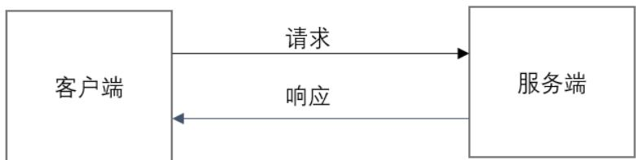

图7服务管理角色

### 7.2 服务结构

#### 7.2.1 概述

服务管理定义了统一的表达格式和框架来描述各类服务，这种表达格式称为服务结构。服务结构定义了服务由包括服务声明、服务引用、属性、方法、事件在内的服务结构成员组成，以及他们组成的方式；服务结构也定义了服务之间的引用与逻辑关系；服务结构通过定义服务结构成员的表达格式和访问方式将上述内容结构化、数据化。客户端通过服务结构理解服务端提供的功能，并根据自身需求进行访问。服务结构通过服务发现流程获取，服务结构是访问服务的依据。

#### 7.2.2 服务组成

##### 7.2.2.1 服务

服务是指服务端公开的一组能力信息或功能集合。一个应用或通用应用服务框架由一个或多个服务组成，通过服务集合提供完整功能，如一个家庭室内监测服务可以提供湿度检测服务和温度检测服务。

服务由服务结构成员构成。其中，服务声明是必须存在的。服务中还可以包含引用服务声明，对其它服务进行引用。服务中的方法、事件的存在性遵循基础服务层应用或者基础应用层标准的定义。允许为同一服务定义多个实例。

服务类型分为首要服务和次要服务，首要服务是服务端对外公开的能提供一组应用完整功能的服务集合。次要服务也是一个基本的服务功能定义，但该服务不对外独立提供完整功能，只能由其它服务进行引用。

按照服务定义的方式，服务分为星闪标准服务和自定义服务两类。标准服务是由星闪联盟定义的服务，自定义服务是由厂商根据实际需求在符合本标准基础上自行定义的服务。服务的关系图8所示。

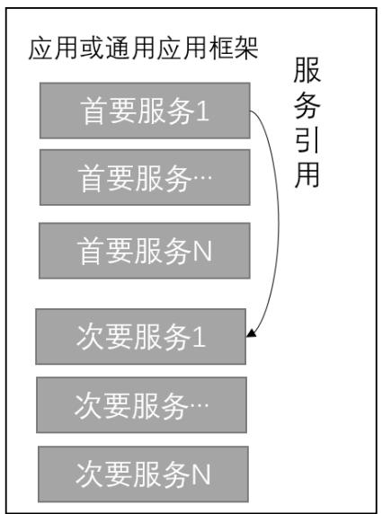

图8服务的关系

服务的标识使用通用唯一标识表示，用于唯一的表达服务的含义。

一个服务的范围是从该服务的服务声明开始，直到服务声明中指示的结束句柄为止。服务声明之后紧跟其它服务结构成员，典型的顺序为服务引用、属性、方法和事件。如果实际服务中服务结构成员有缺失，按照上述顺序递补即可。服务的结构如图9所示。

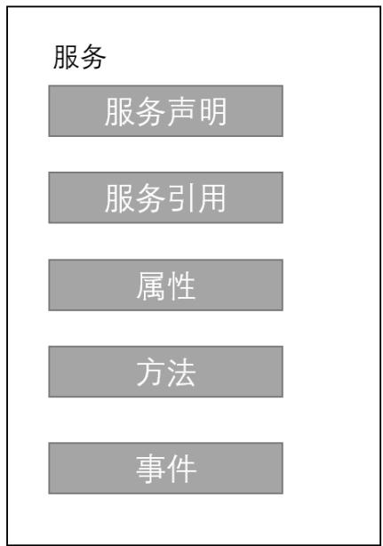

图9服务的结构

##### 7.2.2.2 服务声明

服务声明是服务中最先出现的服务结构成员，服务声明的句柄也是服务的起始句柄。服务声明指示了服务的类型和服务的标识。

##### 7.2.2.3 服务引用

服务引用描述了服务引用了一个或几个其它的服务以及服务的类型和句柄范围。被引用的服务可以为首要服务或次要服务，首要服务和次要服务均可以引用其它服务。被引用的服务可以继续引用其它服务，但是不允许引用原始服务。一个服务引用其它服务的数量没有限制。同一个服务可以同时被其它服务引用。

##### 7.2.2.4 属性

属性用于描述服务功能、状态以及相关的配置信息。客户端通过对属性的访问来实现与服务的交互。服务端用通用唯一标识来描述属性的用途，并通过操作指示字段表示该数据值的访问方式。属性中也有可选字段，称为描述符。它们可以对数据值进行解释说明、格式解析或操作方式进行控制。属性值和描述符值有相应的访问权限，比如认证、加密、授权等，由服务端定义，客户端需要达成对应访问权限条件后才允许访问属性值和描述符。服务端对客户端访问权限的验证由实现决定，比如服务端可以通过基础服务层的安全管理功能单元或者向星闪接入层查询客户端的认证、加密、授权的结果。

##### 7.2.2.5 方法

方法是服务端提供给客户端的访问接口，客户端通过请求服务端的方法完成特定功能的操作。每种方法定义自己的输入参数、返回结果的含义和格式。方法可以有可选的输入参数，方法执行完成后服务端也会返回操作的结果。方法一般用来简化多步骤属性访问流程。方法的执行也可能会改变服务中的属性值。

##### 7.2.2.6 事件

事件是服务端特定情况下触发并由相关服务主动向客户端发送的信息，比如与属性值无关的公共事件如告警、故障等信息。事件信息包含事件类型及关联数据。事件类型可以包括设备异常、故障和告警等，服务端使用通用唯一标识描述事件类型和功能。事件由上层协议定义。事件定义包括事件类型的

定义、事件关联数据含义和格式的定义。客户端可以使用星闪交互协议获取事件的通用唯一标识来识别事件关联的数据含义和数据格式。事件关联数据不在条目中体现。

#### 7.2.3 服务基本数据结构

##### 7.2.3.1 条目

服务以条目的方式进行呈现。一个条目可以表达一个服务声明或一个服务引用或一个属性或一个方法或一个事件。条目由句柄、类别、标识、数据、权限和附加信息组成。数据字段中又分为操作指示、数据值、描述符。在一个条目中，句柄、类别、标识是必须存在的，数据字段、权限和附加信息是可选的。条目的结构仅为逻辑层面的定义，服务端中服务实际的存储方式由具体实现把握。条目中除数据值和描述值外的多字节字段为小端序，数据值和描述符值默认为小端序，除非高层对它们另有定义。条目的结构如图10所示。

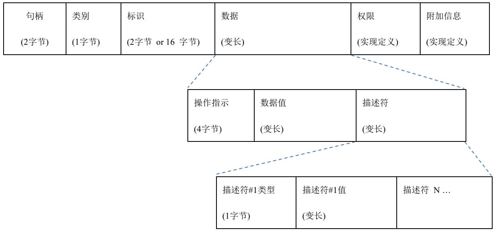

图10条目的结构

##### 7.2.3.2 句柄

句柄是服务端生成的条目的索引号，指示该条目在服务端的位置。在一个服务端上，句柄的值不允许重复；一个条目由唯一句柄索引。句柄长度2个字节，其中0x0000为预留句柄，0x0001-0x000F为服务管理可使用句柄，0x0010-0xFFFF为服务可使用句柄。条目句柄的分配可以是不连续的，但必须为升序。客户端可以通过句柄对条目的内容进行访问。

##### 7.2.3.3 类别

类别表示该条目承载的服务结构成员类型以及标准和自定义类型的信息。类别长度为1字节。具体定义见表31。

表 31 类别定义

<table><tr><td>类别</td><td>取值</td><td>描述</td></tr><tr><td>标准首要服务</td><td>0x00</td><td>星闪标准定义的首要服务&lt;&lt;StdPrimaryService&gt;&gt;</td></tr><tr><td>标准次要服务</td><td>0x01</td><td>星闪标准定义的次要服务&lt;&lt; StdSecondaryService &gt;&gt;</td></tr><tr><td>标准属性</td><td>0x02</td><td>星闪标准定义的服务属性&lt;&lt; StdProperty&gt;&gt;</td></tr><tr><td>标准方法</td><td>0x03</td><td>星闪标准定义的服务方法&lt;&lt; StdMethod&gt;&gt;</td></tr><tr><td>标准事件</td><td>0x04</td><td>星闪标准定义的服务事件&lt;&lt;StdEvent&gt;&gt;</td></tr><tr><td>标准服务引用</td><td>0x05</td><td>引用星闪标准定义服务&lt;&lt;StdServiceReference&gt;&gt;</td></tr><tr><td>保留</td><td>0x06-0x07</td><td>保留后续扩展</td></tr><tr><td>自定义首要服务</td><td>0x08</td><td>厂商自定义首要服务&lt;&lt;VendorPrimaryService&gt;&gt;</td></tr><tr><td>自定义次要服务</td><td>0x09</td><td>厂商自定义次要服务&lt;&lt;VendorSecondaryService&gt;&gt;</td></tr><tr><td>自定义属性</td><td>0x0A</td><td>厂商自定义服务属性&lt;&lt;VendorProperty&gt;&gt;</td></tr><tr><td>自定义方法</td><td>0x0B</td><td>厂商自定义服务方法&lt;&lt;VendorMethod&gt;&gt;</td></tr><tr><td>自定义事件</td><td>0x0C</td><td>厂商自定义服务事件&lt;&lt;VendorEvent&gt;&gt;</td></tr><tr><td>自定义服务引用</td><td>0xCD</td><td>厂商自定义服务引用&lt;&lt;VendorServiceReference&gt;&gt;</td></tr><tr><td>保留</td><td>0x0E-0xFF</td><td>保留后续扩展</td></tr></table>

##### 7.2.3.4 标识

标识表示该条目描述的具体内容，由通用唯一标识指示。标准服务或标准服务成员使用16比特通用唯一标识；自定义服务或自定义服务成员使用128比特的通用唯一标识。标准服务或标准服务成员使用的16比特通用唯一标识由星闪联盟统一进行分配，具有全局的唯一性。通过标识，客户端可以明确条目承载的是某一个服务、属性、方法、事件和引用了某一个服务。

##### 7.2.3.5 数据

###### 概述

数据字段是与标识字段关联的数据信息。数据字段中又分为操作指示，数据值和描述符。其中操作指示规定了数据值和描述符中的值域的访问方式。数据字段可以携带可变数量的描述符，也可以不携带描述符，由数据值的访问方式和上层协议确定。

###### 操作指示

操作指示规定了数据值和描述符值的访问方式。操作指示占用4字节，其中低8比特用于表示数据值的访问方式，高24比特采用位图的方式表示描述符值的访问方式。

描述符都是可读的，写入访问控制由协议和实现定义。有些描述符的写入权限在定义时就是固定的，有些则是可变的，当数据中包含这些访问方式可变的描述符时，需要在高24字节中将对应的比特置为相应的值。

表 32 操作指示字段结构

<table><tr><td>比特索引</td><td>作用范围</td><td>含义</td><td>描述</td></tr><tr><td>b0</td><td rowspan="7">数据值访问控制</td><td>读取</td><td>当该比特置位后,数据值可被读取</td></tr><tr><td>b1</td><td>无响应写入</td><td>当该比特置位后,数据值可被写入,写入后无反馈</td></tr><tr><td>b2</td><td>有响应写入</td><td>当该比特置位后,数据值可被写入,写入后产生反馈给客户端</td></tr><tr><td>b3</td><td>通知</td><td>当该比特置位后,数据值通过通知方式传递给客户端</td></tr><tr><td>b4</td><td>指示</td><td>当该比特置位后,数据值通过指示方式传递给客户端</td></tr><tr><td>b5</td><td>广播</td><td>当该比特置位后,数据值可携带在广播中。</td></tr><tr><td>b6-b7</td><td>保留</td><td></td></tr><tr><td>b8</td><td></td><td>数据值说明描述符控制</td><td>当该比特置位后,数据值说明描述符可被写入</td></tr><tr><td>b9</td><td rowspan="3">描述符值访问控制</td><td>客户端属性值配置描述符</td><td>当该比特置位后，客户端属性值配置描述符可被写入</td></tr><tr><td>b10</td><td>服务端属性值配置描述符</td><td colspan="1">当该比特置位后，服务端属性值配置描述符可被写入</td></tr><tr><td>b11 - b31</td><td>保留</td><td colspan="1"></td></tr></table>

###### 数据值

数据值的含义由标识定义。数据值是一个字节组，长度可为0，可以表示为常规的整型数值，布尔值或字符串等，也可以借助描述符来表达浮点数、科学计数法表示的数值以及自定义的数据结构。数据值的长度是隐式的，由服务端自己维护。当客户端使用星闪服务交互协议信令对数据值进行访问时，比如对数据值进行读取，数据值的长度可由携带该数据值的报文隐式指示，如果是对多个数据值进行读取，则数据值的长度需要在读取响应信令中显式给出。

属性条目中的数据值也称为属性值。

###### 描述符

描述符主要用于承载数据值的关联信息，比如数据值的补充描述、数据值的格式说明、数据值的访问控制、或者由上层协议定义的特定功能。描述符由描述符类型和描述符数据组成。服务管理功能单元定义了一系列标准描述符供上层协议使用，同时允许上层协议定义额外的特定描述符。当数据字段携带描述符时，描述符的顺序是不固定的。客户端不能对描述符的顺序进行任何假定。当客户端发现了不能识别的描述符时，可以将其跳过，并且不应去访问该描述符。描述符值默认是可读的，当它是为可写入时，应在访问控制字段体现。

描述符类型表示该描述符的功能，占用1字节，类型范围0x00-0xFF。属性、方法、事件的描述符类型定义空间相互独立。

对于属性描述符，服务管理功能单元占用0x00-0x1F，0x00预留不做定义。0xFF为厂商自定与描述符类型，其余值留给上层协议使用。属性描述符具体类型见表33。

表 33 属性描述符类型

<table><tr><td>类型</td><td>取值</td></tr><tr><td>属性说明描述符</td><td>0x01</td></tr><tr><td>客户端属性值配置描述符</td><td>0x02</td></tr><tr><td>服务端属性值配置描述符</td><td>0x03</td></tr><tr><td>属性格式描述符</td><td>0x04</td></tr><tr><td>服务管理保留</td><td>0x05 - 0x1F</td></tr><tr><td>上层协议使用</td><td>0x20 - 0xFE</td></tr><tr><td>厂商自定义</td><td>0xFF</td></tr></table>

描述符值的含义由描述符类型定义。描述符的值的格式也是由描述符类型决定的。具体的表达格式在各个描述符定义中给出。

###### 权限

权限是客户端对服务端上的服务结构成员进行访问时，服务端提出的安全层面的要求。只有满足安全要求的客户端才能对服务结构成员进行访问，由服务端进行设置，对客户端不可见。

权限的种类可以为以下几种：

认证要求：需要认证或无需认证。当服务端要求认证时，客户端如未与服务端进行认证，则客户端发起的星闪服务交互协议请求会执行失败，在对应的响应中返回未能满足认证要求的错误码。

加密要求：需要加密或无需加密。当服务端要求加密时，客户端与服务端的逻辑信道未经加密时，则客户端发起的星闪服务交互协议请求会执行失败，在对应的响应中返回未加密的错误码。

授权要求：需要授权或无需授权。当服务端要求授权时，客户端在访问数据值或描述符值之前，需要先获得服务端的授权；否则客户端发起的星闪服务交互协议请求会执行失败，在对应的响应中返回未授权的错误码。

安全权限允许与访问控制中的读取和写入控制搭配使用，读取和写入时的权限要求可以不同。例如写入时要求认证、读写时要求加密等。

数据值权限和描述符值权限是独立设置的，没有任何关联关系。

服务端可以通过基础服务层的安全管理功能单元或者接入层获取客户端是否认证、加密、具体由实现决定。

###### 附加信息

附加条件是条目的一个可选项，用于服务端对相应条目进行注释，内容由实现决定，对客户端不可见。

#### 7.2.4 服务结构成员表示

##### 7.2.4.1 服务声明表示

服务声明的条目定义如表 34 所示：服务声明是只读的，内容由服务端设定，不允许客户端修改。数据值的格式是固定的，为服务结束的句柄。服务声明可以携带描述符，用于进一步描述或者标识服务的功能，比如当定义多个相同服务时，可以在服务声明中携带描述符来区分各服务的功能。服务声明可携带的描述符类型与属性描述符类型属于同一命名空间。服务声明数据值是公开的，因此无需认证、加密和授权。

表 34 服务声明条目表示

<table><tr><td>句柄</td><td>类别</td><td>标识</td><td>数据</td><td>数据值权限</td><td>描述符值权限</td></tr><tr><td>0xNNNN</td><td>&lt;&lt;StdPrimaryService&gt;&gt; 或 &lt;&lt;StdSecondaryService&gt;&gt; 或 &lt;&lt;VendorPrimaryService&gt;&gt; 或 &lt;&lt;VendorSecondaryService&gt;&gt;</td><td>16 比特星闪标准通用唯一标识或128 比特自定义服务通用唯一标识</td><td>操作指示=只读数据值=服务结束的句柄可选数量的描述符= {描述符类型, 描述符值}</td><td>无需认证无需授权无需加密</td><td>每个描述符号值都有对应的权限描述。权限由描述符定义时给出。</td></tr></table>

##### 7.2.4.2 服务引用表示

服务引用的条目定义如表35所示：服务引用是只读的，内容由服务端设定，不允许客户端修改。数据值的格式是固定的，为被引用服务的起始句柄和被引用服务的结束句柄。服务引用的数据字段不携带描述符。服务引用是公开的，因此无需认证、加密和授权。

表 35 服务引用条目表示

<table><tr><td>句柄</td><td>类别</td><td>标识</td><td>数据</td><td>数据值权限</td></tr><tr><td>0xNNNN</td><td>&lt;&lt;StdServiceReference&gt;&gt;或
&lt;&lt;VendorServiceReference&gt;&gt;</td><td>16比特星闪标准通用唯一标识或128比特自定义服务通用唯一标识</td><td>操作指示=只读数据值= {被引用服务的起始句柄,被引用服务的结束句柄}</td><td>无需认证
无需授权
无需加密</td></tr></table>

##### 7.2.4.3 属性表示

属性条目的表达方式如下表所示：

表 36 属性条目表示

<table><tr><td>句柄</td><td>类别</td><td>标识</td><td>数据</td><td>数据值权限</td><td>描述符值权限</td></tr><tr><td>0xNNNN</td><td>&lt;&lt;StdProperty&gt;&gt;或&lt;&lt;VendorProperty&gt;&gt;</td><td>16比特星闪标准通用唯一标识或128比特自定义服务通用唯一标识</td><td>操作指示=上层实现决定数据值=属性值可选数量的描述符={描述符类型,描述符值}</td><td>上层协议或实现决定</td><td>每个描述符都存在权限描述,权限由描述符定义时给出</td></tr></table>

##### 7.2.4.4 方法表示

方法交互使用星闪交互协议中的方法相关信令进行，包括方法请求、方法结果响应等。方法定义为方法分配了通用唯一标识用于标识方法类型，并明确了方法的输入参数、返回结果等参数含义和格式。客户端通过服务发现等方式获取方法的标识，并通过标识识别出方法关联的输入参数、返回结果等参数含义和格式。交互过程中，客户端请求方法时需要发送方法必要的输入参数给服务端，服务端返回结果时需要返回必要的结果参数给客户端。方法关联的输入参数、返回结果等参数不在方法条目中存储。方法权限是指调用方法需要的权限，当方法的调用会改变其它服务结构成员的数据时，方法的权限定义范围必须能够覆盖方法可能改变的服务结构成员的数据的权限。方法的表示见表37。

表 37 方法条目表示

<table><tr><td>句柄</td><td>类别</td><td>标识</td><td>权限</td></tr><tr><td>0xNNN</td><td>&lt;&lt;StdMethod&gt;&gt;或&lt;&lt;VendorMethod&gt;&gt;</td><td>16比特星闪标准通用唯一标识或128比特自定义服务通用唯一标识</td><td>上层协议或实现决定</td></tr></table>

##### 7.2.4.5 事件表示

事件的交互，通过星闪交互协议的事件相关信令进行，服务端中的事件成员指示服务支持的事件。事件定义时为事件分配了通用唯一标识用于指示事件类型，并明确了事件关联数据的含义和格式。事件交互过程中，服务端需要将事件类型和事件关联数据发送给客户端。客户端可以通过事件类型识别事件关联数据的含义和格式，事件关联数据不用存储在事件条目中。事件条目的表示见表38。

表 38 事件条目表示

<table><tr><td>句柄</td><td>类别</td><td>标识</td></tr><tr><td>0xNNNN</td><td>&lt;&lt;StdEvent&gt;&gt;或
&lt;&lt;VendorEvent&gt;&gt;</td><td>16比特星闪标准
通用唯一标识或
128比特自定义服
务通用唯一标识</td></tr></table>

#### 7.2.5 服务管理描述符

##### 7.2.5.1 属性说明描述符

属性说明描述符是针对数据值的文字性说明，描述符的值存放说明文本内容，通过 UTF-8 字符串表示。属性说明描述符在数据中的表示见表 39。

表 39 属性说明描述符的表示

<table><tr><td>长度</td><td>值</td><td>访问控制</td><td>权限</td></tr><tr><td>变长</td><td>UTF8 字符串</td><td>上层协议或实现决定</td><td>上层协议或实现决
定</td></tr></table>

##### 7.2.5.2 客户端属性值配置描述符

客户端属性值配置描述符定义了特定客户端如何配置属性值。客户端可以对该描述符的值进行写入操作，触发服务端对相关属性值通知、指示过程，获取数据。服务端会为不同客户端准备不同的描述符值副本，使客户端对属性值的访问控制是独立的。各个客户端也只能读取属于自己的描述符值副本。客户端对数据值的访问控制配置在连接存在时有效，当连接断开后，描述符副本值变为初始值。

当属性值的访问控制允许通知或访问时，属性需要携带客户端属性值描述符。客户端属性描述符在一个条目中最多只能有一个。

客户端属性值配置描述符的值长度2字节，以位域形式表示，不同配置由不同的比特表示，描述符的表示见表40。其中，当服务端发现b0和b1同时设置为1时，即客户端同时选择通知方式和指示方式时，服务端应结合属性值访问控制的具体情况，可选择任一合适方式进行发送，具体由服务端实现决定。

表 40 客户端属性值配置描述符表示

<table><tr><td>长度</td><td>值</td><td>访问控制</td><td>权限</td></tr><tr><td>2字节</td><td>b0:如果设置为1,服务端将属性值通过通知发送给客户端。只有属性值访问控制允许通知时才能生效b1:如果设置为1,服务端将属性值通过指示发送给客户端。只有属性值访问控制允许指示时才能生效比特2-比特15:保留</td><td>可读可写</td><td>可读:无安全权限需求;可写:需要认证和授权。</td></tr></table>

##### 7.2.5.3 服务端属性值配置描述符

服务端属性值配置描述符定义了服务端上的属性值如何配置。服务端属性值配置符在服务端上只

有一份副本，一经写入，对所有客户端生效。

当属性值的访问控制允许广播时，属性可携带服务端属性值配置描述符，服务端属性值配置符在一个条目中最多只能有一个。

服务端属性值配置描述符的值长度2字节，以位域形式表示，不同配置由不同的比特表示，描述符的表示见表41。

表 41 服务端属性值配置描述符表示

<table><tr><td>长度</td><td>值</td><td>访问控制</td><td>权限</td></tr><tr><td>2字节</td><td>b0:如果设置为1，服务端将属性值通过广播方式发送给客户端。只有属性值访问控制允许广播时才能生效 比特2-比特15: 保留</td><td>可读可写</td><td>可读：无安全权限需求；可写：需要认证和授权。</td></tr></table>

##### 7.2.5.4 属性值格式描述符

属性值格式描述符说明了属性值的格式，分别从格式，十进制指数，二进制指数，单位，命名空间，描述五个方面说明。属性值格式描述符的表示见表42。

表 42 属性值格式描述符表示

<table><tr><td>长度</td><td>值</td><td>访问控制</td><td>权限</td></tr><tr><td>7字节</td><td>字节0:类型字节1:十进制指数字节2:二进制指数:1字节字节3~4:单位字节5~6:描述</td><td>只读</td><td>无</td></tr></table>

类型：属性值类型，如整型，浮点数或者字符串等，类型的具体定义见表43。

表 43 属性值格式类型

<table><tr><td>索引类型</td><td>类型</td></tr><tr><td>0x01</td><td>8比特无符号数</td></tr><tr><td>0x02</td><td>16比特无符号数</td></tr><tr><td>0x03</td><td>32比特无符号数</td></tr><tr><td>0x04</td><td>64比特无符号数</td></tr><tr><td>0x05</td><td>8比特有符号数</td></tr><tr><td>0x06</td><td>16比特有符号数</td></tr><tr><td>0x07</td><td>32比特有符号数</td></tr><tr><td>0x08</td><td>64比特有符号数</td></tr><tr><td>0x09</td><td>布尔值 0 = 假; 1 = 真</td></tr><tr><td>0x0A</td><td>IEEE-754 32比特浮点数</td></tr><tr><td>0x0B</td><td>IEEE-754 64比特浮点数</td></tr><tr><td>0x0C</td><td>UTF-8 字符串</td></tr><tr><td>0xD</td><td>UTF-16 字符串</td></tr><tr><td>0x0E</td><td>数组</td></tr><tr><td>0x0F</td><td>结构体</td></tr><tr><td>其它</td><td>保留</td></tr></table>

十进制指数：十进制指数字段仅用于整型类型的属性值。十进制指数字段类型为8比特有符号数。属性值实际值  $=$  属性值  $*10^{\mathrm{d}}$  ，d为十进制指数。

二进制指数：二进制指数字段仅用于整型类型的属性值。二进制指数字段类型为8比特有符号数。属性值实际值  $=$  属性值  $*2^{\mathrm{b}}$  ，b为二进制指数。

单位：属性值的单位，用通用唯一标识表示，由星闪联盟统一定义。

描述：属性值的说明，用通用唯一标识表示，由星闪联盟统一定义。

#### 7.2.6 服务结构缓存

##### 7.2.6.1 概述

服务结构缓存是服务端的服务结构信息保存到客户端本地形成的服务端的服务结构副本。服务结构缓存是一种可选的优化方案，用于避免客户端对同一服务固化的服务端在多次连接时每次都进行服务发现；也可以用于避免客户端连接多个承载相同服务的不同服务端时，对每个服务端都进行服务发现。

服务结构缓存对应的一种服务结构，而不是绑定于一个服务端。多个服务端拥有同样的服务结构时，服务结构缓存对这些服务端都是有效的。当服务端上的服务结构发生变更时，该服务结构缓存不能适用于变化后的服务端。当服务端中表达服务结构成员的条目中的句柄、类别、标识、操作指示(如存在)、描述符类型(如存在)发生变化时，即认为服务结构发生了变化。客户端在使用服务结构缓存时，需保证使用的服务结构缓存对服务端是有效的。服务结构缓存的有效性可以通过比对服务结构散列值和接收服务结构变更事件来验证。当服务结构缓存失效或不能保证有效性时，客户端需对服务端进行服务发现过程，获取最新的服务端服务结构。

##### 7.2.6.2 服务结构散列值

###### 服务结构散列值的定义

服务结构散列值是服务中所有服务结构成员通过哈希函数生成的指纹信息。客户端可以通过星闪交互协议相关信令获取服务结构散列值来验证服务端的服务是否发生变更，也可以验证服务端提供的服务和服务结构是否与已缓存的副本相同。当服务结构发生变更时，服务端应该重新计算服务结构散列值，并将新值更新在服务结构散列值属性的属性值中。

###### 服务结构散列值的表示

服务结构散列值以属性的方式呈现，它的句柄是为固定值0x000F。服务结构散列值可以直接通过0x000F句柄来访问。服务结构散列值的表示见表44。

表 44 散列值的表示

<table><tr><td>句柄</td><td>类别</td><td>标识</td><td>数据</td><td>数据值权限</td></tr><tr><td>0x000F</td><td>&lt;&lt;StdProperty&gt;&gt;</td><td>&lt;&lt;服务结构散列值&gt;&gt;</td><td>操作指示=读取数据值=128比特服务结构散列值</td><td>无需认证无需授权</td></tr></table>

###### 服务结构散列值的计算

服务结构散列值根据以下方式计算：

服务结构散列值为 SHA-256(M) 计算结果截取低 128 比特。M 为可变长度的数据。SHA-256 为安全散列函数。

M的组成规则如下：

M 的范围是条目的句柄，类别，标识，操作指示和描述符类型列表。上述成员都可以表示为字节

组。其中描述符类型列表是条目中所有描述符的类型值按照升序排列的字节组。M 是按照条目句柄升序顺序将所有字节组拼接后的结果。其中，所有字节组内部都是小端字节顺序。

###### 服务结构散列值的广播

当接入层支持广播时，服务端可以将服务结构散列值通过广播发出，需填充的广播结构见表 45。

表 45 服务结构散列值在广播中的表示

<table><tr><td>数据类型</td><td>数据段</td></tr><tr><td>&lt;&lt;服务结构散列值&gt;&gt;</td><td>128 比特服务结构散列值</td></tr></table>

##### 7.2.6.3 服务变更事件

###### 服务变更事件的定义

服务变更事件用于告知与服务端连接的客户端，服务端的服务结构发生了变化。服务结构的变化可能由于服务端上的应用动态添加或删除了服务，或系统升级服务发生了改变等。客户端收到服务变更事件后，应认为与服务端对应的服务结构缓存失效，并重新发起服务发现过程。若服务端的服务结构不会发生变化，则服务变更事件在服务端上不存在。当服务变更事件存在时，其句柄为0x000E；

###### 服务变更事件的表示

服务变更的事件的表示见表 46。

表 46 服务变更事件的表示

<table><tr><td>句柄</td><td>类别</td><td>标识</td></tr><tr><td>0x000E</td><td>&lt;&lt;StdEvent&gt;&gt;</td><td>&lt;&lt;服务变更&gt;&gt;</td></tr></table>

服务变更事件在星闪服务交互协议的事件通知报文中携带的数据为发生变更的服务条目句柄范围，客户端可以以此为依据在变更的句柄范围内进行服务发现。

##### 7.2.6.4 服务结构缓存的验证

客户端未和服务端建立连接时，可以通过接收服务端广播中的服务结构散列值，然后与已缓存服务副本的服务结构散列值进行对比后验证。

当客户端与服务端建立连接后，可以先通过读取服务端的服务结构散列值，然后与已缓存服务副本的服务结构散列值进行对比后验证。

### 7.3 层间交互

服务管理功能单元的服务端对基础应用层和基础服务层的功能单元提供服务注册、删除的功能。当相应的注册服务完成后，服务端生成注册服务的服务结构。当接收到删除服务的请求后，服务端即释放对应服务的服务结构。服务管理功能单元会向基础应用层或基础服务层其他功能单元上报服务访问结果，如属性值被修改，接收到方法调用等，基础应用层或基础服务层其他功能单元进行后续的处理。如果客户端访问到需授权的服务结构成员，服务管理功能单元还会上报服务访问的授权请求，由基础应用层或基础服务层其他功能单元决定是否进行授权。

服务管理功能单元的客户端承接基础应用层或基础服务层其他功能单元的服务发现和服务访问的请求，返回相应的服务结构或服务访问结果。客户端也会上报服务端发过来的事件、通知、指示信息。

服务管理功能单元接收到基础应用层或基础服务层其他功能单元的请求后，通过星闪服务交互协议(SSAP)与对端进行交互，相应的SSAP PDU在服务管理传输通道上做为数据进行传输。SSAP的介绍见7.4节。

基础应用层或基础服务层其他功能单元与服务管理功能单元的接口是内部的，由实现决定。服务管

理功能单元的服务端与客户端的交互遵循SSAP，保证协议的一致性。

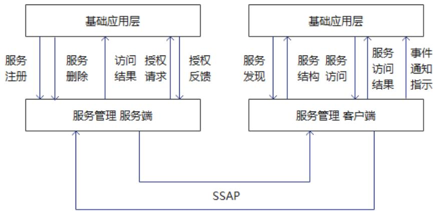

图11 服务管理层间交互示例

### 7.4 服务交互

#### 7.4.1 概述

星闪基础服务层采用服务端-客户端交互模型，服务端提供服务能力，客户端访问获取服务端的服务。基础服务层的服务管理功能单元包括服务结构和服务交互协议SSAP两个部分，服务结构通过通用的表达格式和框架描述各类服务，以结构化和数据化的形式呈现，客户端通过SSAP定义的信令和流程获取、理解和访问服务端提供的服务。具体地，客户端可以获取服务端的服务结构来获取和理解服务端提供的服务类型和功能；客户端也可以通过读取、写入属性值来访问服务。星闪服务交互协议在客户端与服务端已建立的缺省传输通道上进行通信。SLB服务管理传输通道的TCID为0x0009，SLB中继服务管理传输通道为0x0010，SLE服务管理传输通道的TCID为0x000A。所有传输通道均使用基础传输模式。

为标准一致性的考虑，SSAP协议中所有应实现的部分均需按照规定的方式和流程执行。

客户端向服务端发送SSAP信令，而服务端应响应所有收到的客户端的SSAP信令。

一个星闪设备可以同时是客户端和服务端。例如，笔记本电脑通过星闪无线通信系统连接到手机接入互联网，此时手机是服务端，笔记本电脑是客户端；同时，该手机还通过星闪无线通信系统连接到耳机播放音乐，此应用中手机是客户端，耳机是服务端。

一个服务端可以支持多个客户端访问。服务端上的服务结构对所有客户端都是一致的。例如，一个打印机可以通过星闪无线通信系统同时为多个笔记本电脑提供服务，多个笔记本电脑看到的打印机上的服务结构是一致的。

除了提供读取、写入和调用方法请求和命令信令以外，SSAP协议的通知信令和指示信令可以更直接有效地由服务端向客户端发送服务属性值和触发事件的相关信息。

SLB 服务管理传输通道工作在星闪设备使用 SLB 作为星闪接入层的场景。当 SLB 的默认承载建立时，SLB 服务管理传输通道自动建立。当 SLB 默认承载释放时，SLB 服务管理传输通道自动释放。

SLE 服务管理传输通道工作在星闪设备使用 SLE 作为星闪接入层的场景。当 SLE 的默认承载建立时，SLE 服务管理传输通道自动建立。当 SLE 默认承载释放时，SLE 服务管理传输通道自动释放。

SLB中继服务管理传输通道工作在星闪设备使用SLB作为星闪接入层且支持中继传输功能的场景，用于承载中继服务交互。当SLB的默认承载建立时，且连接管理能力查询时支持中继能力，SLB中继服务管理传输通道自动建立。当SLB默认承载释放或星闪设备关闭中继功能时，SLB中继服务管理传输通道自动释放。

当多种服务管理传输通道均可使用时，传输通道的选择由基础应用层或基础服务层其他工能单元负责，一次完整的双向交互(见7.4.2.2节)只能在同一传输通道上进行。

#### 7.4.2 SSAP PDU 格式规范

##### 7.4.2.1 PDU数据格式定义

SSAP PDU 由消息码、消息控制码、扩展消息控制码（可选）和属性载荷等部分组成，每部分数据大小见表 47。

表 47 SSAP PDU数据格式

<table><tr><td>SSAP PDU 组成</td><td>大小/字节</td><td>描述</td></tr><tr><td>消息码</td><td>1</td><td>SSAP 消息类别
bit7=1时支持“扩展消息控制码”字段</td></tr><tr><td>消息控制码</td><td>1</td><td>SSAP 消息的 Control Flag 指示字节</td></tr><tr><td>扩展消息控制码（可选）</td><td>多字节</td><td>扩展消息控制功能</td></tr><tr><td>属性载荷</td><td>多字节</td><td>消息负载内容</td></tr></table>

其中，消息码表示SSAP PDU的消息类别，一共有六种类型，由PDU名称的后缀表示见表48。

表 48 SSAP PDU类型

<table><tr><td>PDU 类型</td><td>是否需要返回信息</td><td>后缀</td></tr><tr><td>命令（Command）</td><td>无需响应信息</td><td>CMD</td></tr><tr><td>请求（Request）</td><td>需要响应信息</td><td>REQ</td></tr><tr><td>响应（Response）</td><td>-</td><td>RSP</td></tr><tr><td>通知（Notification）</td><td>无需确认信息</td><td>NTF</td></tr><tr><td>指示（Indication）</td><td>需要确认信息</td><td>IND</td></tr><tr><td>确认（Acknowledgement）</td><td>-</td><td>ACK</td></tr></table>

通过将消息码中bit7设置为“1”的方式支持“扩展消息控制码”字段。SSAP全指令集均可通过该方式支持包含扩展消息控制码的PDU数据格式和相应新功能。客户端和服务端在SSAP初始信息交互消息中可标记支持“扩展消息控制码”。并且扩展消息控制码字段的字节长度N由双方通过初始信息交互消息协商确定（参见7.4.4.3）。

不应向不支持“扩展消息控制码”的客户端或服务端发送包含扩展消息控制码的消息。若不支持“扩展消息控制码”的服务端收到此类消息，应返回“PDU不支持（0x02）”错误类型的SSAP_ERROR_RSP消息。

在扩展消息控制码中（参见图12），前2个字节分别由以下功能使用。这些功能可独立使用。

字节0：

bit0-bit3: 用于“SSAP分片序号”功能。详见7.4.2.2 “SSAP分片序号功能”相关描述。

bit4-bit7: 保留。

- 字节1：用于“SSAP消息事务号”功能。详见7.4.2.2 “SSAP消息事务号功能”相关描述。

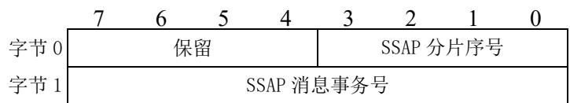

图12 扩展消息控制码

除属性值字段以外，SSAP协议中的多字节传输应为小端模式（Little-endian）。属性值字段的传输解析方式应由基础应用层或基础服务层功能单元来定义。

##### 7.4.2.2 数据与传输适配要求

SSAP协议的一次完整的单向交互包括2种情况：1）从客户端到服务端的命令；2）从服务端到客户端的通知。SSAP协议的一次完整的双向交互包括2种情况：1）从客户端到服务端的请求和相应的从服务端到客户端的响应；2）从服务端到客户端的指示和相应的从客户端到服务端的确认。一次双向交互应在同一SSAP传输通道上进行。如果一次SSAP协议双向交互未能在30秒内完成，则应被认为交互失败，基础应用层或基础服务层功能单元应被通知该失败结果。本次失败的SSAP PDU被丢弃。如果SSAP传输通道在SSAP协议双向交互过程中突然断开，本次交互应被认为已经终止，服务端在交互过程中正在发生变更的属性值应被视为不确定状态，具体应由基础应用层或基础服务层功能单元处理。

SSAP协议的单向交互是没有流量控制的，客户端可以随时发送命令，服务端可以随时发送通知。

除非使用“SSAP 消息事务号”功能，SSAP 协议的双向交互应使用有序问答方式，如先请求后响应或者先指示后确认。在收到相应的响应或确认前，不应重复发送。具体包括以下情况：

a) 先请求后响应：客户端向服务端发送请求后，在收到响应之前，不能在同一传输通道上继续向同一服务端发送其它请求。

b) 先指示后确认：服务端在收到确认之前，不能在同一传输通道上继续向同一客户端发送其它指示。但是客户端可以在发送确认之前发送命令和请求。

SSAP双向交互的请求-响应和指示-确认的流量控制是独立的，不相互影响。如一个客户端收到来自服务端的指示之后，在回复该指示之前向服务端发送了请求的情况是可能存在的。

SSAP协议在双向交互的过程中仍可进行单向交互，双向交互的流量控制不影响单向交互，具体描述如下：

a) 一个服务端收到请求后，发送一个或多个服务端通知，再发送对原始请求的响应的情况是可能存在的。请求的流量控制不受服务端通知的影响。

b) 一个服务端收到请求，然后在响应该请求之前又收到了命令，这种情况是有可能的。请求的流量控制不受命令的传输影响。

c) 一个服务端在发送指示后，在还没有收到确认时，又发送了服务端通知，这种情况是存在的。

d) 一个客户端收到来自服务端的指示之后，在回复该指示之前向服务端发送命令的情况是可能存在的。

SSAP协议交互中可能出现命令缓存溢出，应做如下处理：

a) 应由基础应用层或基础服务层功能单元定义服务端如何处理接收 SSAP 命令溢出的情况；

b) 缓冲区溢出的客户端，可以继续接受命令无法处理，这些命令可以被客户端忽略。

SSAP协议中，每个客户端和服务端的流量控制应是独立的，服务端应能独立处理来自不同客户端的信令。如服务端应能独立处理每个客户端发送的请求。

SSAP协议交互中可能出现分片情况。部分SSAPPDU支持分片功能。在支持分片功能的SSAPPDU中，消息控制码中的bit0-bit1用于指示分片情况，包括起始包（0b00）/接续包（0b01）/结束包（0b10）等三种分片报文。当分片总数是2个时，只有起始包（0b00）和结束包（0b10）；当分片总数大于等于4个时，接续包（即中间分片）数量大于1。

在一个完整SSAP PDU使用多个分片进行传输的过程中，发送端连续发送多个分片报文，接收端不应针对每个分片进行反馈。当接收端接收完整数据报文后，做进一步处理。若成功接收所有分片并需要反馈时，则发送一个完整的反馈报文。

###### SSAP分片序号功能

当客户端和服务端进行 SSAP 初始信息交互后，发现彼此均支持“SSAP 分片序号”功能时，可在

双方进行SSAP交互时使用SSAP分片序号。

在需要分片时，除了继续使用消息控制码中的bit0-bit1标识起始包（0b00）/接续包（0b01）/结束包（0b10）以外，分片PDU扩展消息控制码中字节0的bit0-bit3可用于指示更多分片信息（图12）。该功能最多支持一个完整数据报文包含16个分片。具体使用方法如下：

a) 起始包：bit0-bit3用于指示分片总数（包含起始包、所有接续包、结束包），取值范围2-16。

b) 接续包: bit0-bit3 用于指示接续包在接续包分片中的序号。第一个接续包为 1 , 第二个接续包为 2 , 以此类推, 取值范围 1-14。

c) 结束包：bit0-bit3用于指示分片总数（包含起始包、所有接续包、结束包），取值范围2-16。

在使用包含扩展消息控制码的 PDU 格式时，若不支持 SSAP 分片序号功能，字节 0 的 bit0-bit3 应设置为 0。若支持但不进行分片时，字节 0 的 bit0-bit3 可设置为 0。

当服务端支持扩展消息控制码的PDU格式，但不支持SSAP分片序号功能时，若客户端发送使能SSAP分片序号功能的PDU时，服务端应返回“服务端不支持分片序号(0x12)”错误类型的SSAP_ERROR_RSP消息。

在发送端和接收端两侧，可能存在各种原因丢弃分片，导致接收端未能全部接收所有分片的情况。在接收端，应启用一个分片接收计时器  $\mathrm{T}_{\mathrm{frag}}$  ，取值范围1-30秒。当接收到分片起始包时开始计时，收到分片结束包时停止计时。若超时后仍没有成功接收所有分片，则认定“分片未全部接收”事件发生。该事件包含“分片接收计时器  $\mathrm{T}_{\mathrm{frag}}$  超时且分片未全部接收”和“收到分片结束包且分片未全部接收”等情况。当该事件发生时，按如下情况处理：

- 单向交互时，包括从客户端到服务端的命令、从服务端到客户端的通知，接收端（客户端或服务端）应认定该完整数据报文未能接收成功，可丢弃缓存的相关分片。

- 基于REQ和RSP消息的双向交互时，即从客户端到服务端的请求和相应的从服务端到客户端的响应的双向交互时，接收端应认定该完整数据报文未能接收成功，可丢弃缓存的相关分片。当接收端为服务端时，即服务端接收分片REQ消息时，应进一步反馈携带“服务端未接收所有分包（0x13）”错误类型的SSAP_ERROR_RSP消息；当接收端为客户端时，即客户端接收分片RSP消息时，可发起新一轮基于REQ和RSP消息的双向交互。

- 基于 IND 和 ACK 消息的双向交互时，即从服务端到客户端的指示和相应的从客户端到服务端的确认的双向交互时，接收端应认定该完整数据报文未能接收成功，可丢弃缓存的相关分片。当接收端为客户端时，即客户端接收分片 IND 消息时，应反馈包含“接收失败”错误信息的 ACK 消息；当接收端为服务端时，即服务端接收分片 ACK 消息时，可发起新一轮基于 IND 和 ACK 消息的双向交互。

###### SSAP消息事务号功能

当客户端和服务端进行SSAP初始信息交互后，发现彼此均支持“SSAP消息事务号”功能时，可在双方进行SSAP交互时使用SSAP消息事务号。

该功能允许客户端和服务端在基于SSAP协议进行单向交互或双向交互时，每个SSAP PDU可携带SSAP消息事务号，同时取消了SSAP协议在双向交互时需使用有序问答方式的限制，即允许发送端在收到响应或确认前，可多次发送新的请求或指示消息。具体包括以下情况：

- 先请求后响应：客户端向服务端发送请求后，在收到响应之前，可在同一传输通道上继续向同一服务端发送新请求。

- 先指示后确认：服务端在收到确认之前，可在同一传输通道上继续向同一客户端发送新指示。

SSAP PDU 的“扩展消息控制码”字段中第 2 字节用于指示 SSAP PDU 的消息事务号（图 12），取值范围 1-255。实际最大值应设置为客户端和服务端双方支持的最大 SSAP 消息事务号中的较小值。SSAP PDU 消息事务号从 1 开始计数，新的 SSAP PDU 中的消息事务号依次使用下一个递增的、未使用的数值。当消息事务号达到客户端和服务端双方支持的最大 SSAP 消息事务号中的较小值后，应回退为

1。

同一对设备间基于SSAP协议的单向交互、双向交互的请求-响应和双向交互的指示-确认，应使用不同的消息事务号空间。

响应或确认 PDU 的消息事务号应与对应的请求或指示 PDU 中的消息事务号保持相同。

使用SSAP消息事务号功能时，基础应用层或基础服务层功能单元应确保前后多个并发消息之间没有依赖关系，否则可能产生未知结果。

当SSAP PDU分片时，同一SSAP PDU完整报文的所有分片应使用相同的消息事务号。

当服务端支持扩展消息控制码的PDU格式，但不支持SSAP消息事务号功能时，若客户端发送使能SSAP消息事务号功能的PDU时，服务端应返回“服务端不支持消息事务号（0x14）”错误类型的SSAP_ERROR_RSP消息。

###### SSAP 可靠模式功能

默认情况下，SSAP协议使用SLB或SLE服务管理传输通道（TCID为0x09或0x0A）进行传输。该传输通道为基础模式传输通道。

在同时满足以下条件时，客户端和服务端可创建可靠模式传输通道用于SSAP协议交互。

a) 通过连接管理能力查询（参见 T/XS20002-2025 第7章），确认双方均支持可靠模式传输通道。

b) 通过SSAP初始信息交互，确认双方均支持“SSAP可靠模式”功能。

若SSAP PDU使用可靠模式传输通道进行传输，其使用的帧头PI字段应指示“SSAP协议”（见T/XS20002-20256.5节）。

当服务端不支持 SSAP 可靠模式功能时，若在某可靠模式传输通道上接收到 SSAP PDU 时，应直接丢弃该报文。

支持“SSAP可靠模式”的服务端在接收到来自客户端基于可靠模式传输通道的SSAP PDU后，后续可基于该传输通道与该客户端进行SSAP交互；若该服务端未曾接收到来自客户端基于可靠模式传输通道的SSAP PDU，不应主动发起与该客户端的基于可靠模式传输通道的SSAP交互。

客户端进行基于可靠模式传输通道的 SSAP 交互，也可以继续使用默认服务管理传输通道与同一服务端进行 SSAP 交互；同样的，服务端进行基于可靠模式传输通道的 SSAP 交互后，也可以继续使用默认服务管理传输通道与同一客户端进行 SSAP 交互。双方应确保一次完整的双向交互或一次单向交互中的所有分片在相同的传输通道中进行传输。

#### 7.4.3 SSAP全指令集

SSAP的全部指令见表49。

表 49 SSAP全指令集

<table><tr><td>消息分类</td><td>功能名称与说明</td><td>PDU 消息</td><td>消息码</td><td>描述说明</td></tr><tr><td>错误处理</td><td>服务端返回错误响应</td><td>SSAP_ERROR_RSP</td><td>0x01</td><td>错误响应消息</td></tr><tr><td rowspan="2">信息交互</td><td rowspan="2">初始信息交互</td><td>SSAP_EXCHANGE_INFO_REQ</td><td>0x02</td><td>客户端与服务端交互信息的请求消息</td></tr><tr><td>SSAP_EXCHANGE_INFO_RSP</td><td>0x03</td><td>服务端与客户端交互信息的响应消息</td></tr><tr><td>服务发现</td><td>服务发现交互消息: 支持服务结构或分层发现机制</td><td>SSAPFindSTRUCTURE_REQ</td><td>0x04</td><td>服务管理交互请求消息: 支持服务结构或分层发现机制</td></tr><tr><td rowspan="3"></td><td></td><td>SSAP_FINDSTRUCTURE_RSP</td><td>0x05</td><td>服务管理交互响应消息</td></tr><tr><td rowspan="2">通过UUID发现指定的服务结构,支持服务结构或分层发现机制</td><td>SSAP_FIND_BY_UID_REQ</td><td>0x06</td><td colspan="1">通过UUID发现指定的服务结构的请求消息;支持服务结构或分层发现机制</td></tr><tr><td>SSAP_FIND_BY_UID_RSP</td><td>0x07</td><td colspan="1">通过UUID发现指定的服务结构的响应消息</td></tr><tr><td rowspan="4">读取操作</td><td rowspan="2">1.使用句柄读取单个或多个条目数据信息,句柄所关联的类别和权限已知。若超过MTU可分包发送2.也可读取散列值</td><td>SSAP_READ_REQ</td><td>0x08</td><td>读取请求消息;可使用句柄读取单个或多个条目数据信息;支持读取散列值</td></tr><tr><td>SSAP_READ_RSP</td><td>0x09</td><td colspan="1">读取响应消息(可返回多条属性)</td></tr><tr><td rowspan="2">用于客户端已知属性、方法或者事件的服务UUID,但是未知其句柄时,仍可读取属性的数据信息</td><td>SSAP_READ_BY_UID_REQ</td><td>0x0A</td><td colspan="1">用于客户端已知属性、方法或者事件的服务UUID,但是未知其句柄时,仍可读取属性的数据信息的请求消息(基于UUID)</td></tr><tr><td>SSAP_READ_BY_UID_RSP</td><td>0x0B</td><td colspan="1">基于UUID的读取响应消息(可返回多条属性)</td></tr><tr><td rowspan="3">写入操作</td><td>无响应写入(单个值或者多个值)</td><td>SSAP_WRITE_CMD</td><td>0x0C</td><td>写入命令消息(无响应):支持单个值或者多个值写入</td></tr><tr><td rowspan="2">有响应写入(单个值或者多个值)</td><td>SSAP_WRITE_REQ</td><td>0x0D</td><td colspan="1">写入请求消息:支持单个值或者多个值</td></tr><tr><td>SSAP_WRITE_RSP</td><td>0x0E</td><td colspan="1">写入响应消息:支持单个值或者多个值</td></tr><tr><td rowspan="3">通知或指示</td><td>服务数据属性或事件变化通知(无确认)</td><td>SSAP_VALUE_NTF</td><td>0x0F</td><td>服务数据属性或事件变化通知消息(无响应):可支持多条通知</td></tr><tr><td rowspan="2">服务数据属性或事件变化指示(有确认)</td><td>SSAP_VALUE_IND</td><td>0x10</td><td colspan="1">服务数据属性或事件变化指示消息:可支持多条指示</td></tr><tr><td>SSAP_VALUE_ACK</td><td>0x11</td><td colspan="1">服务数据属性或事件变化确认消息</td></tr><tr><td rowspan="3">方法调用</td><td rowspan="3">客户端调用方法</td><td>SSAP_CALL_METHOD_CMD</td><td>0x12</td><td>客户端调用方法的命令消息(无响应)</td></tr><tr><td>SSAP_CALL_METHOD_REQ</td><td>0x13</td><td colspan="1">客户端调用方法的请求消息</td></tr><tr><td>SSAP_CALL_METHOD_RSP</td><td>0x14</td><td colspan="1">客户端调用方法的响应消息</td></tr></table>

以下四条信令作为基础要求信令集，客户端应能发送以下信令和处理所有信令的响应，服务端应能正确接收处理并发出相应的响应：

SSAP_FINDSTRUCTURE_REQ

SSAPFind_BY_UID_REQ

SSAP_READ_REQ

- SSAP_READ_BY_UID_REQ

基础要求信令集既包括客户端针对服务端所提供的服务结构条目或属性值进行发现或读取，也包括对服务端进行快速服务发现；能够减少服务交互流程，达到降低获取所需服务的时延的目的。

基础要求信令集还包含如下通知信令。服务端应能发送该通知信令，客户端应能正确处理该通知信令：

SSAP_VALUE_NTF

#### 7.4.4 SSAP PDU

##### 7.4.4.1 概述

根据交互功能的不同，可以将PDU消息分为七个类别：错误处理、信息交互、服务发现、读取操作、写入操作、通知或指示和方法调用。

##### 7.4.4.2 错误处理

###### SSAP_ERROR_RSP

SSAP_ERROR_RSP PDU 用于描述一个请求无法完成，由服务端返回的错误响应。

在访问请求信令中如涉及访问多个条目的错误响应，则由服务端通过对应的响应消息（而非SSAP_ERROR_RSP PDU）直接返回至发起请求的客户端。

表 50 SSAP_ERROR_RSP PDU格式

<table><tr><td>PDU参数</td><td>长度(字节)</td><td>PDU 参数描述</td></tr><tr><td>消息码(0x01)</td><td>1</td><td>属性消息码</td></tr><tr><td>消息控制码</td><td>1</td><td>RFU</td></tr><tr><td>请求消息码</td><td>1</td><td>产生错误的请求消息码</td></tr><tr><td>错误句柄</td><td>2</td><td>产生错误的请求句柄值</td></tr><tr><td>错误码</td><td>1</td><td>错误码</td></tr></table>

SSAP ERROR RSP PDU 由消息码、消息控制码、请求消息码、错误句柄和错误码五个参数组成:

消息码参数值设置为  $0 \times 01$

消息控制码参数值为保留；

请求消息码参数值设置为产生此错误的对应请求消息码；

错误句柄参数值设置为产生此错误的对应请求句柄值；

错误码的参数应为表51所示的值之一。

表 51 错误码总集

<table><tr><td>错误类型</td><td>错误码</td><td>错误描述</td></tr><tr><td>无效 PDU</td><td>0x01</td><td>服务端接收的 PDU 无法解析</td></tr><tr><td>PDU 不支持</td><td>0x02</td><td>服务端不支持处理接收的 PDU</td></tr><tr><td>未知错误</td><td>0x03</td><td>服务端执行请求时发生未知错误</td></tr><tr><td>无效句柄</td><td>0x04</td><td>请求中的句柄无效</td></tr><tr><td>资源不足</td><td>0x05</td><td>服务端没有足够资源完成请求</td></tr><tr><td>禁止读取</td><td>0x06</td><td>服务端禁止客户端读取值</td></tr><tr><td>禁止写入</td><td>0x07</td><td>服务端禁止客户端写入值或描述符</td></tr><tr><td>客户端未认证</td><td>0x08</td><td>客户端未经过认证</td></tr><tr><td>客户端未授权</td><td>0x09</td><td>客户端未被授权</td></tr><tr><td>承载未加密</td><td>0x0A</td><td>传输PDU的承载未加密</td></tr><tr><td>未找到条目</td><td>0x0B</td><td>服务端未找到对应条目</td></tr><tr><td>方法访问错误</td><td>0x0C</td><td>服务端被访问的条目不可使用方法进行访问</td></tr><tr><td>数据类型错误</td><td>0x0D</td><td>客户端发送的读取或写入数据类型不符</td></tr><tr><td>数据值长度错误</td><td>0x0E</td><td>客户端发送的数据长度错误</td></tr><tr><td>值超出范围</td><td>0x0F</td><td>客户端写入的值超出范围</td></tr><tr><td>服务端不支持分包</td><td>0x10</td><td>服务端不支持信令的分包发送</td></tr><tr><td>条目数量超限</td><td>0x11</td><td>请求数量超出服务端的支持能力</td></tr><tr><td>服务端不支持分片序号</td><td>0x12</td><td>服务端不支持信令的分片序号功能</td></tr><tr><td>服务端未接收所有分包</td><td>0x13</td><td>服务端未接收所有分包</td></tr><tr><td>服务端不支持消息事务号</td><td>0x14</td><td>服务端不支持消息事务号功能</td></tr><tr><td>上层应用错误</td><td>0xEF~0xFF</td><td>预留给上层协议定义应用错误</td></tr><tr><td>其它</td><td>未定义错误码</td><td>保留</td></tr></table>

如果服务端收到的请求消息无法正确解析，则服务端应在其响应消息中包括“无效PDU”的错误码并将相应的属性句柄设置为0x0000。

如果服务端收到一个不支持的请求消息，则服务端应在其响应消息中包括“PDU不支持”的错误码并将相应的属性句柄设置为0x0000。不支持的请求消息可以是不支持该消息码的处理，或不支持请求中消息控制码的处理。

如果服务端收到一个无效的或者不支持的命令消息，则服务端应忽略该命令。

如果服务端没有足够的资源处理一个请求消息，则服务端应在其响应消息中包括“资源不足”的错误码并将相应的属性句柄设置为0x0000。如果服务端在处理一个请求消息时出现错误，则服务端应在其响应消息中包括“未知错误”的错误码并将相应的属性句柄设置为0x0000。

如果客户端的请求涉及多个条目，而服务端仅支持访问单个条目，服务端应发送带“条目数量超限”错误码的 SSAP_ERROR_RSP_PDU 响应消息。

如果在 SSAP_ERROR_RSP PDU 接收到一个客户端不能解释的错误码，那么 SSAP_ERROR_RSP

PDU 仍说明给定的请求由于未知原因不能执行。

如果服务端需要发送“无效 PDU”，“PDU 不支持”，“资源不足”，“条目数量超限”的错误码，应使用 SSAP_ERROR_RSP_PDU。

“服务端未接收所有分包”错误码，请参见7.4.2.1 相关描述。

“服务端不支持分片序号”错误码，请参见7.4.2.2 SSAP分片序号功能相关章节。

“服务端不支持消息事务号”错误码，请参见7.4.2.2 SSAP消息事务号功能相关章节。

另外，服务端发送 SSAP_ERROR_RSP PDU 之后不应中断与客户端的连接。

##### 7.4.4.3 信息交互

###### SSAP_EXCHANGE_INFO_REQ

初始信息交互：客户端使用SSAP_EXCHANGE_INFO_REQ PDU向服务端发送信息交互的请求。本PDU应作为客户端与服务端启动服务交互流程时所调用的第一个信令。

表 52 SSAP_EXCHANGE_INFO_REQ PDU格式

<table><tr><td>PDU参数</td><td>长度(字节)</td><td>PDU 参数描述</td></tr><tr><td>消息码(0x02)</td><td>1</td><td>消息码</td></tr><tr><td>消息控制码</td><td>1</td><td>位图方式表示:bit0:MTU;bit1:星闪协议版本号;bit2:扩展消息控制码;bit3:SSAP可靠模式;bit4~bit7:保留</td></tr><tr><td>客户端MTU</td><td>2</td><td>客户端接收MTU</td></tr><tr><td>版本</td><td>2</td><td>星闪协议版本号:字节0:大版本号;字节1:小版本号;</td></tr><tr><td>扩展消息控制码</td><td>4</td><td>字节0使用位图方式表示:bit0-1:扩展消息控制码的长度,0b00表示2字节,其他值保留bit2:SSAP分片序号功能,0表示不支持,1表示支持;bit3:SSAP消息事务号功能,0表示不支持,1表示支持;bit4-7:保留;字节1:当字节0中bit3为1时,该字节指示客户端支持的最大SSAP消息事务号数量,取值范围1-255,否则该字节无意义;字节2-3:保留。</td></tr></table>

SSAP_EXCHANGE_INFO_REQ PDU（信息交互请求）由消息码、消息控制码、客户端MTU和版本四个参数组成：

消息码参数值设置为  $0\mathrm{x}02$

消息控制码参数值以位图方式设置为不同意义的值：bit0表示MTU，bit1表示版本，bit2表示扩展消息控制码，bit3表示SSAP支持可靠模式，bit4-7为保留位。只有在对应位图值为1时，PDU载荷才可能包含相应的参数。

当消息控制码bit3为1时，表示客户端支持SSAP可靠模式，即SSAP PDU可基于可靠模式传输通道进行交互。

客户端MTU参数值设置为客户端能够接受的MTU值；该参数值应大于或等于该SSAP传输通道的缺省MTU值；

未进行MTU协商时，SSAP传输通道的MTU应为该传输通道的缺省MTU。MTU协商后，SSAP传输通道的MTU应为协商后的值。

版本参数值设置为星闪协议版本号（支持大小版本号），第一个字节为大版本号，第二个字节为小版本号。

扩展消息控制码参数为4字节，参见表52。当PDU参数“消息控制码”字段中bit2“扩展消息控制码”设置为1，并且PDU参数“扩展消息控制码”字段中字节0的bit2设置为1时，支持“SSAP分片序号”功能。当PDU参数“消息控制码”字段中bit2“扩展消息控制码”设置为1，并且PDU参数“扩展消息控制码”字段中字节0的bit3设置为1时，支持“SSAP消息事务号”功能，字节1继续指示客户端支持的最大SSAP消息事务号数量；若不支持该功能，字节1无意义。

###### SSAP_EXCHANGE_INFO_RSP

服务端接收到客户端发送的 SSAP_EXCHANGE_INFO_REQ 后，使用 SSAP_EXCHANGE_INFO_RSP 进行响应。

表 53 EXCHANGE_INFO_RSP PDU 格式

<table><tr><td>PDU参数</td><td>长度(字节)</td><td>PDU参数描述</td></tr><tr><td>消息码(0x03)</td><td>1</td><td>消息码</td></tr><tr><td>消息控制码</td><td>1</td><td>位图方式表示:bit0:MTU;bit1:星闪协议版本号;bit2:扩展消息控制码;bit3:SSAP可靠模式;bit4~bit7:保留。</td></tr><tr><td>服务端MTU</td><td>2</td><td>服务端接收MTU</td></tr><tr><td>版本</td><td>2</td><td>星闪协议版本号:字节0:大版本号;字节1:小版本号。</td></tr><tr><td>扩展消息控制码</td><td>4</td><td>字节0使用位图方式表示:bit0-1:扩展消息控制码的长度,0b00表示2字节,其他值保留;bit2:SSAP分片序号功能,0表示不支持,1表示支持;bit3:SSAP消息事务号功能,0表示不支持,1表示支持;bit4-7:保留;字节1:当字节0中bit3为1时,该字节指示服务端支持的最大SSAP消息事务号个数,取值范围1-255,否则该字节无意义;字节2-3:保留。</td></tr></table>

SSAP_EXCHANGE_INFO_RSP PDU（信息交互响应）由消息码、消息控制码、服务端MTU和版本四个参数组成：

消息码参数值设置为  $0\mathrm{x}03$

消息控制码参数值以位图方式设置为不同意义的值：bit0表示MTU，bit1表示版本，bit2表示扩展消息控制码，bit3表示SSAP支持可靠模式传输通道，bit4-7为保留位。只有在对应位图值为1时，PDU载荷才可能包含相应的参数。

当消息控制码bit3为1时，表示服务端支持SSAP可靠模式，即SSAP PDU可基于可靠模式传输通道进行交互。

服务端MTU参数值设置为服务端能够接受的MTU值；服务端MTU值应大于或等于SSAP传输通道缺省MTU值，SSAP传输通道缺省MTU由数据传输与适配功能单元决定，见T/XS20002-2025第6章。

未进行MTU协商时，SSAP传输通道MTU应为SSAP传输通道的缺省MTU。通过EXCHANGE_INFO_REQ和EXCHANGE_INFO_RSP信令进行协商后，SSAP传输通道MTU应设置为客户端MTU与服务端MTU两者的较小值。

客户端和服务端发出的所有信令 PDU 数据长度应小于或等于该 SSAP 传输通道的 MTU。

如果协商MTU过程发生错误，如客户端MTU或服务端MTU参数设置不合法，则该SSAP传输通道MTU不发生变化。

如果某设备同时是一个客户端和服务端，下列规则应适用于其交互流程：

a）该设备的SSAP_EXCHANGE_INFO_REQ PDU和SSAP_EXCHANGE_INFO_RSP PDU消息中设置的MTU值应相同；

b) MTU值可以进行单向或双向交互，而且MTU值应在每个方向的交互中均为相同的值；

c）如果该设备在SSAP_EXCHANGE_INFO_REQ PDU发出后但在SSAP_EXCHANGE_INFO_RSP PDU收到之前收到某个SSAP请求消息，那么相关SSAP响应消息应使用缺省MTU值；

d) 当SSAP_EXCHANGE_INFO_REQ PDU发出后，该发起设备只能在收到SSAP_EXCHANGE_INFO_RSP PDU后再发出SSAP通知或指示消息，以避免出现MTU值未知的情况。

版本参数值设置为星闪协议版本号（支持大小版本号），第一个字节为大版本号，第二个字节为小版本号。

扩展消息控制码参数为4字节，参见表53。当PDU参数“消息控制码”字段中bit2“扩展消息控制码”设置为1，并且PDU参数“扩展消息控制码”字段中字节0的bit2设置为1时，支持“SSAP分片序号”功能。当PDU参数“消息控制码”字段中bit2“扩展消息控制码”设置为1，并且PDU参数“扩展消息控制码”字段中字节0的bit3设置为1时，支持“SSAP消息事务号”功能，字节1继续指示服务端支持的最大SSAP消息事务号数量；若不支持该功能，字节1无意义。

##### 7.4.4.4 服务发现

###### SSAP_FINDSTRUCTURE_REQ

服务发现交互信令支持服务结构或分层发现机制：SSAP_FINDSTRUCTURE_REQ用于客户端向服务端发送发现服务结构的请求。客户端可通过本PDU使用各种查找类型，例如整个服务结构，首要服务，引用服务等。服务结构发现机制可直接通过一个请求发现服务端的整个服务结构。分层发现机制是指可根据服务结构层次依次通过多个请求逐步发现首要服务、引用服务、属性、方法、事件等服务结构成员。

表 54 SSAP_FINDSTRUCTURE_REQ PDU格式

<table><tr><td>PDU参数</td><td>长度（字节）</td><td>PDU 参数描述</td></tr><tr><td>消息码(0x04)</td><td>1</td><td>消息码</td></tr><tr><td>消息控制码</td><td>1</td><td>bit2~bit0: 指示查找类型，服务结构（0b000）/首要服务（0b001）/引用服务（0b010）/属性（0b011）/方法（0b100）/事件（0b101）/RFU（others）
bit4-bit3: 仅标准条目（0b00）/厂商自定义（0b01）/混合（0b10）/RFU（0b11）
bit5: 响应模式：0=客户端单次请求，服务端仅响应一次，查找结果超过单次响应承载时，需要客户端继续发送请求。1=客户端单次请求，服务端通过一次或多次响</td></tr><tr><td></td><td></td><td>应,返回完整查找结果
bit7-bit6: RFU</td></tr><tr><td>起始句柄</td><td>2</td><td>查找的起始句柄: 0x0001 ~ 0xFFFF</td></tr><tr><td>结束句柄</td><td>2</td><td>查找的结束句柄: 0x0001 ~ 0xFFFF</td></tr></table>

SSAP_FINDSTRUCTURE_REQ PDU由消息码、消息控制码、起始句柄和结束句柄四个参数组成：

消息码参数值设置为  $0 \times 04$

消息控制码参数值以位图方式设置为不同意义的值，其中bit6-bit7为保留值，其他bit定义详见表54；

起始句柄的值设置为查找的起始句柄；

结束句柄的值设置为查找的结束句柄；起始句柄值应小于或等于结束句柄值。客户端希望获取的服务信息句柄值应设置在起始句柄值与结束句柄值之间。

本请求 PDU 支持一次性查询整个服务端上的整个服务结构或分层查询一个或多个符合条件的服务结构成员。

###### SSAP_FINDSTRUCTURE_RSP

SSAP_FINDSTRUCTURE_RSP PDU用于服务端收到SSAP_FINDSTRUCTURE_REQ PDU请求后，向客户端发送对应的响应（支持分包发送）。服务端根据客户端请求消息中的条目类型进行过滤，服务端可根据自身实现选择条目格式打包，并在SSAP_FINDSTRUCTURE_RSP消息的消息控制码中的bit3-bit2位带上条目类型，客户端根据SSAP_FINDSTRUCTURE_RSP消息中的条目类型来进行解包。

表 55 SSAP_FINDSTRUCTURE_RSP PDU格式

<table><tr><td>PDU参数</td><td>长度（字节）</td><td>PDU 参数描述</td></tr><tr><td>消息码(0x05)</td><td>1</td><td>消息码</td></tr><tr><td>消息控制码</td><td>1</td><td>bitl-bit0: 起始数据包 (0b00) / 中间数据包 (0b01) /结束数据包 (0b10) / 单个完整数据包 (0b11)
bit3-bit2: 仅标准条目 (0b00) / 厂商自定义 (0b01) /混合 (0b10) / RFU (0b11)
bit7~bit4: RFU</td></tr><tr><td>数据列表</td><td>可变</td><td>查找服务结构返回的数据列表见表 56;查找首要服务/引用服务返回的数据列表见表 58;查找属性/方法/事件返回的数据列表见表 61;</td></tr></table>

SSAP_FINDSTRUCTURE_RSP PDU由消息码、消息控制码、和数据列表三个参数组成。

消息码参数值设置为  $0 \times 05$

消息控制码参数值使用bit1-bit0设置为本条消息的数据包状态，其他bits则为保留位；

数据列表根据查找的不同服务结构设置为不同的值，详见表 55：

如果客户端发送的 SSAP_FINDSTRUCTURE_REQ PDU 中指示查找的是某类服务结构成员，则服务端应向客户端返回指定句柄范围内所有该类服务结构成员的信息，返回信息见表 56。

表 56 服务结构格式

<table><tr><td>服务结构成员</td><td>成员格式</td></tr><tr><td>服务声明</td><td>以结构体表示，成员包括：{句柄（服务声明句柄）}，</td></tr><tr><td></td><td>类别（服务声明类别指示），
标识（服务 UUID，UUID长度可根据类别识别），
描述符类型列表（服务包含的描述符类型，列表结构见表57）
}</td></tr><tr><td>服务引用声明</td><td>以结构体表示，成员包括：
{
句柄（服务引用声明句柄），
类别（服务引用类别指示），
标识（被引用服务的UUID，UUID长度可根据类别识别），
起始句柄（被引用服务的起始句柄），
结束句柄（被引用服务的结束句柄）
}</td></tr><tr><td>属性/事件/方法</td><td>以结构体表示，成员包括：
{
句柄（属性/事件/方法句柄），
类别（属性/事件/方法类别指示），
标识（属性/事件/方法UUID，UUID长度可根据类别识别），
操作指示（属性/事件/方法操作指示），
描述符类型列表（属性/事件/方法包含的描述符类型，列表结构见表57）
}</td></tr></table>

上表中，描述符类型列表用于指示服务声明、属性、方法或事件条目中包含的描述符类型，描述符类型列表格式见表57。

表 57 描述符类型列表格式

<table><tr><td>成员</td><td>成员说明</td></tr><tr><td>描述符数目</td><td>指示描述符类型列表存在的描述符数目N，长度1字节</td></tr><tr><td>描述符类型1</td><td>第一个描述符类型</td></tr><tr><td>描述符类型2</td><td>第二个描述符类型</td></tr><tr><td>……</td><td>……</td></tr><tr><td>描述符类型N</td><td>第N个描述符类型</td></tr></table>

客户端使用SSAP FINDSTRUCTUREREQ查询获取服务结构示例见附录A.1和A.2节。

如果客户端发送的 SSAP_FINDSTRUCTURE_REQ PDU 中指示查找的是首要服务或者引用服务，则服务端将向客户端返回服务数据库中指定句柄范围内所有满足指示条件的首要服务或者引用服务的信息，服务信息格式见表 58。

表 58 服务信息格式

<table><tr><td>查找服务类型</td><td>服务信息格式说明</td></tr><tr><td>首要标准服务/引用标准服务信息</td><td>单个标准服务的服务信息以如下四元组结构表示，包括：{服务起始句柄，服务结束句柄，服务标识（16bits的UUID），服务成员类型指示（指示服务包含的成员类型，成员格式见表59）}</td></tr><tr><td></td><td>单个引用标准服务的服务信息以如下五元组结构表示,包括: {引用服务自身句柄,服务起始句柄,服务结束句柄,服务标识(16bits的UUID),服务成员类型指示(指示服务包含的成员类型,成员格式见表59)}如果存在多个标准服务/引用服务满足条件,则存在多个服务信息结构。</td></tr><tr><td>自定义服务/引用自定义服务信息</td><td>单个自定义服务以如下四元组结构表示,包括: {服务起始句柄,服务结束句柄,服务标识(128bits的UUID),服务成员类型指示(指示服务包含的成员类型,成员格式见表59)}单个引用自定义服务以如下五元组结构表示,包括: {引用服务自身句柄,服务起始句柄,服务结束句柄,服务标识(128bits的UUID),服务成员类型指示(指示服务包含的成员类型,成员格式见表59)}如果存在多个自定义服务/引用自定义服务满足条件,则存在多个服务信息结构。</td></tr><tr><td>所有服务/被引用信息(混合方式)</td><td>混合服务信息可以包含多个标准服务信息和多个自定义服务信息,混合服务信息格式包含标准服务信息子结构和自定义服务子结构,格式如下结构体所示,包括:{{信息指示,{单个标准服务信息四元组结构或者五元组结构}},...},{信息指示,{单个自定义服务信息四元组结构或者五元组结构}},...},}信息指示结构定义见表60</td></tr></table>

表58服务信息格式中服务成员类型指示长度1字节，使用比特0至比特3指示服务中存在的成员类型。服务成员类型指示见表59。

表 59 服务成员类型指示格式

<table><tr><td>比特位</td><td>说明</td></tr><tr><td>0</td><td>指示是否存在服务引用，0表示不存在服务引用，1表示存在服务引用。</td></tr><tr><td>1</td><td>指示是否存在属性，0表示不存在属性，1表示存在属性。</td></tr><tr><td>2</td><td>指示是否存在方法，0表示不存在方法，1表示存在方法。</td></tr><tr><td>3</td><td>指示是否存在事件，0表示不存在事件，1表示存在事件。</td></tr><tr><td>4~7</td><td>保留</td></tr></table>

表58服务信息格式中的信息指示长度1字节，使用比特7指示子结构中的信息类型，使用比特0至比特6指示后续跟随的单个服务信息结构数目。信息指示格式见表60。

表 60 服务信息指示格式

<table><tr><td>比特位</td><td>说明</td></tr><tr><td>7</td><td>指示信息类型，0表示跟随的四元组或者五元组为标准定义的服务/引用服务/属性/事件/方法信息，1表示跟随的四元组或者五元组为自定义服务/引用服务/属性/事件/方法信息。</td></tr><tr><td>6~0</td><td>子结构中，信息指示后续跟随的信息四元组或者五元组数目</td></tr></table>

如果客户端发送的 SSAP_FINDSTRUCTURE_REQ PDU 中指示查找的是属性/方法/事件信息，则服务端将向客户端返回服务数据库中指定句柄范围内所有满足指示条件的属性/方法/事件信息，属性/方法/事件信息格式见表 61。

表 61 属性/方法/事件信息格式

<table><tr><td>查找属性/事件/方法类型</td><td>属性/方法/事件信息格式</td></tr><tr><td>标准属性/方法/事件信息</td><td>单个属性/方法/事件信息以如下四元组结构表示,包括: {属性/方法/事件句柄,属性/方法/事件标识(16bits UUID),属性/方法/事件操作指示,描述符类型列表(属性/事件/方法包含的描述符类型,列表结构见表57)}如存在多个标准属性/方法/事件满足条件,则返回多个标准属性/方法/事件信息。</td></tr><tr><td>自定义属性/方法/事件信息</td><td>单个属性/方法/事件信息以如下四元组结构表示,包括: {属性/方法/事件句柄,属性/方法/事件标识(128bits UUID),属性/方法/事件操作指示,描述符类型列表(属性/事件/方法包含的描述符类型,列表结构见表57)}如存在多个自定义属性/方法/事件满足条件,则返回多个自定义属性/方法/事件信息。</td></tr><tr><td>所有属性/方法/事件信息(混合方式)</td><td>混合属性/事件/方法信息可以包含多个标准属性/事件/方法信息和多个自定义属性/事件/方法信息,混合属性/事件/方法信息格式包含标准属性/事件/方法信息子结构和自定义属性/事件/方法子结构,格式如下结构体所示,包括:{信息指示,{标准属性/事件/方法信息四元组}},...},{信息指示,{自定义属性/事件/方法信息四元组}},...},信息指示定义见表60。</td></tr></table>

如果 SSAP_FINDSTRUCTURE_REQ PDU 能够在服务端上正确查询到一个或多个服务结构成员，该服务端应发送 SSAP_FINDSTRUCTURE_RSP PDU 响应信令，具体格式见表 55。如果出现查询错误，该服务端应发送 SSAP_ERROR_RSP PDU 响应信令，具体格式见表 50。

如果 SSAP_FINDSTRUCTURE_REQ PDU 消息中起始句柄值大于结束句柄值或为 0x0000，服务端应发送带“无效句柄”错误码的 SSAP_ERROR_RSP PDU 响应，并将错误句柄值设置为该起始句柄值。

如果 SSAP_FINDSTRUCTURE_REQ PDU 消息未能成功查询到任何服务结构成员，服务端应发送带“未找到条目”错误码的 SSAP_ERROR_RSP PDU 响应消息，并将错误句柄值设置为起始句柄值。

SSAP_FINDSTRUCTURE_RSP PDU中所有返回的服务条目句柄应遵循从小到大的顺序。

###### SSAP_FIND_BY_UID_REQ

服务发现交互信令支持通过UUID发现服务结构：SSAP_FIND_BY_UID_REQ用于客户端向服务端发送通过UUID发现首要服务或引用服务结构、首要服务、属性、事件、方法信息的请求。服务端PDU支持服务结构或分层发现机制。

表 62 SSAP_FIND_BY_UID_REQ PDU 格式

<table><tr><td>PDU参数</td><td>长度(字节)</td><td>PDU参数描述</td></tr><tr><td>消息码(0x06)</td><td>1</td><td>消息码</td></tr><tr><td>消息控制码</td><td>1</td><td>bit2~bit0:指示查找类型,单个服务结构(0b000)/首要服务(0b001)/引用服务(0b010)/属性(0b011)/方法(0b100)/事件(0b101)/RFU(others)
bit4-bit3:仅标准条目(0b00)/厂商自定义(0b01)/混合(0b10)/RFU(0b11)
bit5:响应模式,0表示客户端单次请求,服务端仅响应一次,查找结果超过单次响应承载时,需要客户端继续发送请求。1表示客户端单次请求,服务端通过一次或多次响应,返回完整查找结果;
bit7~bit6:RFU</td></tr><tr><td>起始句柄</td><td>2</td><td>查找的起始句柄</td></tr><tr><td>结束句柄</td><td>2</td><td>查找的结束句柄</td></tr><tr><td>UUID</td><td>2/16</td><td>指定查找服务、属性、方法或事件的UUID</td></tr></table>

SSAP_FIND_BY_UID_REQ PDU 由消息码、消息控制码、起始句柄、结束句柄和 UUID 五个参数组成：

消息码参数值设置为  $0 \times 06$

消息控制码参数值以位图方式设置为不同意义的值，其中bit4-bit7为保留值，其他bit定义详见表62；

起始句柄的值设置为查找的起始句柄；

结束句柄的值设置为查找的结束句柄；起始句柄值应小于或等于结束句柄值。客户端希望获取的服务信息句柄值应设置在起始句柄值与结束句柄值之间。

UUID的值设置为指定查找服务、属性、方法或事件的UUID；标准星闪UUID为2字节（16-bits），自定义UUID为16字节（128-bits）。

如果 UUID的值设置为指定查找服务的UUID，则查找返回的结果，需要根据消息控制码的指示查找类型进行过滤：如指示查找类型为单个服务结构，则查询该服务的所有服务结构；如指示查找类型为首要服务，则查询该服务的首要服务信息；如指示查找类型为属性，则查询该服务的所有属性信息；其

他类似。

如果 UUID的值设置为指定查找属性、方法或事件的UUID，则查找返回的结果为指定属性、方法或事件的信息。说明：UUID设置和消息控制码的指示查找类型需要匹配，如UUID的值设置为属性的UUID，则消息控制码的指示查找类型需设置为属性

SSAP_FIND_BY_UUID_RSP

SSAP_FIND_BY_UID_RSP 用于服务端收到请求后，向客户端发送通过 UUID 发现首要服务或引用服务结构、首要服务、属性、事件、方法信息的响应。该信令支持分包发送。服务端根据客户端请求消息中的条目类型进行过滤，服务端可根据自身实现选择条目格式打包，并在 SSAP_FIND_BY_UID_RSP 消息的消息控制码中的 bit3-bit2 位带上条目类型，客户端根据 SSAP_FIND_BY_UID_RSP 消息中的条目类型来进行解包。

表 63 SSAP_FIND_BY_UID_RSP PDU格式

<table><tr><td>PDU参数</td><td>长度(字节)</td><td>PDU参数描述</td></tr><tr><td>消息码(0x07)</td><td>1</td><td>消息码</td></tr><tr><td>消息控制码</td><td>1</td><td>bitl-bit0: 起始数据包 (0b00) / 中间数据包 (0b01) /结束数据包 (0b10) / 单个完整数据包 (0b11)bit3-bit2: 仅标准条目 (0b00) / 厂商自定义 (0b01) / 混合 (0b10) / RFU (0b11)bit7~bit4: RFU</td></tr><tr><td>数据列表</td><td>可变</td><td>查找单个服务结构时,返回的数据列表见表64;查找首要服务时,返回的数据列表见表66;查找属性/事件/方法时,返回的数据列表见表68;</td></tr></table>

SSAP_FIND_BY_UID_RSP PDU 由消息码、消息控制码、和数据列表三个参数组成。

消息码参数值设置为  $0\mathrm{x}07$

消息控制码参数值使用bit1-bit0设置为本条消息的数据包状态，其他bits则为保留位；

数据列表根据查找的不同服务结构设置为不同的值，详见表 63：

如果客户端发送的 SSAP_FIND_BY_UID_REQ PDU 中指示查找的是服务结构，则服务端将向客户端返回服务数据库中指定 UUID 服务的服务结构，返回的服务结构见表 64。

表 64 服务结构成员格式

<table><tr><td>服务结构成员</td><td>成员格式</td></tr><tr><td>服务声明</td><td>以结构体表示，成员包括：{句柄（服务声明句柄），类别（服务声明类别指示），标识（服务 UUID，UUID长度可通过类别识别），描述符类型列表（服务包含的描述符类型，结构定义见表65）}</td></tr><tr><td>服务引用声明</td><td>以结构体表示，成员包括：{句柄（服务引用声明句柄），类别（服务引用类别指示），标识（被引用服务的UUID，UUID长度可通过类别识别），起始句柄（被引用服务的起始句柄），结束句柄（被引用服务的结束句柄）</td></tr><tr><td></td><td>}</td></tr><tr><td>属性/事件/方法</td><td>以结构体表示，成员包括：{句柄（属性/事件/方法句柄），类别（属性/事件/方法类别指示），标识（属性/事件/方法 UUID，UUID长度可通过类别识别），操作指示（属性/事件/方法操作指示），描述符类型列表（属性/事件/方法包含的描述符类型，格式定义见表65）}</td></tr></table>

表 64 中, 描述符类型列表用于指示服务声明、属性、方法或事件条目中包含的描述符类型, 描述符类型列表格式见表 65。

表 65 描述符类型列表格式

<table><tr><td>成员</td><td>成员说明</td></tr><tr><td>描述符数目</td><td>指示描述符类型列表存在的描述符数目N，长度1字节</td></tr><tr><td>描述符类型1</td><td>第一个描述符类型</td></tr><tr><td>描述符类型2</td><td>第二个描述符类型</td></tr><tr><td>……</td><td>……</td></tr><tr><td>描述符类型N</td><td>第N个描述符类型</td></tr></table>

如果客户端发送的 SSAP_FIND_BY_UID_REQ PDU 中指示查找的是服务信息，则服务端将向客户端返回服务数据库中指定 UUID 服务的服务信息，返回的服务信息具体见表 66。

表 66 服务信息格式

<table><tr><td>查找服务类型</td><td>服务信息格式说明</td></tr><tr><td>首要标准服务/引用标准服务信息</td><td>单个标准服务的服务信息以如下四元组结构表示，包括：{服务起始句柄，服务结束句柄，服务标识（16bits的UUID），服务成员类型指示（指示服务包含的成员类型，成员格式见表59）}单个标准引用服务的服务信息以如下五元组结构表示，包括：{引用服务自身句柄，服务起始句柄，服务结束句柄，服务标识（16bits的UUID），服务成员类型指示（指示服务包含的成员类型，成员格式见表59）}如果存在多个标准服务/引用服务满足条件，则存在多个多个服务信息结构。</td></tr><tr><td>自定义服务/引用自定义服务信息</td><td>单个自定义服务以如下四元组结构表示，包括：{服务起始句柄，服务结束句柄，</td></tr><tr><td></td><td>服务标识（128bits的UUID），服务成员类型指示（指示服务包含的成员类型，成员格式见表59）
}
单个自定义引用服务的服务信息以如下五元组结构表示，包括：
{引用服务自身句柄，
服务起始句柄，
服务结束句柄，
服务标识（128bits的UUID），
服务成员类型指示（指示服务包含的成员类型，成员格式见表59）
}
如果存在多个自定义服务/引用自定义服务满足条件，则存在多个服务信息结构。</td></tr><tr><td>所有服务/被引用信息（混合方式）</td><td>混合服务信息可以包含多个标准服务信息和多个自定义服务信息，混合服务信息格式包含标准服务信息子结构和自定义服务子结构，格式如下结构体所示，包括：
{
  {信息指示，{单个标准服务信息四元组结构}，...},
  {信息指示，{单个自定义服务信息四元组结构}，...},
}信息指示结构定义见表60</td></tr></table>

表66服务信息格式中服务成员类型指示长度1字节，使用比特0至比特3指示服务中存在的成员类型。服务成员类型指示见表67。

表 67 服务成员类型指示格式

<table><tr><td>比特位</td><td>说明</td></tr><tr><td>0</td><td>指示是否存在服务引用，0表示不存在服务引用，1表示存在服务引用。</td></tr><tr><td>1</td><td>指示是否存在属性，0表示不存在属性，1表示存在属性。</td></tr><tr><td>2</td><td>指示是否存在方法，0表示不存在方法，1表示存在方法。</td></tr><tr><td>3</td><td>指示是否存在事件，0表示不存在事件，1表示存在事件。</td></tr><tr><td>4~7</td><td>保留</td></tr></table>

如果客户端发送的 SSAP_FIND_BY_UID_REQ PDU 中指示查找的是属性/事件/方法信息，则服务器将向客户端返回服务数据库中指定 UUID 的属性/事件/方法信息，返回的属性/事件/方法信息具体见表 68。

表 68 属性/方法/事件信息格式

<table><tr><td>查找属性/事件/方法类型</td><td>属性/方法/事件信息格式</td></tr><tr><td>标准属性/方法/事件信息</td><td>单个属性/方法/事件信息以如下四元组结构表示，包括：{属性/方法/事件句柄，</td></tr><tr><td></td><td>属性/方法/事件标识（16bits UUID），
属性/方法/事件操作指示，
描述符类型列表（属性/事件/方法包含的描述符类型，列表
结构见表57）
}如存在多个标准属性/方法/事件满足条件，则返回多个标准属性/方法/事件信
息。</td></tr><tr><td>自定义属性/方法/事
件信息</td><td>单个属性/方法/事件信息以如下四元组结构表示，包括：
{
属性/方法/事件句柄，
属性/方法/事件标识（128bits UUID），
属性/方法/事件操作指示，
描述符类型列表（属性/事件/方法包含的描述符类型，列表
结构见表57）
}如存在多个自定义属性/方法/事件满足条件，则返回多个自定义属性/方法/事
件信息。</td></tr><tr><td>所有属性/方法/事件
信息（混合方式）</td><td>混合属性/事件/方法信息可以包含多个标准属性/事件/方法信息和多个自定义
属性/事件/方法信息，混合属性/事件/方法信息格式包含标准属性/事件/方法
信息子结构和自定义属性/事件/方法子结构，格式如下结构体所示，包括：
{信息指示，{标准属性/事件/方法信息四元组}，...},
{信息指示，{自定义属性/事件/方法信息四元组}，...},
}信息指示定义见表60。</td></tr></table>

如果 SSAP_FIND_BY_UID_REQ PDU 能够在服务端上正确查询到一个或多个服务条目，该服务端应发送 SSAP_FIND_BY_UID_RSP PDU 响应消息，具体格式见表 63。如果出现查询错误，该服务端应发送 SSAP_ERROR_RSP PDU 响应消息，具体格式见表 50。

如果 SSAP_FIND_BY_UID_REQ PDU 消息中起始句柄值大于结束句柄值或为 0x0000，服务端应发送带“无效句柄”错误码的 SSAP_ERROR_RSP PDU 响应消息，并将错误句柄值设置为该起始句柄值。

如果 SSAP_FIND_BY_UID_REQ PDU 消息未能成功查询到任何服务条目，服务端应发送带“未找到条目”错误码的 SSAP_ERROR_RSP PDU 响应消息，并将错误句柄值设置为起始句柄值。

SSAP_FIND_BY_UID_RSP PDU 中所有返回的服务条目句柄应遵循从小到大的递升顺序。

##### 7.4.4.5 读取操作

###### SSAP_READ_REQ

使用句柄读取数据信息：SSAP_READ_REQ 用于客户端向服务端发送读取的请求信息，可以使用句柄和类别读取单个或多个条目的数据信息，支持读取散列值（支持分包发送）。

表 69 SSAP_READ_REQ PDU格式

<table><tr><td>PDU参数</td><td>长度（字节）</td><td>PDU 参数描述</td></tr><tr><td>消息码(0x08)</td><td>1</td><td>消息码</td></tr><tr><td>消息控制码</td><td>1</td><td>bit1-bit0: 起始数据包 (0b00) / 中间数据包 (0b01) /结束数据包 (0b10) / 单个完整数据包 (0b11)bit7~bit2: RFU</td></tr><tr><td>请求句柄列表</td><td>可变</td><td>List 结构如下:{句柄 1, 数据类型 1}, {句柄 2, 数据类型 2}, ...}</td></tr></table>

SSAP_READ_REQ PDU 由消息码、消息控制码和请求句柄列表三个参数组成。

消息码参数值设置为  $0\mathrm{x}08$

消息控制码参数值使用bit1-bit0设置为本条消息的数据包状态，其他bits则为保留位；

请求句柄列表参数值根据客户端读取请求设置为单个或多个不同的值，结构为{{句柄1,数据类型1}, {句柄2,数据类型2},......}。

本PDU中数据类型（可以用于指示属性、方法、事件条目中数据域的成员。

表 70 数据类型定义

<table><tr><td>Type值</td><td>描述</td></tr><tr><td>0</td><td>数据值</td></tr><tr><td>1~255</td><td>描述符值，描述符类型见表71</td></tr></table>

表 71 中描述符类型值定义如下:

表 71 描述符类型定义

<table><tr><td>Type值</td><td>描述</td></tr><tr><td>1</td><td>属性说明描述符</td></tr><tr><td>2</td><td>客户端属性值配置描述符</td></tr><tr><td>3</td><td>服务端属性值配置描述符</td></tr><tr><td>4</td><td>属性格式描述符</td></tr><tr><td>保留值，描述符扩展</td><td>与描述符同步扩展</td></tr></table>

###### SSAP_READ_RSP

SSAP_READ_RSP PDU 用于服务端向客户端收到读取请求后，向客户端发送读取的响应，可支持多个条目数据在同一个响应中返回（支持分包发送）。

表 72 SSAP_READ_RSP PDU格式

<table><tr><td>PDU参数</td><td>长度（字节）</td><td>PDU 参数描述</td></tr><tr><td>消息码(0x09)</td><td>1</td><td>消息码</td></tr><tr><td>消息控制码</td><td>1</td><td>bit1-bit0: 起始数据包 (0b00) / 中间数据包 (0b01) /结束数据包 (0b10) / 单个完整数据包 (0b11)bit2: 0=单个值; 1=多个值;bit3: 错误标识: 0=没有错误; 1=存在错误bit7~bit4: RFU</td></tr><tr><td>数据列表</td><td>可变</td><td>读取单个值时,读取成功时,返回数据列表结构为:{数据值};读取单个值时,读取失败时,返回数据列表结构为:{数据信息指示}读取多个值时,返回数据列表结构为:{{数据信息指示1,数据值1},{数据信息指示2,数据值2}}...}返回的数据值结果与请求中的顺序对应。数据信息指示长度2字节,使用bit15表示数据值是否读取正常,数据列表中bit15为0时,指示失败,bit14-bit0表示的是错误码;若bit15为1时,指示成功,bit14-bit0表示的是对应数据值的长度。读取多个值时,当数据信息指示字段指示读取失败时,数据值不存在。</td></tr></table>

SSAP_READ_RSP PDU 由消息码、消息控制码、数据列表三个 PDU 参数组成。

消息码参数值设置为  $0\mathrm{x}09$

消息控制码参数值以位图方式设置为不同意义的值，其中bit4-bit7为保留值，其他bit定义详见表72；

如果客户端请求读取的句柄在服务端不存在，则服务端应发送带“无效句柄”错误码的 SSAP_READ_RSP PDU 响应消息。

如果 SSAP_READ_REQ PDU 信令未能成功读取到符合句柄和类型要求的单个或多个数据值，服务端应发送带“数据类型错误错误码的 SSAP_READ_RSP PDU 响应消息。如果客户端没有足够的授权，则服务端应发送带“客户端未授权”错误码的 SSAP_READ_RSP PDU 响应。

如果客户端没有足够的安全认证，则服务端应发送带“客户端未认证”错误码的 SSAP_READ_RSP PDU 响应。

如果客户端没有调整加密配置，但欲读取的属性条目需要加密，则服务端应发送带“承载未加密”错误码的SSAP_READ_RSP PDU响应。

如果客户端所请求的属性条目由于访问控制原因不能被读取，则服务端应发送带“禁止读取”错误码的SSAP_READ_RSP PDU响应。

如果服务端的读取响应超过MTU，需要分包发送而服务端不支持分包发送时，服务端应发送带“服务端不支持分包”错误码的SSAP_READ_RSP PDU响应。

如果客户端所请求的属性条目由于应用错误原因不能被读取，则服务端应发送由上层应用定义的应用错误码的 SSAP_READ_RSP PDU 响应。

###### SSAP_READ_BY_UID_REQ

未知句柄时读取数据信息：SSAP_READ_BY_UID_REQ用于客户端已知属性、方法或者事件的UUID，但未知其句柄时，向服务端发送基于UUID读取条目数据的请求。

表 73 SSAP_READ_BY_UID_REQ PDU格式

<table><tr><td>PDU参数</td><td>长度（字节）</td><td>PDU 参数描述</td></tr><tr><td>消息码(0x0A)</td><td>1</td><td>消息码</td></tr><tr><td>消息控制码</td><td>1</td><td>bit0: 0=标准 UUID, 1=自定义 UUID
bit7~bit1: RFU</td></tr><tr><td>起始句柄</td><td>2</td><td>查找的起始句柄</td></tr><tr><td>结束句柄</td><td>2</td><td>查找的结束句柄</td></tr><tr><td>数据类型</td><td>1</td><td>指示读取的数据类型</td></tr><tr><td>UUID</td><td>2/16</td><td>指定属性、方法或者事件的 UUID</td></tr></table>

SSAP_READ_BY_UID_REQ由消息码、消息控制码、起始句柄、结束句柄、数据类型和UUID六个参数组成。

消息码参数值设置为0x0A；

消息控制码参数值使用bit0设置为UUID的类型，其余bit为保留值；

起始句柄的值设置为查找的起始句柄；

结束句柄的值设置为查找的结束句柄；起始句柄值应小于或等于结束句柄值。客户端希望获取的服务信息句柄值应设置在起始句柄值与结束句柄值之间；

数据类型参数值设置为指示读取的数据类型；

UUID参数值置为指定属性、方法或者事件的UUID，标准星闪UUID为2字节（16-bits），自定义UUID为16字节（128-bits）。

本PDU中数据类型定义可参考表70和表71。

SSAP_READ_BY_UID_REQ PDU 支持一次性发送读取一个或多个条目的请求。如果读取结果中出现单个或多个错误，则由服务端返回对应的响应至发起请求的客户端，即 SSAP_READ_BY_UID_RSP PDU（而非 SSAP_ERROR_RSP PDU）。具体错误码可见表 51。

###### SSAP_READ_BY_UID_RSP

SSAP_READ_BY_UID_RSP 用于服务端收到基于 UUID 的读取请求信息后，向客户端发送读取响应，可以支持多条属性在同一个信令中返回（支持分包发送）。

表 74 SSAP_READ_BY_UID_RSP PDU格式

<table><tr><td>PDU参数</td><td>长度(字节)</td><td>PDU 参数描述</td></tr><tr><td>消息码(0x0B)</td><td>1</td><td>消息码</td></tr><tr><td>消息控制码</td><td>1</td><td>bit1-bit0: 起始数据包 (0b00) / 中间数据包 (0b01) /结束数据包 (0b10) / 单个完整数据包 (0b11) bit2: 0=单个实例; 1=多个实例; bit3: 错误标识: 0=没有错误; 1=存在错误bit7~bit4: RFU</td></tr><tr><td>数据列表</td><td>可变</td><td>返回单个实例时,读取成功时,数据列表结构为:{句柄,数据值};返回单个实例时,读取失败时,数据列表结构为:{句柄,数据信息指示};返回多个实例时,数据列表结构为:{{句柄1,数据信息指示1,数据值1}, {句柄2,数据信息指示2,数据值2}...}数据信息指示长度2字节,使用bit15表示数据值是否读取正常,数据列表中bit15是0失败时,bit14-bit0表示的是错误码;若bit15是1成功时,bit14-bit0表示的是对应数据值的长度。</td></tr></table>

SSAP_READ_BY_UID_RSP PDU 由消息码、消息控制码和数据列表三个 PDU 参数组成。

消息码参数值设置为0x0B；

消息控制码参数值以位图方式设置为不同意义的值，其中bit4-bit7为保留值，其他bit定义详见表74；

如果 SSAP_READ_BY_UID_REQ PDU 消息中起始句柄值大于结束句柄值或为 0x0000，服务端

应发送带“无效句柄”错误码的 SSAP_READ_BY_UID_RSP PDU 响应，并将错误句柄值设置为该起始句柄值。

如果 SSAP_READ_BY_UID_REQ PDU 消息未能成功读取到符合 UUID 和类别要求的单个或多个属性条目，服务端应发送带“未找到条目”错误码的 SSAP_READ_BY_UID_RSP 响应消息，并将错误句柄值设置为对应的请求句柄值。

如果客户端没有提供足够的授权，则服务端应发送带“客户端未授权”错误码的SSAP_READ_BY_UID_RSP PDU响应，并将错误句柄值设置为对应的请求句柄值。

如果客户端没有提供足够的安全认证，则服务端应发送带“客户端未认证”错误码的SSAP_READ_BY_UID_RSP PDU响应，并将错误句柄值设置为对应的请求句柄值。

如果客户端没有调整加密配置，但读取的属性条目需要加密，则服务端应发送带“承载未加密”错误码的 SSAP_READ_BY_UID_RSP PDU 响应，并将错误句柄值设置为对应的请求句柄值。

如果客户端所请求的属性条目由于访问控制原因不能被读取，则服务端应发送带“禁止读取”错误码的 SSAP_READ_BY_UID_RSP PDU 响应，并将错误句柄值设置为对应的请求句柄值。

如果服务端的读取响应超过MTU，需要分包发送而服务端不支持分包发送时，服务端应发送带“服务端不支持分包”错误码的SSAP_READ_RSP PDU响应。

如果客户端所请求的属性条目由于应用错误原因不能被读取，则服务端应发送由上层应用定义的应用错误码的 SSAP_READ_BY_UID_RSP PDU 响应，并将错误句柄值设置为对应的请求句柄值。

##### 7.4.4.6 写入操作

###### SSAP_WRITE_CMD

无响应写入：SSAP_WRITE_CMD用于客户端向服务端发送无需响应的写入信令，支持一次性写入单个值或多个值的操作（支持分包发送）。

表 75 SSAP_WRITE_CMD PDU格式

<table><tr><td>PDU参数</td><td>长度(字节)</td><td>PDU 参数描述</td></tr><tr><td>消息码(0x0C)</td><td>1</td><td>消息码</td></tr><tr><td>消息控制码</td><td>1</td><td>bit1-bit0:指示写入值的状态,起始包(0b00)/接续包(0b01)/结束包(0b10)/单个完整数据包(0b11);bit2:0=单个值;1=多个值;bit4-bit3:写入操作指示,立即写入(0b00);值未完整传输,需继续传输后续值(0b01);取消写入(0b10);RFU(Others)bit7~bit5:RFU</td></tr><tr><td>写入参数列表</td><td>可变</td><td>1.写入单个值时,写入参数列表结构为{句柄,数据类型,数据值};2.写入多个值时,写入参数列表结构为{$句柄,元组数,{数据类型1,数据值1长度,数据值1},{数据类型2,数据值2长度,数据值2}...},...};3.写入单个值的部分内容时:写入参数列表结构为:{句柄,数据类型,数据值};</td></tr></table>

SSAPWRITECMDPDU由消息码、消息控制码和写入参数列表三个参数组成。

消息码参数值设置为0x0C；

消息控制码参数值以位图方式设置为不同意义的值，其中bit5-bit7为保留值，其他bit定义详见表75；其中，对于消息控制码bit4-bit3的说明如下：

- 立即写入（0b00）：用于单个完整数据包或者分片时的结束包中。

- 值未完整传输，需继续传输后续值（0b01）：用于分片时的起始包（0b00）和接续包(0b01)中，服务端应缓存接收到的分片报文。

- 取消写入（0b10）：用于在分片情况时，客户端在发送结束包之前，可发送包含“取消写入”操作指示的分片报文。服务端收到后应清空缓存的所有相关分片。

写入参数列表的结构根据客户端写入值的设置产生变化：写入单个值时，写入参数列表的结构为{句柄,数据类型,数据值}；写入多个值时，写入参数列表的结构为{{句柄,元组数,{数据类型1,数据值1长度,数据值1},{数据类型2,数据值2长度,数据值2}}......}；写入单个值的部分内容时，写入参数列表的结构为{句柄,数据类型,数据值}。

本PDU中数据类型定义可参考表70和表71。

写入参数列表中的句柄值应为有效的句柄。其数据值在成功写入后应成为该属性的新 Value 值。

如果属性值为可变长度，则该写入属性值应根据实际情况缩短或增加以匹配属性值的长度要求。

如果属性值为固定长度，且写入属性值的长度值小于或等于属性值的长度，则属性值中包括写入属性值长度的部分应被写入新的属性值，而剩下的部分应不被改动。

如果属性值为可变长度，且写入属性值的长度值大于属性值可能的最大的长度，则服务端应忽略该写入请求。

如果属性值为固定长度，且写入属性值的长度值大于属性值的固定长度，则服务端应忽略该写入请求。

当SSAP_WRITE_CMD被收到后，服务端不应产生任何响应消息。

###### SSAP_WRITE_REQ

有响应写入：SSAP_WRITE_REQ用于客户端向服务端发送有响应的写入请求，支持一次性写入单个值或多个值的操作（支持分包发送）。

表 76 SSAP_WRITE_REQ PDU格式

<table><tr><td>PDU参数</td><td>长度(字节)</td><td>PDU 参数描述</td></tr><tr><td>消息码(0x0D)</td><td>1</td><td>消息码</td></tr><tr><td>消息控制码</td><td>1</td><td>bit1-bit0:指示写入Value的状态,起始包(0b00)/接续包(0b01)/结束包(0b10)/单个完整数据包(0b11);bit2:0=单个值;1=多个值;bit4-bit3:写入操作指示,立即写入(0b00);值未完整传输,需继续传输后续值(0b01);取消写入(0b10);RFU(Others)bit5:0=不需原值返回校验;1=需原值返回校验;bit7-bit6:RFU</td></tr><tr><td>写入参数列表</td><td>可变</td><td>1.写入单个值时,写入参数列表结构为{句柄,数据类型,数据值};2.写入多个值时,写入参数列表结构为:{句柄1,元组数,{数据类型1,数据1长度,数据值1},{数据类型2,数据2长度,数据值2}},{句柄2,元组数,{数据类型1,数据1长度,数据值1},{数据类型2,数据2长度,数据值2}}...3.写入单个值的部分内容时:写入参数列表结构为:{句柄,数据类型,数据值}</td></tr></table>

SSAP_WRITE_REQ PDU 由消息码、消息控制码和写入参数列表三个参数组成。

消息码参数值设置为0x0D；

消息控制码参数值以位图方式设置为不同意义的值，其中bit6-bit7为保留值，其他bit定义详见表76；其中，对于消息控制码bit4-bit3的说明如下：

立即写入(0b00)：用于单个完整数据包或者分片时的结束包中。

- 值未完整传输，需继续传输后续值（0b01）：用于分片情况下的起始包（0b00）和接续包（0b01）中，服务端应缓存接收到的分片报文。

- 取消写入 (0b10)：用于在分片情况时，客户端在发送结束包之前，可发送包含“取消写入”操作指示的分片报文。服务端收到后应清空缓存的所有相关分片，并返回包含“取消写入”写入结果的 SSAP_WRITE_RSP PDU。

写入参数列表的结构根据客户端写入值的设置产生变化：写入单个值时，写入参数列表的结构为{句柄,数据类型,数据值}；写入多个值时，写入参数列表的结构为{{句柄1,元组数,{数据类型1,数据1长度,数据值1},{数据类型2,数据2长度,数据值2}}},{句柄2,元组数,{数据类型1,数据1长度,数据值1},{数据类型2,数据2长度,数据值2}}...；写入单个值的部分内容时，写入参数列表的结构为{{句柄,数据类型,数据值}}。

本PDU中数据类型定义可参考表70和表71。

###### SSAP_WRITE_RSP

SSAP_WRITE_RSP 用于服务端收到写入请求后，向客户端发送写入响应，支持一次性响应写入单个值或者多个值的操作（支持分包发送）。

表 77 SSAP_WRITE_RSP PDU格式

<table><tr><td>PDU参数</td><td>长度(字节)</td><td>PDU 参数描述</td></tr><tr><td>消息码(0x0E)</td><td>1</td><td>消息码</td></tr><tr><td>消息控制码</td><td>1</td><td>bitl-bit0: 起始包 (0b00)/接续包 (0b01)/结束包 (0b10)/单个数据包(0b11);bit3-bit2: 指示服务端写入结果; 写入成功 (0b00)/写入失败 (0b01)/取消写入 (0b10)/;bit7~bit4: RFU</td></tr><tr><td>错误数量</td><td>1</td><td>错误数量(有错误的情况下出现)</td></tr><tr><td>错误数据列表</td><td>可变</td><td>返回的错误信息, 数据列表格式: {{句柄 1, 错误码 1}, {句柄 2, 错误码 2}...};其中, 句柄长度 2 字节; 错误码长度 1 字节 (错误数据列表在有错误的情况下出现)</td></tr><tr><td>值列表</td><td>可变</td><td>按照表 76中写入参数列表中的每个写入成功的值进行原值返回</td></tr></table>

SSAP_WRITE_RSP PDU 由消息码、消息控制码、错误数量、错误数据列表和值列表五个参数组成。

消息码参数值设置为0x0E；

消息控制码参数值以位图方式设置为不同意义的值，其中bit4-bit7为保留值，其他bit定义详见表77；其中，消息控制码bit3-bit2关于服务端写入结果指示信息的描述如下：

- 写入成功（0b00）：包含单值写入成功、多值全部写入成功等情况。

- 写入失败（0b01）：包含单值写入失败、多值部分写入失败、多值全部写入失败等情况。

- 取消写入（0b10）：指示服务端已将包含“取消写入”指示的SSAP_WRITE_REQ PDU相关的所

有分片清空。

错误数量参数值设置为读取错误的总数量，且仅在至少有一个错误的情况下出现；

错误数据列表参数值设置为返回的读取错误信息，包括错误所对应的句柄和错误码，具体格式为{{句柄1,错误码1},{句柄2,错误码2}...},且仅在至少有一个错误的情况下出现。具体错误码可见表51；

值列表包含在表 76 写入参数列表内容中所有写入成功的值的原值返回信息。即只有成功写入的值才需要原值返回，放入值列表中；未成功写入的值，通过错误数据列表按相应要求返回。

写入参数列表中的句柄值应为有效的句柄。其数据值在成功写入后应成为该属性的新属性值，且服务端应发送相应的SSAP_WRITE_RSP PDU响应。

如果客户端请求写入消息中含需原值返回校验的要求，则服务端在成功写入属性值后应发送带该属性值的SSAP_WRITE_RSP PDU响应消息返回客户端予以校验。

如果客户端请求写入的句柄在服务端不存在，则服务端应发送带“无效句柄”错误码的SSAP_WRITE_RSP PDU响应消息，并将错误句柄值设置为对应的请求句柄值。

如果 SSAP_WRITE_REQ PDU 消息未能成功写入因不符合类别要求的单个或多个数据值，服务端应发送带“数据类型错误”错误码的 SSAP_WRITE_RSPPDU 响应，并将错误句柄值设置为对应的请求句柄值。

如果属性值为可变长度，则该写入属性值应根据实际情况缩短或增加以匹配属性值的长度要求。

如果属性值为固定长度，且写入属性值的长度值小于或等于属性值的长度，则属性值中从最低位开始，包括写入属性值长度的部分应被写入新的属性值，而剩下的部分应不被改动。

如果属性值为可变长度，且写入属性值的长度值大于属性值可能的最大长度，则服务端应忽略该写入请求，并发送带“数据值长度错误”错误码的SSAP_WRITE_RSP PDU响应，并将错误句柄值设置为对应的请求句柄值。

如果属性值为固定长度，且写入属性值的长度值大于属性值的长度，则服务端应忽略该写入请求，并发送带“数据值长度错误”错误码的SSAP_WRITE_RSPPDU响应，并将错误句柄值设置为对应的请求句柄值。

如果写入的属性值超出了该属性值所允许的取值范围，则服务端应忽略该写入请求，并发送带“值超出范围”错误码的 SSAP_WRITE_RSP PDU 响应，并将错误句柄值设置为对应的请求句柄值。

如果客户端没有提供足够的授权去写入请求的属性值，则服务端应发送带“客户端未授权”错误码的 SSAP_WRITE_RSP PDU 响应，并将错误句柄值设置为对应的请求句柄值。

如果客户端没有提供足够的安全认证去写入请求的属性值，则服务端应发送带“客户端未认证”错误码的 SSAP_WRITE_RSP PDU 响应，并将错误句柄值设置为对应的请求句柄值。

如果客户端没有调整加密配置，但写入的属性值需要加密，则服务端应发送带“承载未加密”错误码的 SSAP_WRITE_RSP PDU 响应，并将错误句柄值设置为对应的请求句柄值。

如果客户端所请求的数据值由于访问控制原因不能被写入，则服务端应发送带“禁止写入”错误码的SSAP_WRITE_RSP PDU响应，并将错误句柄值设置为对应的请求句柄值。

如果服务端的有响应写入的响应超过MTU，需要分包发送而服务端不支持分包发送时，服务端应发送带“服务端不支持分包”错误码的SSAP_WRITE_RSP PDU响应。

如果客户端所请求的属性值由于应用错误原因不能被写入，则服务端应发送由上层应用定义的应用错误码的 SSAP_WRITE_RSP PDU 响应，并将错误句柄值设置为对应的请求句柄值。

##### 7.4.4.7 通知或指示

###### SSAP_VALUE_NTF

服务数据属性或事件变化通知（无确认）：SSAP_VALUE_NTF用于服务端向客户端发送无需确认的服务数据属性或事件变化通知，支持一次性发送多条通知（支持分包发送）。

表 78 SSAP_VALUE_NTF PDU格式

<table><tr><td>PDU参数</td><td>长度(字节)</td><td>PDU 参数描述</td></tr><tr><td>消息码(0xOF)</td><td>1</td><td>消息码</td></tr><tr><td>消息控制码</td><td>1</td><td>bit1-bit0: 起始包(0b00)/接续包(0b01)/结束包(0b10)/单个数据包(0b11);bit2: 0=属性值的通知; 1=事件的通知;bit7~bit3: RFU</td></tr><tr><td>数据列表</td><td>可变</td><td>结构: {{句柄1, 数据值1长度, 数据值1}, {句柄2, 数据值2长度, 数据值2}...}, ...}句柄: 2字节, 通知属性或者事件对应的句柄;数据值长度: 2字节, 指示后续数据值长度;数据值: 属性值或者事件的状态值等。</td></tr></table>

SSAP_VALUE_NTF PDU 由消息码、消息控制码和数据列表三个参数组成。

消息码参数值设置为  $0\mathrm{x}0\mathrm{F}$

消息控制码参数值以位图方式设置为不同意义的值，其中bit3-bit7为保留值，其他bit定义详见表78；

数据列表参数值的长度可变，其结构为{{句柄1，数据值1长度,数据值1},{句柄2，数据值2长度，数据值 \(2\} \dots \dots \} ,\dots \} 。其中，句柄为2字节，指示通知属性或者事件对应的句柄；数据值长度为2字节，指示数据值长度；数据值设置为属性值或者事件的状态值。

数据列表中的句柄值应为有效的句柄。其数据值在成功设置后应成为该属性的新属性值。

如果客户端在做服务发现前，就先接收到其不能识别的通知，则该客户端可以丢弃不作处理。后续的处理可由基础应用层或基础服务层功能单元决定。

当SSAP_VALUE_NTF被收到后，客户端不应产生任何响应。

###### SSAP_VALUE_IND

服务数据属性或事件变化指示（有确认）：SSAP_VALUE_IND用于服务端向客户端发送需要确认的服务数据属性或事件变化指示，支持一次性发送多条指示（支持分包发送）。

表 79 SSAP_VALUE_IND PDU格式

<table><tr><td>PDU参数</td><td>长度(字节)</td><td>PDU 参数描述</td></tr><tr><td>消息码(0x10)</td><td>1</td><td>消息码</td></tr><tr><td>消息控制码</td><td>1</td><td>bitl-bit0: 起始包 (0b00)/接续包 (0b01)/结束包 (0b10)/单个数据包(0b11);bit2: 0=属性值的指示; 1=事件的指示;bit7~bit3: RFU</td></tr><tr><td>数据列表</td><td>可变</td><td>数据列表结构: {{句柄, 数据值1长度, 数据值1}, {句柄, 数据值2长度, 数据值2}...}, ...}句柄: 2字节, 通知属性或者事件对应的句柄;数据值长度: 2字节, 指示后续数据值长度;数据值: 属性值或者事件的状态值等等。</td></tr></table>

SSAP_VALUE_IND PDU 由消息码、消息控制码和数据列表三个参数组成。

消息码参数值设置为  $0 \times 10$

消息控制码参数值以位图方式设置为不同意义的值，其中bit3-bit7为保留值，其他bit定义详见表79；

数据列表参数值的长度可变，其结构为{{句柄，数据值1长度,数据值1},{句柄，数据值2长度,数据值 \(2\}\dots \dots \} ,\dots \} 。其中，句柄为2字节，指示通知属性或者事件对应的句柄；数据值长度为2字节，指示后续数据值长度；数据值设置为属性值或者事件的状态值。

数据列表中的句柄值应为有效的句柄。其数据值应为该属性最新属性值

###### SSAP_VALUE_ACK

SSAP_VALUE_ACK用于客户端收到指示后，向服务端发送服务数据属性或事件变化的确认信令（支持分包发送）。

表 80 SSAP_VALUE_ACK PDU格式

<table><tr><td>PDU参数</td><td>长度(字节)</td><td>PDU 参数描述</td></tr><tr><td>消息码(0x11)</td><td>1</td><td>消息码</td></tr><tr><td>消息控制码</td><td>1</td><td>bit1-bit0: 起始包 (0b00)/接续包 (0b01)/结束包 (0b10)/单个数据包 (0b11);bit2: 0=属性值的指示确认; 1=事件的指示确认;bit7~bit3: RFU</td></tr><tr><td>数据列表</td><td>可变</td><td>数据列表结构: {确认标志1,确认标志2,...};确认标志: 1字节, 表示客户端的接收确认; 0=接收失败; 1=接收成功;</td></tr></table>

SSAP_VALUE_ACK PDU 由消息码、消息控制码和数据列表三个参数组成。

消息码参数值设置为  $0 \times 11$

消息控制码参数值以位图方式设置为不同意义的值，其中bit3-bit7为保留值，其他bit定义详见表80；

数据列表参数值的长度可变，其结构为{确认标志1,确认标志2,…}。其中，确认标志为1字节，表示客户端的接收确认状态：值为0时表示接收失败，值为1时表示接收成功。

。

如果数据列表中的句柄值或者属性值为无效值或不能识别(如客户端此时未对服务端进行服务发现)，客户端应向服务端发送SSAP_VALUE_ACK PDU响应，可忽略已接收到的句柄与属性值信息。

##### 7.4.4.8 方法调用

###### SSAP_CALL_METHOD_CMD

客户端调用方法：SSAP_CALL_METHOD_CMD 用于客户端调用方法时，向服务端发送无需响应的命令（支持分包发送）。

表 81 SSAP_CALL_METHOD_CMD PDU格式

<table><tr><td>PDU参数</td><td>长度（字节）</td><td>PDU 参数描述</td></tr><tr><td>消息码（0x12）</td><td>1</td><td>消息码</td></tr><tr><td>消息控制码</td><td>1</td><td>bitl-bit0: 起始包（0b00）/接续包（0b01）/结束包（0b10）/单个数据包（0b11）；
bit7~bit2: RFU</td></tr><tr><td>句柄</td><td>2</td><td>方法的句柄</td></tr><tr><td>参数</td><td>可变</td><td>方法的参数。服务方法调用时需要的参数，具体格式由上层服务定义</td></tr></table>

SSAP_CALL_METHOD_CMD PDU 由消息码、消息控制码、句柄和参数四个参数组成。

消息码参数值设置为  $0\mathrm{x}12$

消息控制码参数值使用bit1-bit0设置为本条消息的数据包状态，其他bits则为保留位；

句柄参数值设置为调用方法的句柄值；

参数的长度可变，值设置为调用方法的参数值。服务方法调用时需要的输入参数，具体格式由基础应用层或基础服务层功能单元定义。

SSAP_CALL_METHOD_CMD PDU 中的句柄值应为有效的句柄。其参数值在成功设置后应根据基础应用层或基础服务层功能单元决定其输出结果。

当 SSAP_CALL_METHOD_CMD 被收到后，服务端不应产生任何响应。

SSAP_CALL_METHOD_REQ

SSAP_CALL_METHOD_REQ 被用于客户端需要调用方法时，向服务端发送有响应的请求信息（支持分包发送）。

表 82 SSAP_CALL_METHOD_REQ PDU格式

<table><tr><td>PDU参数</td><td>长度（字节）</td><td>PDU 参数描述</td></tr><tr><td>消息码(0x13)</td><td>1</td><td>消息码</td></tr><tr><td>消息控制码</td><td>1</td><td>bitl-bit0: 起始包 (0b00) /接续包 (0b01) /结束 (0b10) /单个数据包 (0b11);bit7~bit2: RFU</td></tr><tr><td>句柄</td><td>2</td><td>服务方法访问句柄</td></tr><tr><td>参数</td><td>可变</td><td>方法的参数。服务方法调用时需要的参数，具体格式由基础应用层或基础服务层功能单元定义</td></tr></table>

SSAP_CALL_METHOD_REQ PDU 由消息码、消息控制码、句柄和参数四个参数组成。

消息码参数值设置为  $0 \times 13$

消息控制码参数值使用bit1-bit0设置为本条消息的数据包状态，其他bits则为保留位；

句柄参数值设置为调用方法的句柄值；

参数的长度可变，值设置为调用方法的参数值。服务方法调用时需要的输入参数，具体格式由基础应用层或基础服务层功能单元定义。

SSAP_CALL_METHOD_RSP

SSAP_CALL_METHOD_RSP 用于服务端收到客户端调用方法的请求后，向客户端发送响应（支持分包发送）。

表 83 SSAP_CALL_METHOD_RSP PDU格式

<table><tr><td>PDU参数</td><td>长度（字节）</td><td>PDU 参数描述</td></tr><tr><td>消息码(0x14)</td><td>1</td><td>消息码</td></tr><tr><td>消息控制码</td><td>1</td><td>bitl-bit0: 起始包（0b00）/接续包（0b01）/结束包（0b10）/单个数据包（0b11）;</td></tr><tr><td></td><td></td><td>bit7~bit2: RFU</td></tr><tr><td>结果</td><td>可变</td><td>方法调用结果返回。服务方法调用后返回的结果，具体格式由基础应用层或基础服务层其他功能单元定义</td></tr></table>

SSAP_CALL_METHOD_RSP PDU 由消息码、消息控制码和结果三个参数组成。

消息码参数值设置为0x14；

消息控制码参数值使用bit1-bit0设置为本条消息的数据包状态，其他bits则为保留位；

结果参数长度可变，值设置为方法调用返回的结果，该结果具体格式由基础应用层或基础服务层功能单元定义。

SSAP_CALL_METHOD_REQ PDU 中的句柄值应为有效的句柄。其参数值在成功设置后应根据上层应用服务决定其输出结果。

如果 SSAP_CALL_METHOD_REQ PDU 中的句柄在服务端不存在，服务端应发送带“无效句柄”错误码的 SSAP_ERROR_RSP PDU 响应消息，并将错误句柄值设置为对应的请求句柄值。如果 SSAP_CALL_METHOD_REQ PDU 中的句柄对应的服务端条目不可使用方法进行访问，服务端应发送带“方法访问错误”错误码的 SSAP_ERROR_RSP PDU 响应消息，并将错误句柄值设置为对应的请求句柄值。

##### 7.4.4.9 SSAP PDU响应汇总

表 84 为所有 SSAP PDU 指令所允许的响应汇总内容。

表 84 SSAP PDU响应汇总表

<table><tr><td>SSAP PDU</td><td>成功响应PDU</td><td>错误响应PDU</td><td>错误码Error Codes</td></tr><tr><td>SSAP_EXCHANGE_INFO_REQ</td><td>SSAP_EXCHANGE_INFO_RSP</td><td>无</td><td>无</td></tr><tr><td>SSAP_FINDSTRUCTURE_REQ</td><td>SSAP_FINDSTRUCTURE_RSP</td><td>SSAP_ERROR_RSP</td><td>无效PDU(0x01)PDU不支持(0x02)无效句柄(0x04)未找到条目(0x0B)</td></tr><tr><td>SSAP_FIND_BY_UID_REQ</td><td>SSAP_FIND_BY_UID_RSP</td><td>SSAP_ERROR_RSP</td><td>无效PDU(0x01)PDU不支持(0x02)无效句柄(0x04)未找到条目(0x0B)</td></tr><tr><td>SSAP_READ_REQ</td><td>SSAP_READ_RSP</td><td>SSAP_ERROR_RSP/SSAP_READ_RSP</td><td>无效PDU(0x01)PDU不支持(0x02)无效句柄(0x04)禁止读取(0x06)客户端未认证(0x08)客户端未授权(0x09)承载未加密(0x0A)数据类型错误(0x0D)服务端不支持分包(0x10)服务端不支持分片序号(0x12)服务端未接收所有分包(0x13)服务端不支持消息事务号(0x14)条目数量超限(0x11)上层应用错误(0xEF~0xFF)</td></tr><tr><td>SSAP_READ_BY_UID_REQ</td><td>SSAP_READ_BY_UID_RSP</td><td>SSAP_ERROR_RSP/SSAP_READ_BY_UID_RSP</td><td>无效PDU(0x01)PDU不支持(0x02)无效句柄(0x04)禁止读取(0x06)客户端未认证(0x08)客户端未授权(0x09)承载未加密(0x0A)未找到条目(0x0B)服务端不支持分包(0x10)</td></tr><tr><td></td><td></td><td></td><td>服务端不支持分片序号(0x12)服务端未接收所有分包(0x13)服务端不支持消息事务号(0x14)上层应用错误(0xEF~0xFF)</td></tr><tr><td>SSAP_WRITE_CMD</td><td>无</td><td>无</td><td>无</td></tr><tr><td>SSAP_WRITE_REQ</td><td>SSAP_WRITE_RSP</td><td>SSAP_ERROR_RSP/SSAP_WRITE_RSP</td><td>无效PDU(0x01)PDU不支持(0x02)无效句柄(0x04)禁止写入(0x07)客户端未认证(0x08)客户端未授权(0x09)承载未加密(0x0A)数据类型错误(0xCD)数据值长度错误(0xE)值超出范围(0xEF)服务端不支持分包(0x10)条目数量超限(0x11)服务端不支持分片序号(0x12)服务端未接收所有分包(0x13)服务端不支持消息事务号(0x14)上层应用错误(0xEF~0xFF)</td></tr><tr><td>SSAP_VALUE_NTF</td><td>无</td><td>无</td><td>无</td></tr><tr><td>SSAP_VALUE_IND</td><td>SSAP_VALUE_ACK</td><td>无</td><td>无</td></tr><tr><td>SSAP_CALL_METHOD_CMD</td><td>无</td><td>无</td><td>无</td></tr><tr><td>SSAP_CALL_METHOD_REQ</td><td>SSAP_CALL_METHOD_RSP</td><td>SSAP_ERROR_RSP</td><td>无效PDU(0x01)PDU不支持(0x02)无效句柄(0x04)方法访问错误(0xC)服务端不支持分包(0x10)服务端不支持分片序号(0x12)服务端未接收所有分包(0x13)服务端不支持消息事务号(0x14)</td></tr></table>

## 附录A
>
> （资料性）

### 服务发现示例

#### A. 1 服务示例

服务及其服务成员的示例如下表所示，示例中的服务与服务成员与标准定义服务与服务成员无关联关系。

示例中，为增加可读性，标识（UUID）不直接使用数值标识，而是使用名称加书名号标识，比如电池状态服务的标识，使用《Battery Service》表示。

表A.1 《Battery Service》服务示例

<table><tr><td>句柄</td><td>类别</td><td>标识</td><td>数据</td></tr><tr><td>0x000F</td><td>散列值</td><td>&lt;&lt;服务结构散列值&gt;&gt;</td><td>服务结构散列值</td></tr><tr><td>0x0010</td><td>标准首要服务</td><td>&lt;&lt;Battery Service&gt;&gt;</td><td>操作指示: 0x00(只读);数据值: 0x0013(服务结束句柄)</td></tr><tr><td>0x0013</td><td>标准属性</td><td>&lt;&lt;Battery Level&gt;&gt;</td><td>操作指示: 0x00(只读);数据值: 0x56(电池电量)描述符:{类型=0x02(客户端属性值配置描述符),长度=0x02(2字节),值=0x01(通知配置)}</td></tr><tr><td>0x0100</td><td>标准首要服务</td><td>&lt;&lt;Thermometer HumidityService&gt;&gt;</td><td>操作指示: 0x00(只读);数据值: 0x0104(服务结束句柄)</td></tr><tr><td>0x0101</td><td>标准服务引用</td><td>&lt;&lt;Manufacturer Service&gt;&gt;</td><td>操作指示: 0x00(只读);数据值:0x0500(服务起始句柄)0x0503(服务结束句柄)</td></tr><tr><td>0x0102</td><td>自定义服务引用</td><td>&lt;&lt;Vendor Specific Service xx&gt;&gt;</td><td>操作指示: 0x00(只读);数据值:0x0550(服务起始句柄)0x0568(服务结束句柄)</td></tr><tr><td>0x0103</td><td>标准属性</td><td>&lt;&lt;Temperature&gt;&gt;</td><td>操作指示=0x02,数据值=0x0028,描述符1={类型=0x04(属性值格式描述符),长度=0x07(7字节),描述符值={0x02,0x00,0x00, «degrees Celsius», «Outside»}};描述符2=</td></tr><tr><td></td><td></td><td></td><td>{类型=0x01(属性说明描述符),长度=0x013(19字节),描述符值="OutsideTemperature" };</td></tr><tr><td>0x0104</td><td>标准属性</td><td>&lt;&lt;Relative Humidity&gt;&gt;</td><td>操作指示=0x02,数据值=0x27,描述符1={类型=0x04(属性值格式描述符),长度=0x07(7字节),描述符值={0x02,0x00,0x00, «percentage», «Outside»} };描述符2={类型=0x01(属性说明描述符),长度=0x019(25字节),描述符值="Outside Relative Humidity" };</td></tr><tr><td>0x0200</td><td>标准首要服务</td><td>&lt;&lt; Smoke Alarm Service &gt;&gt;</td><td>操作指示:0x00(只读);数据值:0x0201(服务结束句柄)</td></tr><tr><td>0x0201</td><td>标准事件</td><td>&lt;&lt; Smoke Alarm Event&gt;&gt;</td><td></td></tr><tr><td>0x0300</td><td>标准首要服务</td><td>&lt;&lt;Position Service&gt;&gt;</td><td>操作指示:0x00(只读);数据值:0x0302(服务结束句柄)</td></tr><tr><td>0x0301</td><td>标准属性</td><td>&lt;&lt;Latitude Longitude&gt;&gt;</td><td>操作指示=0x02,数据值=0x28BEAFA40B320FCE,</td></tr><tr><td>0x0302</td><td>标准方法</td><td>&lt;&lt;Move Method&gt;&gt;</td><td></td></tr><tr><td>0x0500</td><td>标准次要服务</td><td>&lt;&lt;Manufacturer Service&gt;&gt;</td><td>操作指示:0x00(只读);数据值:0x0503(服务结束句柄)</td></tr><tr><td>0x0501</td><td>标准属性</td><td>&lt;&lt;Manufacturer Name&gt;&gt;</td><td>操作指示=0x02,数据值="xxx Handset"</td></tr><tr><td>0x0503</td><td>标准属性</td><td>&lt;&lt;Serial Number&gt;&gt;</td><td>操作指示=0x00,数据值="237495-3282-A"</td></tr><tr><td>0x0550</td><td>自定义次要服务</td><td>&lt;&lt;Vendor Specific Servicexxx&gt;&gt;</td><td>操作指示:0x00(只读);数据值:0x0568(服务结束句柄)</td></tr><tr><td>0x0568</td><td>自定义属性</td><td>&lt;&lt;Vendor Specific Type&gt;&gt;</td><td>操作指示=0x00,数据值=0x123456789;</td></tr></table>

#### A.2 服务结构发现示例

以A.1节中的服务示例为参考，如果客户端发送的SSAP_FINDSTRUCTURE_REQ PDU中指示查找的是服务结构，并且句柄范围设置为  $0\mathrm{x}0001\sim 0\mathrm{x}$  FFFF，则服务器将返回以下内容：

```txt
<<Battery Service>>服务结构：{
```

```txt
$\{0\mathrm{x}0010,0\mathrm{x}00, <   <   \text{Battery Service} > > ,\{0\mathrm{x}00\} \}$
```

```txt
{0x0013,0x02，<<BatteryLevel  $> > ,0\mathrm{x}00,\{0\mathrm{x}01,0\mathrm{x}02\} \}$
```

```txt
}  
<<Thermometer Humidity Service>>服务结构：{0x0100, 0x00, <<Thermometer Humidity Service>>, {0x00}, {0x0101, 0x05, <<Manufacturer Service>>, 0x0500, 0x0503}, {0x0102, 0xD, <<Vendor Specific Service xx >>, 0x0550, 0x0568}, {0x0103, 0x02, <<Temperature >>, 0x00, {0x02, 0x04, 0x01}}, {0x0104, 0x02, <<Relative Humidity >>, 0x00, {0x02, 0x04, 0x01}},  
}  
<<Smoke Alarm Service>>服务结构：{0x0200, 0x00, <<Smoke Alarm Service >>, {0x00}, {0x0201, 0x04, <<Smoke Alarm Event >>, 0x00, {0x00}}  
}  
<<Position Service>>服务结构：{0x0300, 0x00, <<Position Service >>, {0x00}, {0x0301, 0x04, <<Latitude Longitud >>, 0x00, {0x00}, {0x0302, 0x03, <<Move Method >>, 0x00, {0x00}}  
}  
<<Manufacturer Service>>服务结构：{0x0500, 0x01, <<Manufacturer Service >>, {0x00}, {0x0501, 0x04, <<Manufacturer Name >>, 0x00, {0x00}, {0x0502, 0x03, <<Serial Number >>, 0x00, {0x00}}  
}  
<<Vendor Specific Service xxx>>服务结构：{0x0550, 0x09, <<Vendor Specific Service xxx >>, {0x01}, {0x568, 0xA, <<Vendor Specific Type >>, 0x17, {17}  
}  
数据内容超过SSAP_FINDSTRUCTURE_RSP PDU单次承载时，可以选择分包多次发送。
```

## 附录B
>
>（规范性）

### 通用唯一标识（UUID）

#### B.1 范围划分

星闪联盟标准内，通用唯一标识在时间和空间上是唯一的。星闪联盟标准定义的通用唯一标识长度为16bit，用该值来标识服务、属性、事件、方法、计量单位、属性值描述、厂商等信息。

通用唯一标识定义如下表所示：

表B.1UUID 范围划分

<table><tr><td>UUID范围</td><td>描述</td></tr><tr><td>0x0000 - 0xFFFF</td><td>服务通用唯一标识</td></tr><tr><td>0x1000 - 0x6FFF</td><td>属性通用唯一标识</td></tr><tr><td>0x7000 - 0x7FFF</td><td>方法通用唯一标识</td></tr><tr><td>0x8000 - 0x8FFF</td><td>事件通用唯一标识</td></tr><tr><td>0x9000 - 0x91FF</td><td>计量单位</td></tr><tr><td>0x9200 - 0x97FF</td><td>属性值描述</td></tr><tr><td>0x9800 - 0xEFFF</td><td>预留</td></tr><tr><td>0xF000 - 0xFFFFFF</td><td>厂商标识</td></tr></table>

#### B.2 服务通用唯一标识定义

基础服务层功能单元定义的服务通用唯一标识在本节定义，基础应用层的服务在上层协议定义服务时确定。

表B. 2服务通用唯一标识定义

<table><tr><td>UUID</td><td>描述</td></tr><tr><td>0x0000</td><td>&lt;&lt;5G connection service&gt;&gt;</td></tr><tr><td>0x0001</td><td>&lt;&lt;多域协调与管理&gt;&gt;</td></tr><tr><td>0x0002 - 0xFFFF</td><td>预留给上层协议定义</td></tr></table>

#### B.3 属性通用唯一标识定义

基础服务层功能单元定义的属性通用唯一标识在本节定义，基础应用层的属性在上层协议定义服务时确定。

表B. 3属性通用唯一标识定义

<table><tr><td>UUID</td><td>描述</td></tr><tr><td>0x1000</td><td>&lt;&lt;服务结构散列值&gt;&gt;</td></tr><tr><td>0x1001</td><td>&lt;&lt;PLMN&gt;&gt;</td></tr><tr><td>0x1002</td><td>&lt;&lt;celluar network connectivity&gt;&gt;</td></tr><tr><td>0x1003</td><td>&lt;backhaul type&gt;&gt;</td></tr><tr><td>0x1004</td><td>&lt;管理节点协商结果&gt;&gt;</td></tr><tr><td>0x1005-0x6FFF</td><td>预留给上层协议定义</td></tr></table>

#### B.4 方法通用唯一标识定义

基础服务层功能单元定义的方法通用唯一标识在本节定义，基础应用层的方法在上层协议定义服务时确定。

表B.4 方法通用唯一标识定义

<table><tr><td>UUID</td><td>描述</td></tr><tr><td>0x7000</td><td>&lt;&lt;多域能力交互&gt;&gt;</td></tr><tr><td>0x7001</td><td>&lt;&lt;多域管理节点协商&gt;&gt;</td></tr><tr><td>0x7002-0x7FFF</td><td>预留给上层协议定义</td></tr></table>

#### B.5 事件通用唯一标识定义

基础服务层功能单元定义的事件通用唯一标识在本节定义，基础应用层的事件在上层协议定义服务时确定。

表B.5 事件通用唯一标识定义

<table><tr><td>UUID</td><td>描述</td></tr><tr><td>0x8000</td><td>&lt;&lt;服务变更&gt;&gt;</td></tr><tr><td>0x8001- 0x8FFF</td><td>预留给上层协议定义</td></tr></table>

#### B. 6 计量单位定义

基于国际计量单位制与国家法定计量单位制，使用通用唯一标识表示计量单位，具体如下表所示：

表B.6 计量单位定义

<table><tr><td>UUID</td><td>描述</td></tr><tr><td>0x9000</td><td>无单位</td></tr><tr><td>0x9001</td><td>长度单位,米(m)</td></tr><tr><td>0x9002</td><td>质量单位,千克(kg)</td></tr><tr><td>0x9003</td><td>时间单位,秒(s)</td></tr><tr><td>0x9004</td><td>电流单位,安[培](A)</td></tr><tr><td>0x9005</td><td>热力学温度单位,开[尔文](K)</td></tr><tr><td>0x9006</td><td>物质的量单位,摩[尔](mol)</td></tr><tr><td>0x9007</td><td>发光强度单位,坎[德拉](cd)</td></tr><tr><td>0x9008</td><td>平面角单位,弧度(rad)</td></tr><tr><td>0x9009</td><td>立体角单位,球面度(sr)</td></tr><tr><td>0x900A</td><td>频率单位,赫[兹](Hz)</td></tr><tr><td>0x900B</td><td>力学单位,牛[顿](N)</td></tr><tr><td>0x900C</td><td>压强单位,帕[斯卡](Pa)</td></tr><tr><td>0x900D</td><td>能量单位,焦[耳](J)</td></tr><tr><td>0x900E</td><td>功率单位,瓦[特](W)</td></tr><tr><td>0x900F</td><td>电荷量单位,库[仑](C)</td></tr><tr><td>0x9010</td><td>电压单位,伏[特](V)</td></tr><tr><td>0x9011</td><td>电容单位,法[拉](F)</td></tr><tr><td>0x9012</td><td>电阻单位,欧[姆](Ω)</td></tr><tr><td>0x9013</td><td>电导单位,西[门子](S)</td></tr><tr><td>0x9014</td><td>磁通量单位,韦[伯](Wb)</td></tr><tr><td>0x9015</td><td>磁通量密度单位,特[斯拉](T)</td></tr><tr><td>0x9016</td><td>电感单位,亨[利](H)</td></tr><tr><td>0x9017</td><td>温度单位,摄氏度(℃)</td></tr><tr><td>0x9018</td><td>光通量单位,流[明](lm)</td></tr><tr><td>0x9019</td><td>光照度单位,勒[克斯](1x)</td></tr><tr><td>0x901A</td><td>放射性活度单位,贝可[勒尔](Bq)</td></tr><tr><td>0x901B</td><td>吸收剂量单位,戈[瑞](Gy)</td></tr><tr><td>0x901C</td><td>剂量当量单位,希[沃特](Sv)</td></tr><tr><td>0x901D</td><td>时间单位,分钟(min)</td></tr><tr><td>0x901E</td><td>时间单位,小时(h)</td></tr><tr><td>0x901F</td><td>时间单位,天(d)</td></tr><tr><td>0x9020</td><td>平面角单位,[角]秒(”,second)</td></tr><tr><td>0x9021</td><td>平面角单位,[角]分('',minute)</td></tr><tr><td>0x9022</td><td>平面角单位,[角]度(°,degree)</td></tr><tr><td>0x9023</td><td>旋转速度单位,转角分(r/min)</td></tr><tr><td>0x9024</td><td>长度单位,海里(n mile)</td></tr><tr><td>0x9025</td><td>速度单位,节(kn)</td></tr><tr><td>0x9026</td><td>质量单位,吨(t)</td></tr><tr><td>0x9027</td><td>质量单位,原子质量(u)</td></tr><tr><td>0x9028</td><td>体积单位,升(L)</td></tr><tr><td>0x9029</td><td>能,电子伏(eV)</td></tr><tr><td>0x902A</td><td>级差单位,分贝(dB)</td></tr><tr><td>0x902B</td><td>线密度单位,特[克斯](tex)</td></tr><tr><td>0x902C~0x91FF</td><td>预留</td></tr></table>

#### B.7 属性值描述定义

表B.7 属性值描述定义

<table><tr><td>UUID</td><td>描述</td></tr><tr><td>0x9200</td><td>未知</td></tr><tr><td>0x9201</td><td>内部（inside）</td></tr><tr><td>0x9202</td><td>外部（outside）</td></tr><tr><td>0x9203</td><td>左（left）</td></tr><tr><td>0x9204</td><td>右（right）</td></tr><tr><td>0x9205 - 0x97FF</td><td>预留给上层协议定义</td></tr></table>

#### B.8 厂商标识

厂商标识由各公司申请，星闪联盟统一分配，用来表示各厂商的身份。具体值由分配时指定。

## 附录C
>
> (资料性)

## 标准修订记录

<table><tr><td>时间</td><td>版本</td><td>修订内容</td></tr><tr><td>2022.09.22</td><td>1.0.0</td><td>1.0 版本发布</td></tr><tr><td>2024.12.25</td><td>1.1.0</td><td>增加对多跳组网支持、勘误</td></tr><tr><td>2025.09.08</td><td>1.2.0</td><td>新增 SSAP 协议解释性描述和新特性
• SSAP PDU 扩展消息控制码
• SSAP PDU 分片增强
• SSAP PDU 消息事务号
• SSAP 可靠模式</td></tr></table>
